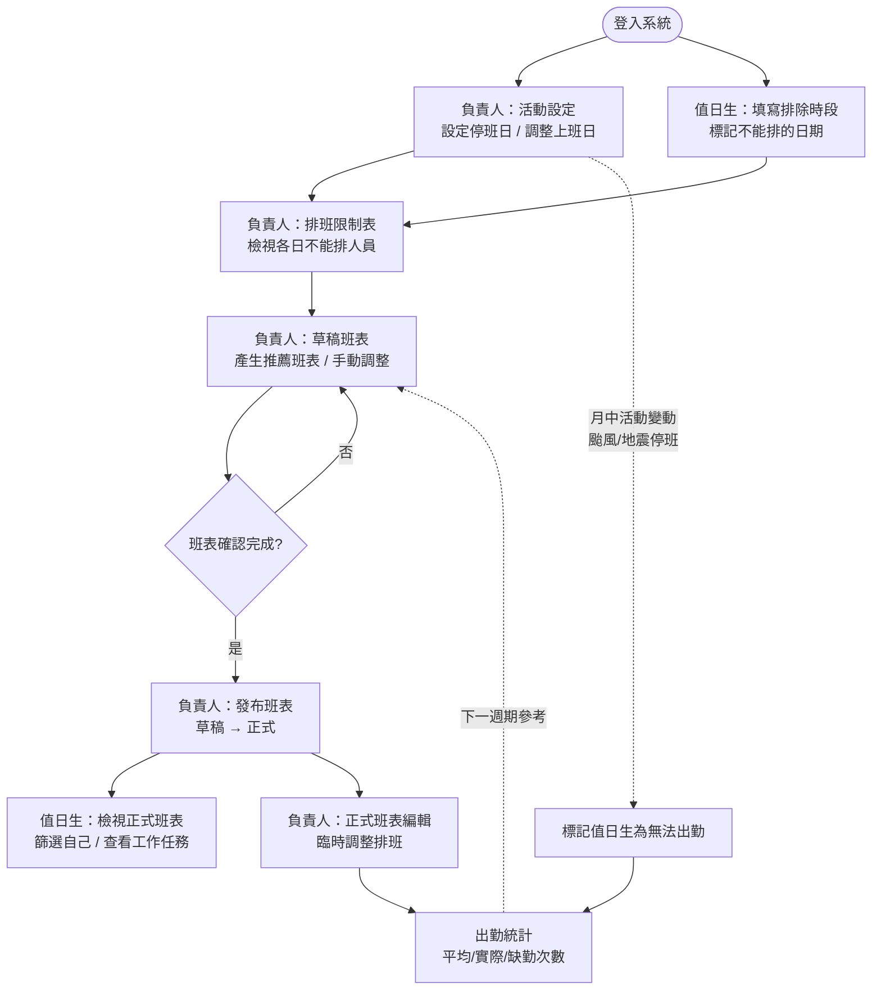
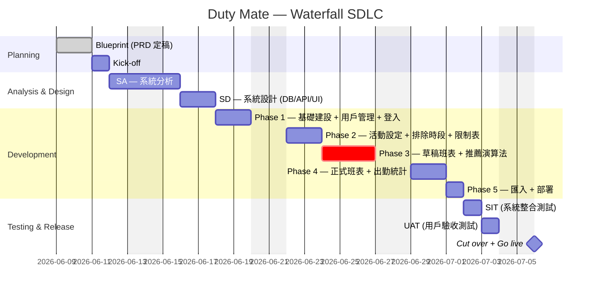

# 聯和趨動 Duty Mate App

AI 陪跑 Side Project、解決[值日生](#值日生)排班 effort 過度集中於一人，希望集眾人之力，結合系統，節省排班時間

## Project Requirement Document (PRD)

## 1. Document Information（文件資訊）

| 項目         | 內容                               |
| ------------ | ---------------------------------- |
| Project Name | Duty Mate                          |
| 文件類型     | Project Requirement Document (PRD) |
| 文件版本     | v1.0                               |
| 開發模式     | Waterfall                          |
| 技術選型     | 確定                               |
| 技術架構     | 確定                               |
| 部署平台     | 確定                               |
| 文件狀態     | 草稿                               |
| 文件作者     | 建宇                               |
| 審核人       | 待定                               |
| 建立日期     | 2026-06-09                         |
| 更新日期     | 2026-06-10                         |

---

## 2. Project Overview（專案概述）

### 2.1 問題背景

[值日生](#值日生)排班目前由單一[排班負責人](#排班負責人)手動處理，造成以下痛點：

- Effort 集中 — 排班工作落在一個人身上，每個月都需花費大量時間協調、確認和調整[值日生](#值日生)班表
- 溝通成本高 — [排班負責人](#排班負責人)可能需要逐一詢問各同仁可用時間、處理換班的要求，來回溝通耗時
- 容錯率低 — 排班工作集中在一人，若當事人不在，流程容易斷掉

### 2.2 目標

透過系統化，將排班的參與分散到所有成員，讓大家能自助填寫可用時間、查看班表、申請換班，從而將[排班負責人](#排班負責人)從繁瑣的手動協調中解放出來，大幅縮短整體排班所需的時間與溝通往返

---

## 3. User Roles（使用者角色）

### 3.1 角色定義

- [排班負責人](#排班負責人)：負責管理[值日生](#值日生)排班的用戶，具有設定班表、調整班表、發布班表、管理用戶等權限
- [值日生](#值日生)：負責按照排班表執行值日工作的用戶，具有填寫無法排班的時間、查看班表、申請換班等權限

> [排班負責人](#排班負責人)同樣也是[值日生](#值日生)的一員，會同時擁有兩種角色的權限，既能管理整體的排班流程，也能參與到[值日生](#值日生)的工作

### 3.2 角色權限定義

- R：Read（讀取權限），R(o) 表示只能讀取自己的資料，沒有特別標記則表示可以讀取所有人的資料
- W：Write（寫入權限），W(o) 表示只能寫入自己的資料，沒有特別標記則表示可以寫入所有人的資料
- E：Edit（編輯權限），E(o) 表示只能編輯自己的資料，沒有特別標記則表示可以編輯所有人的資料
- D：Delete（刪除權限），D(o) 表示只能刪除自己的資料，沒有特別標記則表示可以刪除所有人的資料
- N：None（無權限）

| 功能/角色                 | [排班負責人](#排班負責人) | [值日生](#值日生)   |
| ------------------------- | ------------------------- | ------------------- |
| 主介面                    | R                         | R                   |
| 填寫[排除時段](#排除時段) | R/W/E/D                   | R(o)/W(o)/E(o)/D(o) |
| [排班限制表](#排班限制表) | R                         | N                   |
| [推薦班表](#推薦班表)     | R/W/E                     | N                   |
| [草稿班表](#草稿班表)     | R/W/E/D                   | N                   |
| 班表發布                  | W                         | N                   |
| [正式班表](#正式班表)     | R/W/E/D                   | R                   |
| 工作任務設定              | R/W/E/D                   | N                   |
| 活動設定                  | R/W/E/D                   | N                   |
| 用戶管理                  | R/W/E/D                   | N                   |
| 出勤統計                  | R                         | N                   |
| 過往班表匯入              | W                         | N                   |

---

## 4. Project Scope（專案範圍）

### 4.1 核心目標

1. 提供一個平台讓用戶填寫[排除時段](#排除時段)，供[排班負責人](#排班負責人)參考
2. 提供班表推薦功能，該功能根據用戶填寫的排除時段，自動生成推薦的[值日生](#值日生)班表，並允許[排班負責人](#排班負責人)進行調整
3. 提供班表管理功能，讓[排班負責人](#排班負責人)可以針對系統推薦的班表進行調整並發布，以利調整後符合公司實際的出勤狀況，同時也讓[值日生](#值日生)可以清楚知道自己出勤的狀況
4. 提供班表檢視功能，讓所有[值日生](#值日生)可以查看自己的出勤狀況，並且可以自行篩選[值日生](#值日生)，在查看班表時，只需要專注自己出勤的部分，提升使用體驗
5. 提供活動管理功能，讓[排班負責人](#排班負責人)可以設定國定假日等活動，以利在產生[排班限制表](#排班限制表)時，可以不用排入當天的[值日生](#值日生)；同時也可以設定異常活動（如颱風、地震等導致停班），以利後續統計[值日生](#值日生)的出勤狀況時，可以記錄當天的[值日生](#值日生)實際沒有出勤
6. 提供[值日生](#值日生)工作任務設定功能，讓[排班負責人](#排班負責人)可以設定[值日生](#值日生)的工作任務，並以備註形式顯示在班表上，以利各[值日生](#值日生)清楚自己要完成的工作內容
7. 提供用戶管理功能，讓[排班負責人](#排班負責人)可以對系統用戶進行增修改查的操作，以利後續進行用戶的管理
8. 提供[值日生](#值日生)出勤統計功能，讓[排班負責人](#排班負責人)可以統計各[值日生](#值日生)每個月的[值日生](#值日生)出勤的次數，以利檢視每個[值日生](#值日生)的排班次數是否平均
9. 提供過往班表匯入功能，讓[排班負責人](#排班負責人)可以匯入過往的[值日生](#值日生)班表，以利統計截至目前為止的出勤狀況

---

## 5. Site Map（網站地圖）


## 6. Business Flow（業務流程）

### 6.1 整體業務循環（每月排班週期）

一個完整的值日生排班週期流程，串接各功能頁面：



**週期說明**

1. **前置設定**：負責人先在「活動設定」標好國定假日、調整上班日；值日生各自在「排除時段」標記不能排的日期。
2. **產生班表**：負責人在「草稿班表」用系統推薦或手動排班，反覆調整。
3. **發布**：確認後發布，草稿轉為正式班表，全體值日生可查看。
4. **月中異動**：若臨時停班（颱風、地震）或請假，於活動設定 / 正式班表處理，已排班者標記為「無法出勤」。
5. **統計回饋**：出勤統計彙整平均、實際、缺勤次數，作為下次排班的平衡參考。

---

## 7. Specification（規格說明）

### 7.1 功能與規格描述

\* 表示追加的功能點，非核心目標

#### 登入頁

- ##### 目標：提供用戶登入系統的界面，支持基本的帳號密碼驗證

- ##### 使用角色
  - [排班負責人](#排班負責人)：允許登入
  - [值日生](#值日生)：允許登入

- ##### 規格
  - 帳號：使用公司郵箱作為帳號，確保用戶身份的唯一性
  - 密碼：包含字母(不限制大小寫)和數字，並且至少8位長度
  - 忘記密碼：提供忘記密碼的功能，讓用戶可以通過郵箱重置密碼，確保用戶能夠順利恢復帳號訪問權限
  - 登入功能：用戶輸入帳號和密碼後，點擊登入按鈕進行驗證，成功後進入系統主界面，失敗則顯示錯誤提示

- ##### 卡控機制
  - 帳號、密碼必填，且必須符合格式要求，否則無法提交登入請求
  - 提供適當的錯誤提示，幫助用戶識別問題所在，例如「帳號不存在」或「密碼錯誤」

- ##### 驗收標準

  | Scenario   | Given                            | When         | Then                       |
  | ---------- | -------------------------------- | ------------ | -------------------------- |
  | 成功登入   | 用戶已註冊且輸入正確的帳號和密碼 | 點擊登入按鈕 | 成功登入系統，進入主界面   |
  | 帳號不存在 | 用戶輸入未註冊的帳號 or 密碼錯誤 | 點擊登入按鈕 | 顯示錯誤提示「帳號不存在」 |

- ##### 待釐清
  - ###### Q1. 是否需要提供註冊功能，讓用戶可以自行註冊帳號？
    - [ ] 需要
    - [x] 不需要
    - [ ] 其他（請說明）

    > 建議：不需要，因為[值日生](#值日生) App 的使用對象是公司內部員工，帳號可以由管理員統一創建和分配，這樣可以更好地控制用戶的身份和權限

  - ###### Q2. 是否需要提供忘記密碼功能？
    - [ ] 需要
    - [x] 不需要
    - [ ] 其他（請說明）

    > 建議：暫時不需要，若真的忘記密碼，可以由運維人員協助重置

#### 主介面

- ##### 目標：提供用戶進入系統後的第一個界面，讓用戶可以快速導航到各個功能模塊

- ##### 使用角色
  - [排班負責人](#排班負責人)：R
  - [值日生](#值日生)：R

- ##### 規格
  - 上方導覽列
    - 顯示歡迎訊息，包含用戶的姓名和角色
  - 側邊導航選單
    - 讓用戶可以快速找到自己需要使用的功能模塊，例如[排除時段](#排除時段)、[排班限制表](#排班限制表)、[草稿班表](#草稿班表)、[正式班表](#正式班表)等
    - 根據用戶的角色，顯示不同的功能選項，例如[值日生](#值日生)只能看到自己的[排除時段](#排除時段)和[正式班表](#正式班表)，而[排班負責人](#排班負責人)則可以看到所有功能模塊
  - 主要內容區
    - 默認顯示[正式班表](#正式班表)，讓用戶可以快速查看當前的班表狀況
    - 根據用戶的選擇，切換到不同的功能模塊，例如點擊[排除時段](#排除時段)選項後，顯示[排除時段](#排除時段)頁面，讓用戶可以填寫或查看[排除時段](#排除時段)

#### [值日生](#值日生)[排除時段](#排除時段)頁面

- ##### 目標：提供用戶填寫「不能排」的時間，並將這些資料存儲在系統中供管理員參考

- ##### 無此功能的使用權限
  - [排班負責人](#排班負責人)：R/W/E/D
  - [值日生](#值日生)：R(o)/W(o)/E(o)/D(o)

- ##### 規格
  - 日曆介面
    - 提供月視圖，讓用戶可以更靈活地查看和選擇時間段
    - 讓用戶可以直接透過點擊的方式，標記自己無法擔任[值日生](#值日生)的時間；重複點擊可以取消標記
    - 可以切換月份，讓用戶可以提前填寫未來幾個月的[排除時段](#排除時段)
    - [排班負責人](#排班負責人)可以填寫其他同仁的[排除時段](#排除時段) [TODO: 要在想要怎麼有好的 UI/UX 的方式，讓[排班負責人](#排班負責人)可以方便地切換到其他同仁的[排除時段](#排除時段)頁面，來填寫或查看其他同仁的[排除時段](#排除時段)]
  - 保存功能
    - 用戶填寫完畢後，點擊保存按鈕，將資料提交到後端進行存儲

- ##### 卡控機制
  - [值日生](#值日生)只能填寫自己的[排除時段](#排除時段)，無法查看或修改其他用戶的[排除時段](#排除時段)

- ##### 驗收標準

  | Scenario                         | Given                                                   | When                             | Then                                                           |
  | -------------------------------- | ------------------------------------------------------- | -------------------------------- | -------------------------------------------------------------- |
  | 成功填寫排除時段                 | 用戶在日曆上選擇了自己無法擔任[值日生](#值日生)的時間段 | 點擊保存按鈕                     | 成功保存排除時段，並且這些資料能夠正確存儲在系統中供管理員參考 |
  | 取消已填寫的排除時段             | 用戶在日曆上選擇了已填寫的排除時段                      | 點擊保存按鈕                     | 成功取消排除時段，並且這些變更能夠正確反映在系統中             |
  | 無法查看或修改其他用戶的排除時段 | 用戶進入自己的排除時段頁面                              | 嘗試查看或修改其他用戶的排除時段 | 只會顯示自身的排除時段                                         |

- ##### 待釐清
  - ###### Q1. 能不能填寫今日以前的的[排除時段](#排除時段)？
    - [ ] 可以
      - 如果可以，是否要限制只能填寫今天以後的時間？
    - [x] 不可以
    - [ ] 其他（請說明）

    > 建議：不能填寫今日以前的時間，因為[值日生](#值日生)填寫的排除時段主要是為了提供管理員在排班時參考，如果允許填寫過去的時間，可能因為過了排班週期，所以即使改了也沒有實際的影響

  - ###### Q2. [值日生](#值日生)能不能在當月班表發布後修改的[排除時段](#排除時段)？
    - [ ] 可以
      - 如果可以，是否要限制只能填寫今天以後的時間？
    - [x] 不可以
    - [ ] 其他（請說明）

    > 建議：不能修改，因為當月班表發布後，若[值日生](#值日生)修改的時段剛好是自己被排班的時段，會造成班表與實際狀況不符，若有需要調整，可以透過申請換班的方式來處理，若申請換班的功能尚未完成，可以由[排班負責人](#排班負責人)針對[正式班表](#正式班表)進行編輯來處理。以上建議，需要確認 Q2 的調整權限後，才能確定是否可行

#### [排班限制表](#排班限制表)頁面

- ##### 目標：提供[排班負責人](#排班負責人)查看用戶填寫的[排除時段](#排除時段)，並根據這些資料產生排班清單，以利系統生成推薦的班表

- ##### 使用角色與權限
  - [排班負責人](#排班負責人)：R
  - [值日生](#值日生)：N

- ##### 規格
  - 日曆介面
    - 提供月視圖，讓[排班負責人](#排班負責人)可以更靈活地查看和選擇時間段
    - 在日曆天上顯示當天無法排班人員的名稱，讓[排班負責人](#排班負責人)可以一目了然地看到當天有哪些[值日生](#值日生)無法擔任[值日生](#值日生)
    - 可以切換月份，讓[排班負責人](#排班負責人)可以提前查看未來幾個月的排除時段

- ##### 卡控機制
  - 只有[排班負責人](#排班負責人)可以查看用戶填寫的排除時段，[值日生](#值日生)無法查看其他用戶的排除時段

- ##### 驗收標準

  | Scenario         | Given                                       | When                 | Then                                                                                            |
  | ---------------- | ------------------------------------------- | -------------------- | ----------------------------------------------------------------------------------------------- |
  | 成功查看排除時段 | [排班負責人](#排班負責人)進入排班限制表頁面 | 查看日曆上的排除時段 | 成功查看所有用戶填寫的排除時段，並且這些資料能夠正確顯示在日曆上供[排班負責人](#排班負責人)參考 |

#### [草稿班表](#草稿班表)頁面

- ##### 目標：
  - [排班負責人](#排班負責人)可以根據用戶填寫的「不能排」時間，透過系統自動生成推薦的[值日生](#值日生)班表，並保有自主調整的權限，此外生成的功能可以重複使用，讓[排班負責人](#排班負責人)可以在每次排班時都能快速產生新的班表
  - 班表發布：[排班負責人](#排班負責人)可以發布最終確定的[值日生](#值日生)班表，讓所有[值日生](#值日生)可以查看自己的出勤狀況

- ##### 使用角色
  - [排班負責人](#排班負責人)：R/W/E/D
  - [值日生](#值日生)：N

- ##### 規格
  - [草稿班表](#草稿班表)維護功能
    - [排班負責人](#排班負責人)進入[草稿班表](#草稿班表)頁面，此介面提供[排班負責人](#排班負責人)查看當前選擇的月份，並且可以切換月份來查看不同月份的[草稿班表](#草稿班表)
    - [排班負責人](#排班負責人)可以選擇指定的月份後，在此介面進行排班資料維護
  - 日曆介面
    - 提供月視圖，讓[排班負責人](#排班負責人)可以更靈活地查看和選擇時間段
    - 不能切換月份，僅能查看當前選擇的月份，避免[排班負責人](#排班負責人)在調整班表時，誤操作切換到其他月份
    - 在日曆天上顯示當天的排班人員名稱
    - 根據活動設定，顯示當天的活動類型與註記，並且限制[停班日](#停班日)狀態為 Disabled，無法被排入[值日生](#值日生)的班表中
    - 根據活動設定，顯示當天的活動類型與註記，並且開放[調整上班日](#調整上班日)狀態為 Enabled，可以被排入[值日生](#值日生)的班表中
  - [推薦班表](#推薦班表)生成
    - 根據用戶填寫的「不能排」時間，系統自動生成推薦的[值日生](#值日生)班表，並且可以重複使用，讓[排班負責人](#排班負責人)可以在每次排班時都能快速產生新的班表
    - [推薦班表](#推薦班表)生成規則：
      1. 排除活動設定中[停班日](#停班日)的日子，這些日子不會被排入[值日生](#值日生)的班表中
      2. 納入活動設定中[調整上班日](#調整上班日)的日子，這些日子會被排入[值日生](#值日生)的班表中
      3. 按照前兩點計算得出應排班日數量，並根據目前的[值日生](#值日生)人數，計算平均分配每個[值日生](#值日生)需要排班的次數。[排班平均次數](#排班平均次數)可能會有除不盡的情況，這時候會將剩餘的班次隨機分配給部分[值日生](#值日生)，確保每個[值日生](#值日生)的排班次數盡可能接近平均，隨機分配的規則待確認
      4. 根據目前的[值日生](#值日生)人數清單，先取一位[值日生](#值日生)，將他/她的「不能排」時間從需要排班的日子中排除，然後從剩下的日子中，隨機分配給該[值日生](#值日生)需要排班的次數，排班與排班的間隔最少 3 天；接著再取下一位[值日生](#值日生)，重複上述步驟，直到所有[值日生](#值日生)都被分配到需要排班的日子為止
  - 班表調整
    - [排班負責人](#排班負責人)可以針對系統推薦的班表進行調整，以確保最終發布的班表符合公司實際的出勤狀況
    - [排班負責人](#排班負責人)設定班表時，可以直接在日曆上點擊某一天，選擇要排入的[值日生](#值日生)，選單需排除當天無法排班的[值日生](#值日生)
    - [排班負責人](#排班負責人)設定班表時，無法針對活動類型為[停班日](#停班日)的日子進行排班，這些日子在日曆上會顯示為 Disabled 狀態，無法被選取
    - [排班負責人](#排班負責人)設定班表時，可以針對活動類型為[調整上班日](#調整上班日)的日子進行排班，這些日子在日曆上會顯示為 Enabled 狀態，可以被選取
    - [排班負責人](#排班負責人)設定班表時，可以直接在日曆上點擊某一天，移除已經排入的[值日生](#值日生)，以利調整班表的彈性
    - 調整時會聯動人員排班統計功能，讓[排班負責人](#排班負責人)可以實時參考每個[值日生](#值日生)的排班次數，避免某些[值日生](#值日生)被過度排班或過少排班
  - 人員排班統計功能
    - 顯示各[值日生](#值日生)預計的[排班平均次數](#排班平均次數)，讓[排班負責人](#排班負責人)在調整班表時，可以參考每個[值日生](#值日生)的排班次數，避免某些[值日生](#值日生)被過度排班或過少排班
    - 顯示各[值日生](#值日生)[實際排班次數](#實際排班次數)，讓[排班負責人](#排班負責人)在調整班表時，可以參考每個[值日生](#值日生)的[實際排班次數](#實際排班次數)，避免某些[值日生](#值日生)被過度排班或過少排班
  - 保存功能
    - [排班負責人](#排班負責人)在調整完班表後，點擊保存按鈕，將資料提交到後端進行存儲
    - 保存後的資料能夠正確存儲在系統中並且呈現在當前介面
    - 保存僅針仍屬於草稿狀態，尚未發布，只有[排班負責人](#排班負責人)可以查看和編輯，直到[排班負責人](#排班負責人)決定發布為止
    - 保存時，僅針對當前月份的班表進行保存，避免誤操作導致其他月份的班表資料被覆蓋或丟失
  - 一鍵清除功能
    - [排班負責人](#排班負責人)可以點擊「清除班表」按鈕，一鍵清除當前[草稿班表](#草稿班表)的所有排班資料，讓[排班負責人](#排班負責人)可以重新生成新的[草稿班表](#草稿班表)或重新調整班表
    - 點擊「清除班表」按鈕時，需提示[排班負責人](#排班負責人)確認是否要清除班表，以避免誤操作導致資料丟失
  - 班表發布
    - [排班負責人](#排班負責人)可以發布最終確定的[值日生](#值日生)班表，讓所有[值日生](#值日生)可以查看自己的出勤狀況
    - 發布的同時，將草稿班表的狀態從「草稿」改為「正式」，並且將發布的班表資料存儲在正式班表中，供[值日生](#值日生)查看

- ##### 卡控機制
  - 同一天只能排一位[值日生](#值日生)
  - 活動類型為[停班日](#停班日)的日子狀態為 Disabled，無法被排入[值日生](#值日生)的班表中
  - 活動類型為[調整上班日](#調整上班日)的日子狀態為 Enabled，可以被排入[值日生](#值日生)的班表中
  - 該月份[草稿班表](#草稿班表)若以發布，則無法再進行調整。調整可於[正式班表](#正式班表)進行，或是透過申請換班的方式來處理

- ##### 驗收標準

  | Scenario                                                   | Given                                                                                | When                                                                                                      | Then                                                                                                                                                                                                                                                                                                                                         |
  | ---------------------------------------------------------- | ------------------------------------------------------------------------------------ | --------------------------------------------------------------------------------------------------------- | -------------------------------------------------------------------------------------------------------------------------------------------------------------------------------------------------------------------------------------------------------------------------------------------------------------------------------------------- |
  | 成功產生[草稿班表](#草稿班表)                              | [排班負責人](#排班負責人)選擇了指定的月份的[草稿班表](#草稿班表)                     | [排班負責人](#排班負責人)針對特定日期指定[值日生](#值日生)後，按下保存按鈕                                | 成功將指派的[值日生](#值日生)記錄在[草稿班表](#草稿班表)並且這些變更能夠正確存儲在系統中並且呈現在當前介面                                                                                                                                                                                                                                   |
  | 成功修改[草稿班表](#草稿班表)                              | [排班負責人](#排班負責人)選擇了指定的月份的[草稿班表](#草稿班表)且該草稿已有排班紀錄 | [排班負責人](#排班負責人)針對已排入[值日生](#值日生)的日期，重新指定[值日生](#值日生)後，按下保存按鈕     | 成功將修改後的[值日生](#值日生)記錄在[草稿班表](#草稿班表)，並且這些變更能夠正確存儲在系統中並且呈現在當前介面                                                                                                                                                                                                                               |
  | 成功從[草稿班表](#草稿班表)移除特定日期的[值日生](#值日生) | [排班負責人](#排班負責人)選擇了指定的月份的[草稿班表](#草稿班表)且該草稿已有排班紀錄 | [排班負責人](#排班負責人)針對已排入[值日生](#值日生)的日期，移除已指定的[值日生](#值日生)後，按下保存按鈕 | 成功將該日期移除[值日生](#值日生)的排班資料，並且這些變更能夠正確存儲在系統中並且呈現在當前介面                                                                                                                                                                                                                                              |
  | 成功從[草稿班表](#草稿班表)清除所有排班資料                | [排班負責人](#排班負責人)選擇了指定的月份的[草稿班表](#草稿班表)且該草稿已有排班紀錄 | [排班負責人](#排班負責人)點擊「清除班表」按鈕，並且確認要清除班表的操作                                   | 成功清除[草稿班表](#草稿班表)的所有排班資料，並且[草稿班表](#草稿班表)回到初始狀態(該月份所有應排班日期皆皆為指派任何[值日生](#值日生))                                                                                                                                                                                                      |
  | 成功生成[推薦班表](#推薦班表)                              | [排班負責人](#排班負責人)選擇了指定的月份的[草稿班表](#草稿班表)                     | [排班負責人](#排班負責人)點擊班表推薦按                                                                   | 產生根據用戶填寫的[排除時段](#排除時段)與活動設定自動生成的推薦[草稿班表](#草稿班表)，成功條件須包含：1. 所有[值日生](#值日生)皆有排班 2. 所有[值日生](#值日生)的[實際排班次數](#實際排班次數)要等於平均排班次數 3. 無衝突排班 4. 符合活動設定，[停班日](#停班日)沒有指派[值日生](#值日生)，[調整上班日](#調整上班日)有指派[值日生](#值日生) |
  | 成功調整[推薦班表](#推薦班表)                              | [排班負責人](#排班負責人)透過[推薦班表](#推薦班表)功能產生班表，但想要異動排班       | [排班負責人](#排班負責人)調整[推薦班表](#推薦班表)中特定日子指派的[值日生](#值日生)                       | 成功調整[推薦班表](#推薦班表)，並且在調整的同時，能夠同步每個[值日生](#值日生)的[實際排班次數](#實際排班次數)                                                                                                                                                                                                                                |
  | 無法調整活動類型為[停班日](#停班日)的日子                  | [排班負責人](#排班負責人)產生了[草稿班表](#草稿班表)                                 | [排班負責人](#排班負責人)嘗試在活動類型為[停班日](#停班日)的日子進行排班                                  | 活動類型為[停班日](#停班日)的日子無法被選取，並且顯示為 Disabled 狀態                                                                                                                                                                                                                                                                        |
  | 允許調整活動類型為[調整上班日](#調整上班日)的日子          | [排班負責人](#排班負責人)產生了[草稿班表](#草稿班表)                                 | [排班負責人](#排班負責人)嘗試在活動類型為[調整上班日](#調整上班日)的日子進行排班                          | 活動類型為[調整上班日](#調整上班日)的日子可以被選取，並且顯示為 Enabled 狀態                                                                                                                                                                                                                                                                 |
  | 排班時無法選擇[排除時段](#排除時段)的[值日生](#值日生)     | [排班負責人](#排班負責人)產生了[草稿班表](#草稿班表)                                 | [排班負責人](#排班負責人)嘗試選擇[排除時段](#排除時段)的[值日生](#值日生)                                 | [排除時段](#排除時段)的[值日生](#值日生)不會顯示在可選列表中                                                                                                                                                                                                                                                                                 |
  | 無法同一天排兩位[值日生](#值日生)                          | [排班負責人](#排班負責人)產生了[草稿班表](#草稿班表)                                 | [排班負責人](#排班負責人)嘗試在同一天排入兩位[值日生](#值日生)                                            | 同一天只能排一位[值日生](#值日生)，無法選取第二位[值日生](#值日生)                                                                                                                                                                                                                                                                           |
  | 成功儲存[草稿班表](#草稿班表)                              | [排班負責人](#排班負責人)調整完[草稿班表](#草稿班表)後                               | 點擊保存按鈕                                                                                              | 成功保存調整後的[草稿班表](#草稿班表)，這些資料能夠正確存儲在系統中並且呈現在當前介面                                                                                                                                                                                                                                                        |
  | 成功發布班表                                               | [排班負責人](#排班負責人)調整完[草稿班表](#草稿班表)後                               | 點擊發布按鈕                                                                                              | 成功發布[正式班表](#正式班表)，並且[值日生](#值日生)可以查看自己的出勤狀況                                                                                                                                                                                                                                                                   |

- ##### 待釐清
  - ###### Q1. 若有沒排班的情況是否允許發布？
    - [x] 允許，但需要提醒[排班負責人](#排班負責人)哪天沒排到
    - [ ] 不允許
    - [ ] 其他（請說明）

    > 建議：允許，但需要提醒[排班負責人](#排班負責人)，允許的原因是因為後續如果要調整，仍可在[正式班表](#正式班表)編輯

  - ###### Q2. 當[排班負責人](#排班負責人)自行排班，此時若操作[推薦班表](#推薦班表)的功能，是否要覆蓋已排班的部分？
    - [ ] 要，但需要提醒[排班負責人](#排班負責人)會覆蓋已排班的部分
    - [x] 不要，[推薦班表](#推薦班表)的功能僅針對尚未排班的部分進行排班，已排班的部分不受影響
    - [ ] 其他（請說明）

  - ###### Q3. 是否可以建立與發布未來的[草稿班表](#草稿班表)，讓[排班負責人](#排班負責人)可以提前產生未來幾個月的班表？
    - [x] 可以
    - [ ] 不可以
    - [ ] 其他（請說明）

    > 建議：可以，因為[排班負責人](#排班負責人)可能需要提前規劃未來幾個月的班表，提前產生[草稿班表](#草稿班表)可以讓他們有更多時間進行調整和確認

#### [正式班表](#正式班表)頁面

- ##### 目標：
  - 提供用戶查看[值日生](#值日生)班表的界面，讓[值日生](#值日生)可以清楚知道自己出勤的狀況
  - 可根據用戶篩選[值日生](#值日生)班表的功能，讓[值日生](#值日生)在查看班表時，只需要專注自己出勤的部分，提升使用體驗
  - _\*申請換班：提供[值日生](#值日生)申請換班的界面，讓[值日生](#值日生)可以在有事時，請其他同仁幫忙[值日生](#值日生)（不需要經過管理員審核，只要其他該同仁同意即可\)_
  - 工作任務設定頁面：提供[排班負責人](#排班負責人)設定[值日生](#值日生)的工作任務，並以備註形式顯示在班表上，以利各[值日生](#值日生)清楚自己要完成的工作內容

- ##### 使用角色
  - [排班負責人](#排班負責人)：R/W/E/D
  - [值日生](#值日生)：R

- ##### 規格
  - 日曆介面
    - 提供月視圖，讓用戶可以更靈活地查看和選擇時間段
    - 在日曆天上顯示當天的排班人員名稱，讓[值日生](#值日生)可以一目了然地看到自己出勤的狀況和需要完成的工作內容
    - 可以切換月份，讓用戶可以查看過去與未來幾個月的班表
    - 根據活動設定，顯示當天的活動類型與註記，並且限制[停班日](#停班日)狀態為 Disabled，無法被排入[值日生](#值日生)的班表中
    - 根據活動設定，顯示當天的活動類型與註記，並且開放[調整上班日](#調整上班日)狀態為 Enabled，可以被排入[值日生](#值日生)的班表中
    - 根據活動設定，若當天為[停班日](#停班日)，但已排入[值日生](#值日生)，則將該名[值日生](#值日生)標記為[無法出勤](#無法出勤)的狀態
  - 篩選功能
    - 提供篩選[值日生](#值日生)的功能，讓[值日生](#值日生)在查看班表時，只需要專注自己出勤的部分
  - 編輯功能
    - [排班負責人](#排班負責人)可以點擊編輯按鈕，讓[正式班表](#正式班表)進入編輯模式
    - 在編輯模式下，[排班負責人](#排班負責人)設定班表時，無法針對活動類型為[停班日](#停班日)的日子進行排班，這些日子在日曆上會顯示為 Disabled 狀態，無法被選取
    - 在編輯模式下，[排班負責人](#排班負責人)設定班表時，可以針對活動類型為[調整上班日](#調整上班日)的日子進行排班，這些日子在日曆上會顯示為 Enabled 狀態，可以被選取
    - 在編輯模式下，[排班負責人](#排班負責人)可以針對[正式班表](#正式班表)進行調整，直接在日曆上點擊某一天，選擇要排入的[值日生](#值日生)，選單需排除當天無法排班的[值日生](#值日生)
    - 在編輯模式下，[排班負責人](#排班負責人)可以直接在日曆上點擊某一天，移除已經排入的[值日生](#值日生)，以利調整班表的彈性
    - 調整時會聯動人員排班統計功能，讓[排班負責人](#排班負責人)可以實時參考每個[值日生](#值日生)的排班次數，避免某些[值日生](#值日生)被過度排班或過少排班
  - 人員排班統計功能
    - 顯示各[值日生](#值日生)實際排班的次數，讓[排班負責人](#排班負責人)在調整班表時，可以參考每個[值日生](#值日生)的[實際排班次數](#實際排班次數)，避免某些[值日生](#值日生)被過度排班或過少排班
  - 保存功能
    - [排班負責人](#排班負責人)在調整完班表後，點擊保存按鈕，將資料提交到後端進行存儲
    - 保存後的資料能夠正確存儲在系統中並且呈現在當前介面

- ##### 卡控機制
  - 同一天只能排一位[值日生](#值日生)
  - 活動類型為[停班日](#停班日)的日子狀態為 Disabled，無法被排入[值日生](#值日生)的班表中
  - 活動類型為[調整上班日](#調整上班日)的日子狀態為 Enabled，可以被排入[值日生](#值日生)的班表中

- ##### 驗收標準

| Scenario                                               | Given                                                  | When                                                                                              | Then                                                                                                          |
| ------------------------------------------------------ | ------------------------------------------------------ | ------------------------------------------------------------------------------------------------- | ------------------------------------------------------------------------------------------------------------- |
| 成功調整[正式班表](#正式班表)                          | [排班負責人](#排班負責人)產生了[正式班表](#正式班表)   | [排班負責人](#排班負責人)調整[正式班表](#正式班表)，將特定日期指派的[值日生](#值日生)更換為其他人 | 成功調整[正式班表](#正式班表)，並且在調整的同時，能夠同步每個[值日生](#值日生)的[實際排班次數](#實際排班次數) |
| 無法調整活動類型為[停班日](#停班日)的日子              | [排班負責人](#排班負責人)產生了[正式班表](#正式班表)   | [排班負責人](#排班負責人)嘗試在活動類型為[停班日](#停班日)的日子進行排班                          | 活動類型為[停班日](#停班日)的日子無法被選取，並且顯示為 Disabled 狀態                                         |
| 允許調整活動類型為[調整上班日](#調整上班日)的日子      | [排班負責人](#排班負責人)產生了[正式班表](#正式班表)   | [排班負責人](#排班負責人)嘗試在活動類型為[調整上班日](#調整上班日)的日子進行排班                  | 活動類型為[調整上班日](#調整上班日)的日子可以被選取，並且顯示為 Enabled 狀態                                  |
| 排班時無法選擇[排除時段](#排除時段)的[值日生](#值日生) | [排班負責人](#排班負責人)產生了[正式班表](#正式班表)   | [排班負責人](#排班負責人)嘗試選擇[排除時段](#排除時段)的[值日生](#值日生)                         | [排除時段](#排除時段)的[值日生](#值日生)不會顯示在可選列表中                                                  |
| 無法同一天排兩位[值日生](#值日生)                      | [排班負責人](#排班負責人)產生了[正式班表](#正式班表)   | [排班負責人](#排班負責人)嘗試在同一天排入兩位[值日生](#值日生)                                    | 同一天只能排一位[值日生](#值日生)，無法選取第二位[值日生](#值日生)                                            |
| 成功儲存[正式班表](#正式班表)                          | [排班負責人](#排班負責人)調整完[正式班表](#正式班表)後 | 點擊保存按鈕                                                                                      | 成功保存調整後的[正式班表](#正式班表)，這些資料能夠正確存儲在系統中並且呈現在當前介面                         |

- ##### 待釐清
  - ###### Q1. 能不能修改今日以前的時間？
    - [x] 可以
    - [ ] 不可以
    - [ ] 其他（請說明）

  - ###### Q2. [正式班表](#正式班表)頁面：[正式班表](#正式班表)檢視中的篩選[值日生](#值日生)功能，只能篩選單個人員，還是可以多選人員進行篩選？
    - [x] 單選
    - [ ] 複選
    - [ ] 其他（請說明）

#### 活動設定頁面

- ##### 目標：
  - 提供[排班負責人](#排班負責人)設定國定假日等活動，以利在產生[排班限制表](#排班限制表)時，可以不用排入當天的[值日生](#值日生)
  - 提供[排班負責人](#排班負責人)設定異常活動（如颱風、地震等導致停班），以利後續統計[值日生](#值日生)的出勤狀況時，可以記錄當天的[值日生](#值日生)實際沒有出勤

- ##### 使用角色
  - [排班負責人](#排班負責人)：R/W/E/D
  - [值日生](#值日生)：R

- ##### 規格
  - 活動類型
    - [停班日](#停班日)（國定假日、例假日等）和異常活動（颱風、地震等導致停班的情況）
    - [調整上班日](#調整上班日)（政府公告該休息日或例假日，需調整為上班日）
  - 活動註記
    - 用戶可以為每個活動設定一個名稱或描述，讓[排班負責人](#排班負責人)在查看日曆時，可以清楚知道當天的活動具體是什麼
  - 日曆介面
    - 提供月視圖，讓[排班負責人](#排班負責人)可以更靈活地查看和選擇時間段
    - 在日曆天上顯示當天的活動類型與註記，讓[排班負責人](#排班負責人)可以一目了然地看到當天有哪些活動
    - 可以切換月份，讓[排班負責人](#排班負責人)可以提前查看過去與未來的活動
  - 編輯功能
    - [排班負責人](#排班負責人)可以點擊編輯按鈕，讓活動設定頁面進入編輯模式
    - 在編輯模式下，[排班負責人](#排班負責人)可以新增、修改或刪除活動，並且這些變更能夠正確存儲在系統中並且呈現在當前介面

- ##### 卡控機制
  - 只有[排班負責人](#排班負責人)可以查看和編輯活動設定，[值日生](#值日生)無法查看或編輯活動設定
  - 同一天只能設定一個活動，無法重複設定

- #### 驗收標準

  | Scenario                                                             | Given                                                      | When                                                                                    | Then                                                                                                                                                                                                         |
  | -------------------------------------------------------------------- | ---------------------------------------------------------- | --------------------------------------------------------------------------------------- | ------------------------------------------------------------------------------------------------------------------------------------------------------------------------------------------------------------ |
  | 成功新增[停班日](#停班日)活動                                        | [排班負責人](#排班負責人)進入活動設定頁面                  | 於特定日期點擊新增活動按鈕，活動類型選擇[停班日](#停班日)並註記後，點擊保存按鈕         | 成功新增活動活動，並且這些資料能夠正確存儲在系統中並且呈現在當前介面                                                                                                                                         |
  | 成功新增[調整上班日](#調整上班日)活動                                | [排班負責人](#排班負責人)進入活動設定頁面                  | 於特定日期點擊新增活動按鈕，活動類型選擇[調整上班日](#調整上班日)並註記後，點擊保存按鈕 | 成功新增活動活動，並且這些資料能夠正確存儲在系統中並且呈現在當前介面                                                                                                                                         |
  | 在 [草稿班表](#草稿班表) 中成功反映[停班日](#停班日)活動設定         | [排班負責人](#排班負責人)新增[停班日](#停班日)活動         | [排班負責人](#排班負責人)進入[草稿班表](#草稿班表)頁面                                  | [草稿班表](#草稿班表)中的日曆能夠正確顯示活動類型([停班日](#停班日))與註記，並且限制當天狀態為 Disabled，無法進行排班                                                                                        |
  | 在 [草稿班表](#草稿班表) 中成功反映[調整上班日](#調整上班日)活動設定 | [排班負責人](#排班負責人)新增[調整上班日](#調整上班日)活動 | [排班負責人](#排班負責人)進入[草稿班表](#草稿班表)頁面                                  | [草稿班表](#草稿班表)中的日曆能夠正確顯示活動類型([調整上班日](#調整上班日))與註記，並且當天狀態為 Enabled，可以進行排班                                                                                     |
  | 在 [正式班表](#正式班表) 中成功反映[停班日](#停班日)活動設定         | [排班負責人](#排班負責人)新增[停班日](#停班日)活動         | [排班負責人](#排班負責人)進入[正式班表](#正式班表)頁面                                  | [正式班表](#正式班表)中的日曆能夠正確顯示活動類型([停班日](#停班日))與註記，並且限制當天狀態為 Disabled，無法進行排班。若當日已有指派[值日生](#值日生)則需要將該[值日生](#值日生)標記為[無法出勤](#無法出勤) |
  | 在 [正式班表](#正式班表) 中成功反映[調整上班日](#調整上班日)活動設定 | [排班負責人](#排班負責人)新增[調整上班日](#調整上班日)活動 | [排班負責人](#排班負責人)進入[正式班表](#正式班表)頁面                                  | [正式班表](#正式班表)中的日曆能夠正確顯示活動類型([調整上班日](#調整上班日))與註記，並且當天狀態為 Enabled，可以進行排班                                                                                     |

- ##### 待釐清
  - ###### Q1. 能不能填寫今日以前的的活動？
    - [x] 可以，修改後的活動會影響[正式班表](#正式班表)的排班狀況，若當天已有[值日生](#值日生)被排班，則需要將該[值日生](#值日生)進行註記，並於[出勤統計頁面](#出勤統計頁面)中顯示該[值日生](#值日生)的實際出勤狀況為「未出勤」
    - [ ] 不可以
    - [ ] 其他（請說明）

  - ###### Q2. [排班負責人](#排班負責人)能不能在當月班表發布後修改的活動？
    - [x] 可以，修改後的活動會影響[正式班表](#正式班表)的排班狀況，若當天已有[值日生](#值日生)被排班，則需要將該[值日生](#值日生)進行註記，並於[出勤統計頁面](#出勤統計頁面)中顯示該[值日生](#值日生)的實際出勤狀況為「未出勤」
    - [ ] 不可以
    - [ ] 其他（請說明）

#### 用戶管理頁面

- ##### 目標：提供[排班負責人](#排班負責人)對系統用戶進行增修改查的操作，以利後續進行用戶的管理

- #### 使用角色
  - [排班負責人](#排班負責人)：R/W/E/D
  - [值日生](#值日生)：N

- ##### 規格
  - 用戶資訊
    - 姓名：支援中英文與中文，不可以包含空格和特殊字元（如-、\_等），長度限制在 2~20 字以內，允許同名
    - 電子郵件地址：需要符合電子郵件格式，並且在系統中唯一，不能重複註冊
    - 密碼（需要加密存儲）：包含字母(不限制大小寫)和數字，並且至少8位長度
    - 角色：目前僅有[排班負責人](#排班負責人)或[值日生](#值日生)兩種角色，權限依照[3.2 角色權限定義](#3.2_角色權限定義)進行設定
    - 是否列入排班：用於設定哪些人需要被排入[值日生](#值日生)的班表中，哪些人不需要被排入班表中（例如因為工作性質或其他原因不需要擔任[值日生](#值日生)的同仁），這個設定將影響在生成[推薦班表](#推薦班表)時，系統是否會將該用戶考慮在內
  - 編輯界面
    - 提供一個用戶列表，顯示所有用戶的基本資訊（姓名、電子郵件地址、角色等）
    - 在用戶列表中，每個用戶旁邊提供編輯和刪除按鈕，讓[排班負責人](#排班負責人)可以對用戶進行修改或刪除操作
    - 提供一個新增用戶的按鈕，讓[排班負責人](#排班負責人)可以添加新的用戶到系統中
  - 編輯功能
    - [排班負責人](#排班負責人)可以點擊編輯按鈕，讓用戶管理頁面進入編輯模式
    - 在編輯模式下，[排班負責人](#排班負責人)可以新增、修改或刪除用戶，並且這些變更能夠正確存儲在系統中並且呈現在當前介面
  - 刪除功能
    - [排班負責人](#排班負責人)可以點擊刪除按鈕，刪除用戶，並且這些變更能夠正確存儲在系統中並且呈現在當前介面
    - 刪除前需再次確認，避免誤刪用戶

- #### 卡控機制
  - 只有[排班負責人](#排班負責人)可以查看和編輯用戶管理頁面，[值日生](#值日生)無法查看或編輯用戶管理頁面
  - 建立用戶時，[排班負責人](#排班負責人)與[值日生](#值日生)兩種角色只能選擇其中一種，無法同時選擇兩種角色
  - 允許有複數個[排班負責人](#排班負責人)或[值日生](#值日生)帳號
  - 電子郵件地址在系統中唯一，不能重複註冊
  - 刪除用戶前需要再次確認，避免誤刪用戶
  - 新增與修改用戶資訊時，需要符合格式要求（姓名、電子郵件地址、密碼等），並且在系統中唯一，否則新增按鈕將無法被點擊
  - [排班負責人](#排班負責人)可以修改自己的用戶資訊，但無法修改自己的角色，以避免誤將自己降級為[值日生](#值日生)而無法再進行用戶管理的操作
  - [排班負責人](#排班負責人)無法刪除自己，以避免誤將自己刪除而無法再進行用戶管理的操作
  - [排班負責人](#排班負責人)可以刪除其他[排班負責人](#排班負責人)
  - [排班負責人](#排班負責人)可以刪除[值日生](#值日生)

- #### 驗收標準

| Scenario                          | Given                                     | When                                                                                                             | Then                                                                                                                                                                                                            |
| --------------------------------- | ----------------------------------------- | ---------------------------------------------------------------------------------------------------------------- | --------------------------------------------------------------------------------------------------------------------------------------------------------------------------------------------------------------- |
| 成功新增[值日生](#值日生)         | [排班負責人](#排班負責人)進入用戶管理頁面 | 點擊新增用戶按鈕，填寫符合格式要求的用戶資訊，並選擇[值日生](#值日生)角色後，點擊保存按鈕                        | 成功新增[值日生](#值日生)，並且這些資料能夠正確存儲在系統中並且呈現在當前介面。同時該名[值日生](#值日生)可透過此新增的帳號進行登入，且僅能使用[3.2 角色權限定義](#3.2_角色權限定義)所定義的功能                 |
| 成功修改[值日生](#值日生)         | [排班負責人](#排班負責人)進入用戶管理頁面 | 在用戶列表中，點擊某個[值日生](#值日生)旁邊的編輯按鈕，修改[值日生](#值日生)資訊後，點擊保存按鈕                 | 成功修改[值日生](#值日生)，並且這些資料能夠正確存儲在系統中並且呈現在當前介面。同時該名[值日生](#值日生)登入時，所顯示的資訊也會更新                                                                            |
| 成功刪除[值日生](#值日生)         | [排班負責人](#排班負責人)進入用戶管理頁面 | 在用戶列表中，點擊某個[值日生](#值日生)旁邊的刪除按鈕，確認刪除後                                                | 成功刪除[值日生](#值日生)，並且這些變更能夠正確存儲在系統中並且呈現在當前介面。同時該名[值日生](#值日生)將無法再透過此帳號登入                                                                                  |
| 成功新增[排班負責人](#排班負責人) | [排班負責人](#排班負責人)進入用戶管理頁面 | 點擊新增用戶按鈕，填寫符合格式要求的用戶資訊，並選擇[排班負責人](#排班負責人)角色後，點擊保存按鈕                | 成功新增[排班負責人](#排班負責人)，並且這些資料能夠正確存儲在系統中並且呈現在當前介面。同時該名[排班負責人](#排班負責人)可透過此新增的帳號進行登入，且僅能使用[3.2 角色權限定義](#3.2_角色權限定義)所定義的功能 |
| 成功修改[排班負責人](#排班負責人) | [排班負責人](#排班負責人)進入用戶管理頁面 | 在用戶列表中，點擊某個[排班負責人](#排班負責人)旁邊的編輯按鈕，修改[排班負責人](#排班負責人)資訊後，點擊保存按鈕 | 成功修改[排班負責人](#排班負責人)，並且這些資料能夠正確存儲在系統中並且呈現在當前介面。同時該名[排班負責人](#排班負責人)登入時，所顯示的資訊也會更新                                                            |
| 成功刪除[排班負責人](#排班負責人) | [排班負責人](#排班負責人)進入用戶管理頁面 | 在用戶列表中，點擊某個[排班負責人](#排班負責人)旁邊的刪除按鈕，確認刪除後                                        | 成功刪除[排班負責人](#排班負責人)，並且這些變更能夠正確存儲在系統中並且呈現在當前介面。同時該名[排班負責人](#排班負責人)將無法再透過此帳號登入                                                                  |

- ##### 待釐清

  無

#### 出勤統計頁面

- ##### 目標：提供[排班負責人](#排班負責人)統計各[值日生](#值日生)每個月的[值日生](#值日生)出勤的次數，以利檢視每個[值日生](#值日生)的排班次數是否平均

- #### 使用角色
  - [排班負責人](#排班負責人)：R
  - [值日生](#值日生)：N

- ##### 規格
  - 統計內容
    - 顯示每個[值日生](#值日生)在當前年度的[值日生](#值日生)[排班平均次數](#排班平均次數)、[實際排班次數](#實際排班次數)與[缺勤次數](#缺勤次數)，讓[排班負責人](#排班負責人)可以檢視每個[值日生](#值日生)的排班次數是否平均
  - 表格介面
    - 以表格形式顯示每個[值日生](#值日生)的姓名和當年所有[值日生](#值日生)[排班平均次數](#排班平均次數)、[實際排班次數](#實際排班次數)與[缺勤次數](#缺勤次數)，讓[排班負責人](#排班負責人)可以清楚地看到每個[值日生](#值日生)的出勤狀況
    - 可以切換年份，讓[排班負責人](#排班負責人)可以查看過去與未來幾年的[值日生](#值日生)[排班平均次數](#排班平均次數)、[實際排班次數](#實際排班次數)與[缺勤次數](#缺勤次數)
  - 日曆介面
    - 在統計表格旁邊下方提供一個小型的日曆，以月視圖的形式顯示當前選擇年份的每個月，並且在每個月上顯示該月的[值日生](#值日生)出勤狀況（例如使用不同顏色或符號來表示出勤、缺勤等狀況），讓[排班負責人](#排班負責人)可以更直觀地了解每個月的出勤情況
    - 可以切換月份，讓[排班負責人](#排班負責人)可以查看過去與未來幾個月的[值日生](#值日生)出勤狀況
  - 年度切換
    - 在統計表格的上方提供一個年度切換年份的選單，讓[排班負責人](#排班負責人)可以快速切換到不同的年份，查看該年度的[值日生](#值日生)出勤狀況
  - 聯動功能
    - 在[正式班表](#正式班表)頁面進行調整時，能夠實時更新每個[值日生](#值日生)的[實際排班次數](#實際排班次數)，讓[排班負責人](#排班負責人)在調整班表時，可以參考每個[值日生](#值日生)的出勤狀況，避免某些[值日生](#值日生)被過度排班或過少排班
    - 點擊表格介面中任意一個[值日生](#值日生)的姓名，下方的日曆介面將會篩選出該[值日生](#值日生)的出勤狀況

- ##### 卡控機制
  - 只有[排班負責人](#排班負責人)可以查看出勤統計頁面，[值日生](#值日生)無法查看出勤統計頁面
  - [排班負責人](#排班負責人)在查看統計表格時，可以選擇切換年份，但無法切換月份，因為統計表格是以年度為單位來顯示每個[值日生](#值日生)的出勤狀況的
  - [排班負責人](#排班負責人)在查看日曆介面時，可以切換月份，但無法切換年份，因為日曆介面是以月視圖的形式來顯示每個月的[值日生](#值日生)出勤狀況的

- ##### 驗收標準

| Scenario                                                | Given                                     | When                                                            | Then                                                                                                                                                                                                                        |
| ------------------------------------------------------- | ----------------------------------------- | --------------------------------------------------------------- | --------------------------------------------------------------------------------------------------------------------------------------------------------------------------------------------------------------------------- |
| 成功查看[值日生](#值日生)出勤統計資料                   | [排班負責人](#排班負責人)進入出勤統計頁面 | 查看統計表格和日曆介面                                          | [正式班表](#正式班表)與當前統計的結果一致                                                                                                                                                                                   |
| 成功切換年份查看不同年度的[值日生](#值日生)出勤統計資料 | [排班負責人](#排班負責人)進入出勤統計頁面 | 在年度切換選單中選擇不同的年份                                  | 成功切換到選擇的年份，並且統計表格和日曆介面中的資料都更新為該年度的[值日生](#值日生)出勤狀況                                                                                                                               |
| 成功查看[值日生](#值日生)的出勤狀況                     | [排班負責人](#排班負責人)進入出勤統計頁面 | 在統計表格中點擊某個[值日生](#值日生)姓名                       | 日曆介面成功篩選出該[值日生](#值日生)的出勤狀況，讓[排班負責人](#排班負責人)可以清楚地看到該[值日生](#值日生)在每個月的出勤狀況                                                                                             |
| 成功查看[值日生](#值日生)的出勤狀況                     | [排班負責人](#排班負責人)進入出勤統計頁面 | 在[正式班表](#正式班表)頁面進行調整，並且保存後返回出勤統計頁面 | 統計表格中的[實際排班次數](#實際排班次數)成功更新，反映出調整後的[值日生](#值日生)出勤狀況，讓[排班負責人](#排班負責人)在調整班表時，可以參考每個[值日生](#值日生)的出勤狀況，避免某些[值日生](#值日生)被過度排班或過少排班 |

- ##### 待釐清

  無

#### 過往班表匯入功能

- ##### 目標：提供[排班負責人](#排班負責人)匯入過往的[值日生](#值日生)班表，以利統計截至目前為止的出勤狀況

---

## 8. Schedule（時間表）

根據 PRD 的功能依賴關係，我建議按**依賴順序**而非單純按頁面劃分，分成 5 個 Phase：

---

### 8.1 Phase Definition（階段定義）

#### Phase 1 — 基礎建設 + 用戶管理

**目標：系統骨架與帳號體系**

- 專案初始化（NestJS + SQLite + Handlebars + TailwindCSS）
- 主介面 Layout（上方導覽列 + 側邊導航 + 主內容區）
- 用戶管理頁面（CRUD、角色設定、是否列入排班）
- 登入頁（帳號密碼驗證、Session）
- 角色權限中介層（排班負責人 vs 值日生的路由/功能控制）

**理由：** 所有後續功能都依賴用戶和權限體系存在。

#### Phase 2 — 活動設定 + 排除時段

**目標：排班前的資料準備**

- 活動設定頁面（停班日 / 調整上班日的 CRUD，日曆介面）
- 值日生排除時段頁面（日曆點選標記、儲存、權限控管）
- 排班限制表頁面（彙總排除時段，日曆顯示各日不可排人員）

**理由：** 這三個是草稿班表的前置輸入，彼此也有依賴（活動設定影響哪些天需要排、排除時段影響限制表）。

#### Phase 3 — 草稿班表 + 推薦班表

**目標：核心排班引擎**

- 草稿班表頁面（月份選擇、日曆介面、手動指派/移除值日生）
- 推薦班表演算法（排除停班日、納入調整上班日、平均分配、間隔 ≥ 3 天）
- 人員排班統計功能（平均次數 vs 實際次數即時聯動）
- 一鍵清除功能
- 保存草稿
- 班表發布（草稿 → 正式）

**理由：** 這是系統的核心價值，也是最複雜的部分，集中處理可以確保排班邏輯的一致性。

#### Phase 4 — 正式班表 + 出勤統計

**目標：班表檢視與數據回饋**

- 正式班表頁面（日曆檢視、篩選值日生、編輯模式、無法出勤標記）
- 出勤統計頁面（年度表格、排班平均次數/實際排班次數/缺勤次數、日曆聯動）

**理由：** 正式班表是草稿發布後的產物，出勤統計又依賴正式班表資料，放在一起順理成章。

#### Phase 5 — 收尾與擴充

**目標：補齊周邊功能**

- 過往班表匯入功能
- E2E 測試（Playwright）
- Docker 部署設定
- \*（未來）申請換班功能

#### 各 Phase 預估比重

| Phase | 內容                         | 複雜度 |
| ----- | ---------------------------- | ------ |
| 1     | 基礎建設 + 用戶管理 + 登入   | 中     |
| 2     | 活動設定 + 排除時段 + 限制表 | 中     |
| 3     | 草稿班表 + 推薦演算法        | **高** |
| 4     | 正式班表 + 出勤統計          | 中高   |
| 5     | 匯入 + 部署 + 測試           | 低     |

### 8.2 Timeline（時間線）



#### 時程估算摘要

| 階段          | 天數 | 日期          | 說明                            |
| ------------- | ---- | ------------- | ------------------------------- |
| **Blueprint** | 2d   | 06/09 – 06/10 | PRD 定稿、待釐清項確認          |
| **Kick-off**  | 1d   | 06/11         | 確認分工與技術方案              |
| **SA**        | 2d   | 06/12 – 06/13 | Use Case、流程圖、功能規格      |
| **SD**        | 2d   | 06/16 – 06/17 | DB Schema、API 規格、UI Mockup  |
| **Phase 1**   | 2d   | 06/18 – 06/19 | 專案骨架、登入、用戶 CRUD、權限 |
| **Phase 2**   | 2d   | 06/20 – 06/23 | 活動設定、排除時段、排班限制表  |
| **Phase 3**   | 3d   | 06/24 – 06/26 | 草稿班表、推薦演算法、統計聯動  |
| **Phase 4**   | 2d   | 06/27 – 06/30 | 正式班表、出勤統計              |
| **Phase 5**   | 1d   | 07/01         | 過往匯入、Docker 部署           |
| **SIT**       | —    | 各 Phase 內含 | AI 邊開發邊跑測試               |
| **UAT**       | —    | 各 Phase 內含 | 每個 Phase 完成即驗收           |
| **Go live**   | —    | **07/01**     | 正式上線                        |

---

## 9. Tech Stack Decision (技術選型)

- **語言**：`Node.js ^26.x`，`TypeScript`
- **框架**：`NestJS`
- **模板引擎**：`Handlebars`，使用 `hbs`
- **樣式**：`TailwindCSS`
- **資料庫**：`SQLite`，使用 `@nestjs/typeorm` + `better-sqlite3`
- **單元測試**：`Jest`
- **e2e測試**：`Playwirght`
- **程式風格**：`ESLint`、`Prettier`
- **驗證**：`Session`，使用 `express-session`
- **外部 API 呼叫**：`axios`
- **Logger**：`Nestjs 內建`
- **Deployment**：`Docker`

### 9.1 Subagents

- UI/UX
- Backend Developer
- DBA
- 會寫 Spec 的 PM
- Technical Writer

### 9.2 Hooks

- 程式碼風格檢查
- Commit Lint 檢查

---

## 10. Glossary（術語表）

- ### 排班負責人

指的是負責管理[值日生](#值日生)排班的用戶，具有設定班表、調整班表、發布班表、管理用戶等權限，通常是公司內部的行政人員或專門負責排班的同仁，他們需要根據用戶填寫的「不能排」時間來生成推薦的班表，並且在必要時進行調整，以確保最終發布的班表符合公司實際的出勤狀況

- ### 值日生

指的是按照排班表執行值日工作的用戶，具有填寫無法排班的時間、查看班表等權限，他們需要根據自己的工作安排和個人情況，填寫自己無法擔任[值日生](#值日生)的時間段，讓[排班負責人](#排班負責人)在排班時能夠考慮這些限制，從而避免排班衝突

- ### 排除時段

指的是用戶無法擔任[值日生](#值日生)的時間段，例如因為有其他工作安排、休假等原因，這些時間段將不會被系統考慮在內，從而避免在排班時將用戶安排在他們[無法出勤](#無法出勤)的時間上

- ### 排班限制表

是指根據用戶填寫的「不能排」時間，系統紀錄的一份包含所有可用[值日生](#值日生)的清單，這份清單將作為生成[推薦班表](#推薦班表)的基礎資料，幫助[排班負責人](#排班負責人)快速產生符合實際情況的[值日生](#值日生)班表

- ### 草稿班表

是指[排班負責人](#排班負責人)根據系統推薦的班表進行調整後，尚未正式發布的班表版本，這個版本允許[排班負責人](#排班負責人)進行修改，以確保最終
發布的班表符合公司實際的出勤狀況

- ### 正式班表

是指[排班負責人](#排班負責人)發布後的最終版班表，這個版本將對所有[值日生](#值日生)公開，讓他們可以查看自己的出勤狀況，且可以查看工作任務等相關資訊

- ### 推薦班表

是指系統根據用戶填寫的[排除時段](#排除時段)和活動設定，自動生成的一份初始班表，這份班表會盡量平均地分配[值日生](#值日生)的排班次數，並且避免排班衝突，讓[排班負責人](#排班負責人)可以在此基礎上進行調整，以快速產生符合實際情況的[值日生](#值日生)班表

> 分配邏輯如下：
>
> 1. 排除活動設定中[停班日](#停班日)的日子，這些日子不會被排入[值日生](#值日生)的班表中
> 2. 納入活動設定中[調整上班日](#調整上班日)的日子，這些日子會被排入[值日生](#值日生)的班表中
> 3. 按照前兩點計算得出應排班日數量，並根據目前的[值日生](#值日生)人數，計算平均分配每個[值日生](#值日生)需要排班的次數。[排班平均次數](#排班平均次數)可能會有除不盡的情況，這時候會將剩餘的班次隨機分配給部分[值日生](#值日生)，確保每個[值日生](#值日生)的排班次數盡可能接近平均，隨機分配的規則待確認
> 4. 根據目前的[值日生](#值日生)人數清單，先取一位[值日生](#值日生)，將他/她的「不能排」時間從需要排班的日子中排除，然後從剩下的日子中，隨機分配給該[值日生](#值日生)需要排班的次數，排班與排班的間隔最少 3 天；接著再取下一位[值日生](#值日生)，重複上述步驟，直到所有[值日生](#值日生)都被分配到需要排班的日子為止

- ### 停班日

是指根據政府公告的國定假日或是因為颱風、地震等異常情況導致停班的日子，在這些日子裡，[排班負責人](#排班負責人)會將其設定為[停班日](#停班日)，並且在排班時限制[值日生](#值日生)無法被安排在這些日子上

- ### 調整上班日

是指根據政府公告的休息日或例假日需要調整為上班日的情況，在這些日子裡，[排班負責人](#排班負責人)會將其設定為[調整上班日](#調整上班日)，並且在排班時允許[值日生](#值日生)被安排在這些日子上

- ### [無法出勤](#無法出勤)

是指在[正式班表](#正式班表)發布後，因活動設定臨時變動的停班日(如颱風、地震等導致的停班)或是[值日生](#值日生)臨時請假等原因，導致原本被排班的[值日生](#值日生)實際上[無法出勤](#無法出勤)的狀況，系統會在[出勤統計頁面](#出勤統計頁面)中顯示每個[值日生](#值日生)的缺勤次數，以便[排班負責人](#排班負責人)可以檢視每個[值日生](#值日生)的出勤狀況，並且在必要時進行調整，以確保最終發布的班表符合公司實際的出勤狀況

- ### 排班平均次數

是指在生成[推薦班表](#推薦班表)時，系統會根據可用的[值日生](#值日生)人數和需要排班的日期數量，計算出每個[值日生](#值日生)應該被排班的平均次數，這樣可以確保每個[值日生](#值日生)的排班次數盡可能平均，避免某些[值日生](#值日生)被過度排班或過少排班的情況發生。因每個月的[值日生](#值日生)人數和需要排班的日期數量不同，且可能有除不盡的情況，因此平均次數可能會是小數，系統會隨機將部分[值日生](#值日生)的排班次數增加1次，以確保總排班次數與需要排班的日期數量相符

- ### 實際排班次數

是指在生成[推薦班表](#推薦班表)後，系統會統計每個[值日生](#值日生)實際被排班的次數，這個數字可能會因為[排班負責人](#排班負責人)的調整而有所變化，系統會在調整的同時，實時更新每個[值日生](#值日生)的[實際排班次數](#實際排班次數)，以便[排班負責人](#排班負責人)在調整班表時，可以參考每個[值日生](#值日生)的[實際排班次數](#實際排班次數)，避免某些[值日生](#值日生)被過度排班或過少排班的情況發生

- ### 缺勤次數

是指在[正式班表](#正式班表)發布後，統計每個[值日生](#值日生)實際缺勤的次數，缺勤的狀況主要可能因臨時變動的停班日(如颱風、地震等導致的停班)或是[值日生](#值日生)臨時請假等原因造成，系統會在[出勤統計頁面](#出勤統計頁面)中顯示每個[值日生](#值日生)的缺勤次數，以便[排班負責人](#排班負責人)可以檢視每個[值日生](#值日生)的出勤狀況，並且在必要時進行調整，以確保最終發布的班表符合公司實際的出勤狀況

```

```
