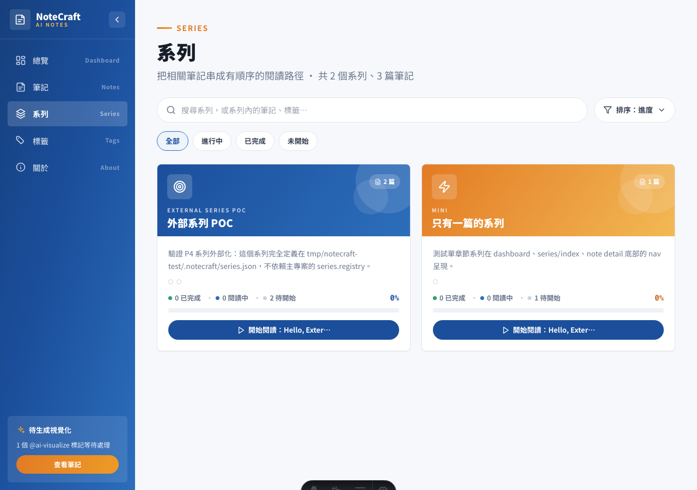

<!--
  截圖用相對路徑，GitHub 直接 render；npm.js 會依 package.json.repository 欄位
  自動 rewrite 成 raw.githubusercontent.com 對應路徑。所以只要記得 publish 前把
  package.json 的 repository 填成真實 GitHub URL 就行。
-->

# NoteCraftApp

**在任何專案下用 `npx` 啟動漂亮的 UI 讀取、編輯 md/mdx 資料夾。**

<p>
  <a href="https://www.npmjs.com/package/notecraftapp"></a>
  <a href="#系統需求"></a>
  <a href="#license"></a>
</p>


---

## 為什麼要 NoteCraftApp

任何專案的 `./docs`、`./notes`、`./content` 資料夾裡塞了一堆 md/mdx，卻沒有一個順手的介面看它們？NoteCraftApp 讓你**一行指令**在瀏覽器打開該資料夾，享受：

- 儀表板 — 統計 / 最近更新 / 標籤分布 / 系列進度
- 巢狀資料夾原生支援 — `guides/oauth/flow.mdx` 直接對到 `/notes/guides/oauth/flow`
- 缺 frontmatter 也能顯示 — 標題從 H1 或檔名抓、日期從檔案 mtime 抓
- MDX 相對圖片路徑（``）自動解析
- 「系列」定義（多份筆記串成有順序的閱讀路徑）
- HMR 寫入 — 在 UI 新增/編輯/刪除筆記、瀏覽器即時反映

---

## Quick Start

在你的 md/mdx 資料夾所在專案下：

```bash
# 一次性檢視（推薦）
npx notecraftapp view ./docs

# 或全域安裝
npm install -g notecraftapp
notecraftapp view ./docs
```

首次執行會複製套件到 `~/.notecraft/app-<version>/` 並跑一次 `npm install`（~30 秒）。之後每次啟動秒開。

---

## 三個子命令

### `notecraftapp view <dir>`

啟動 Astro dev server，HMR + 可寫入。**新增/編輯/刪除筆記瀏覽器即時反映**。

適合：邊寫邊看、快速迭代、日常使用。


### `notecraftapp build <dir>`

把該資料夾 build 成靜態 HTML，產物在 `~/.notecraft/cache/<hash>/dist/`。有快取失效偵測（mtime / fileCount / config），改了東西下次自動 rebuild。

適合：CI、生成後想部署到別的地方。

### `notecraftapp serve <dir>`

靜態伺服器，服務 `build` 產物的 dist。**純唯讀**——沒有寫入 API，「新增筆記」按鈕自動隱藏。仍然掛 `/notes-assets/*` 讓相對圖片正常顯示。

適合：內部團隊分享、Demo 站、放到內網。

---

## 進階

### Frontmatter：全 optional

不用任何 frontmatter 也能 render；缺什麼欄位自動補：

| 欄位          | Fallback 策略                       |
| :------------ | :---------------------------------- |
| `title`       | 內文第一個 `# H1` → 檔名 Title Case |
| `description` | 內文第一段前 220 字                 |
| `createdAt`   | 檔案 birthtime → mtime              |
| `updatedAt`   | 檔案 mtime                          |
| `tags`        | 空陣列                              |

一份純 markdown 也能顯示：

```md
# 我的筆記

隨手寫的第一段就是 description。
```

### 系列（可選）：`.notecraft/series.json`

在 notes 資料夾放一個 `.notecraft/series.json`，串多篇筆記成有順序的閱讀路徑：

```jsonc
{
  "series": [
    {
      "id": "auth-guide",
      "title": "驗證機制指南",
      "eyebrow": "AUTH GUIDE",
      "description": "從 session 到 OAuth 的完整路徑",
      "accent": "blue",
      "icon": "target",
      "slugs": [
        "auth/basic",
        "auth/session-cookie",
        "auth/jwt",
        "auth/oauth-flow",
      ],
    },
  ],
}
```

- `accent`：`"blue" | "orange" | "navy"`
- `icon`：`"target" | "code" | "layers" | "bookOpen" | "bolt"`
- `slugs`：檔案相對 notes 資料夾的路徑（去副檔名），順序即章節順序



沒有 `series.json` 就沒事，`/series` 頁只顯示引導文案。

### 巢狀資料夾

Slug 保留階層：

| 檔案                    | URL                        |
| :---------------------- | :------------------------- |
| `hello.mdx`             | `/notes/hello`             |
| `guides/setup.mdx`      | `/notes/guides/setup`      |
| `guides/oauth/flow.mdx` | `/notes/guides/oauth/flow` |

### 圖片：直接寫相對路徑

MDX 或 md 內 `` / `` 都會被自動 rewrite 成 `/notes-assets/*` URL，由內建靜態伺服器從你的 notes 資料夾直接送。

支援 png / jpg / svg / webp / gif / avif / ico / pdf。

### 寫入 UI

`view` 模式下右上角「+ 新增筆記」按鈕會出現，可以：

- 建立新筆記（自動 slug、frontmatter 模板）
- 編輯標籤（chip 介面 + 標籤自動完成）
- 刪除筆記
- 「以 VS Code 編輯」快速跳轉


寫入路徑安全：

- API 只綁定 `127.0.0.1`，拒絕外部連線
- 所有路徑走 `path.resolve` + prefix 檢查 + `fs.realpath` symlink 防護
- 一律鎖定在你指定的 notes 資料夾底下

---

## CLI Flags

### `view` 與 `serve` 共通

| Flag         | 預設        | 說明                              |
| :----------- | :---------- | :-------------------------------- |
| `--port <n>` | `4321`      | 伺服器 port                       |
| `--host <h>` | `127.0.0.1` | 綁定 host（`0.0.0.0` 曝光到 LAN） |

### 額外

| Flag        | 適用命令      | 說明                   |
| :---------- | :------------ | :--------------------- |
| `--no-open` | serve         | 不自動開瀏覽器         |
| `--rebuild` | build / serve | 強制 rebuild，忽略快取 |

---

## 快取

| 位置                                   | 用途                                 |
| :------------------------------------- | :----------------------------------- |
| `~/.notecraft/app-<version>/`          | 套件穩定執行位置（首次執行複製過去） |
| `~/.notecraft/cache/<sha1(notesDir)>/` | 每個 notes 資料夾一份 build 快取     |
| `~/.notecraft/cache/<hash>/meta.json`  | 快取失效判斷用                       |

清乾淨：`rm -rf ~/.notecraft/`

---

## 系統需求

- **Node.js ≥ 22**
- macOS / Linux（Windows 尚未驗證，可能有路徑問題）

---

## 開發者

想改 CLI 本身或 UI，把 repo clone 下來後：

```bash
npm install
npm run dev                                # astro dev（主專案筆記）
npm run viewer:view -- tmp/notecraft-test  # CLI 走本地 dev 模式
```

CLI 偵測到 `.git` 就會跳過套件複製、直接從當前 repo 執行。詳見 [CLAUDE.md](./CLAUDE.md) 與 [docs/notecraft-npx-viewer.md](./docs/notecraft-npx-viewer.md)。

---

## Roadmap（v1.1+）

- 寫入 UI 支援子資料夾新增
- pagefind 全文搜尋
- 背景 rebuild + SSE reload（免重啟即時反映）
- Windows 完整支援
- 支援 `.notecraft/config.json`（主題、預設 port、隱藏某些筆記）
- 一鍵包成靜態站部署（GitHub Pages / Netlify / Vercel）

---

## License

MIT — 見 [LICENSE](./LICENSE)（TODO：待補）
