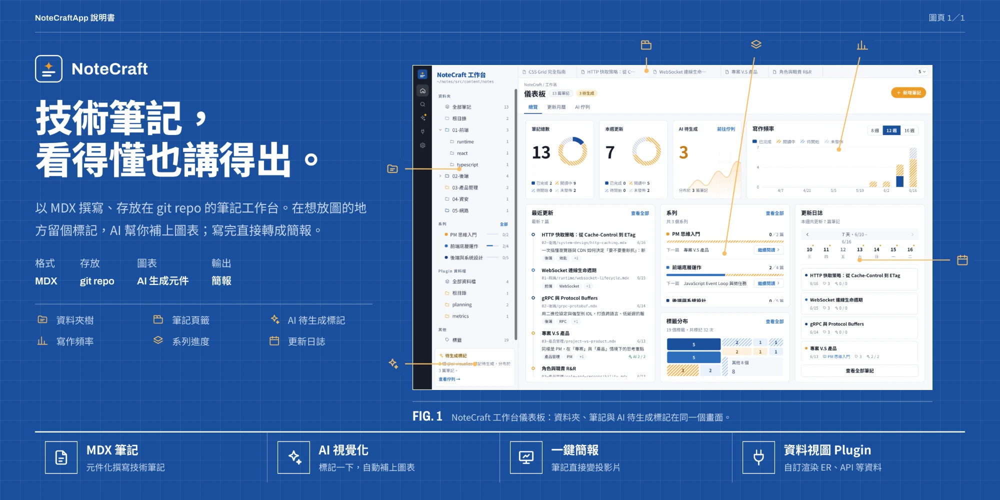
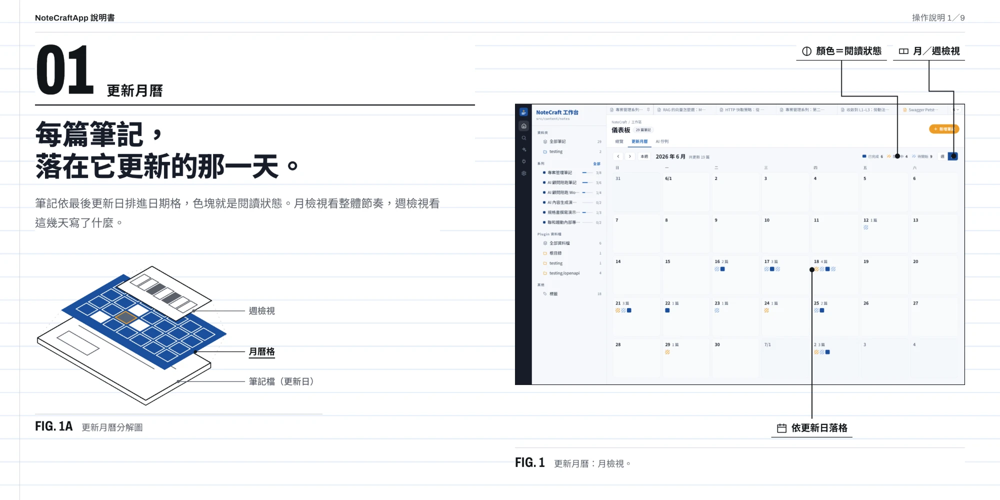
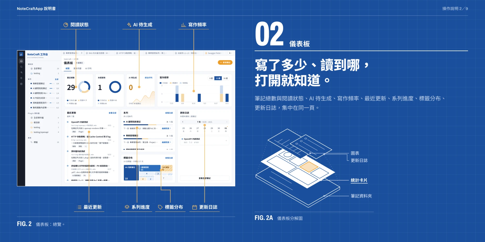
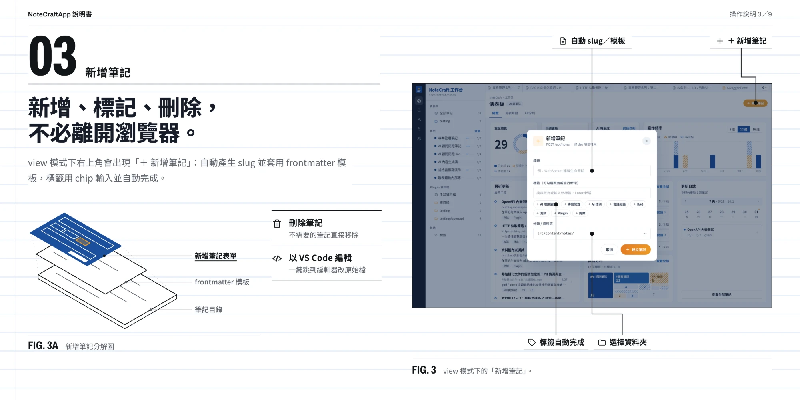
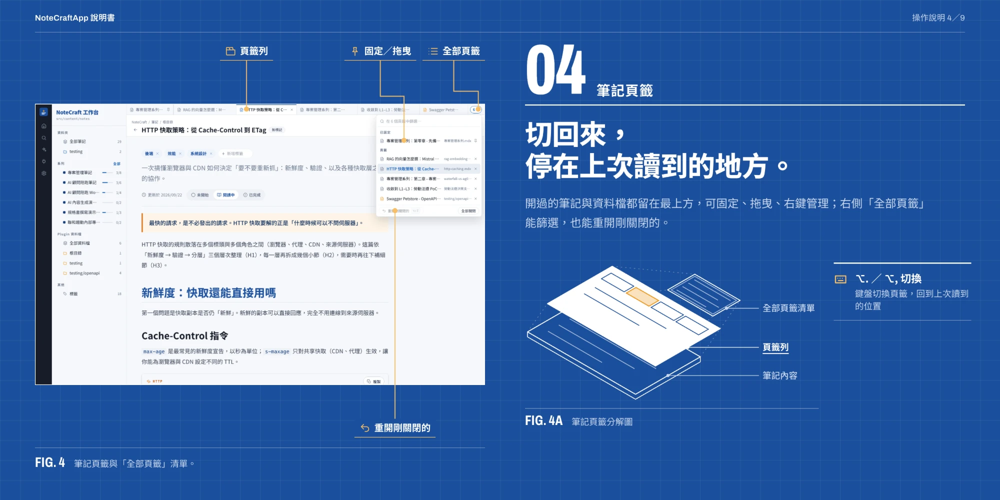
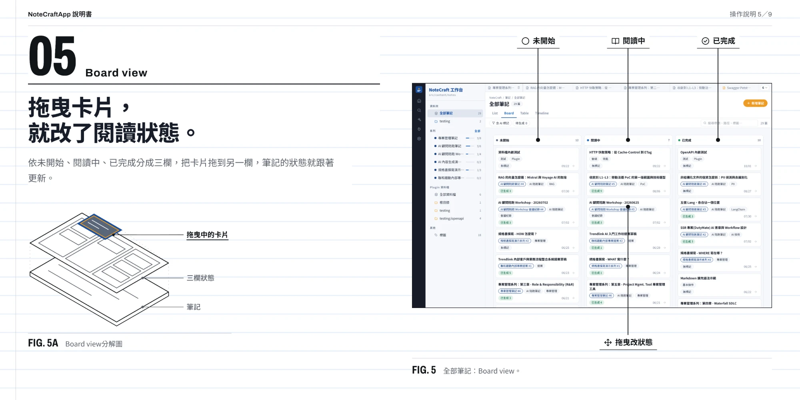
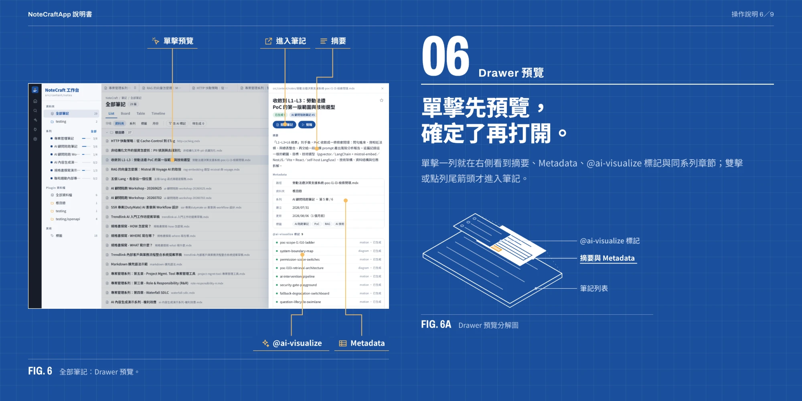
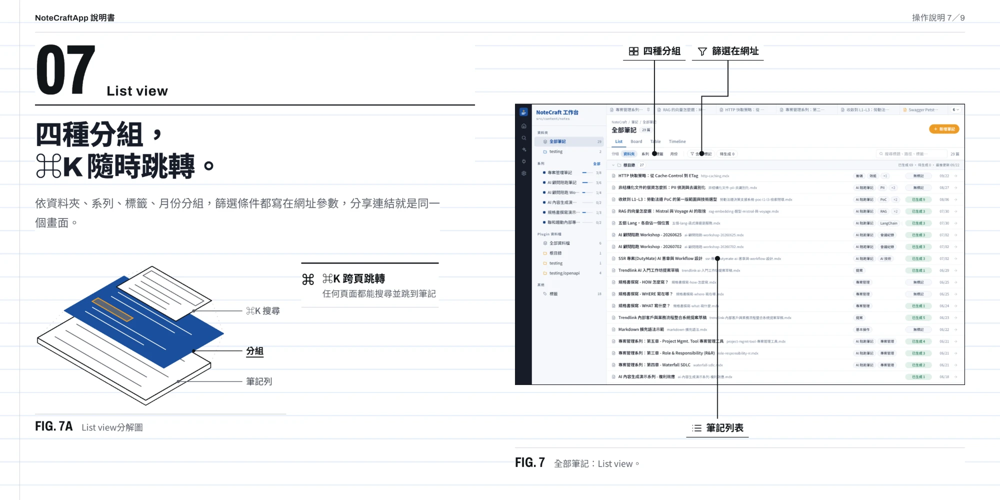
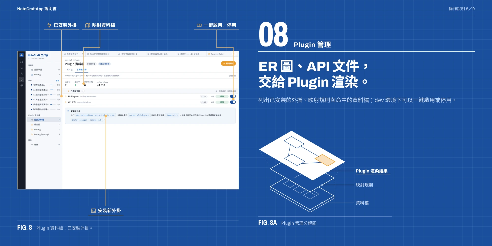
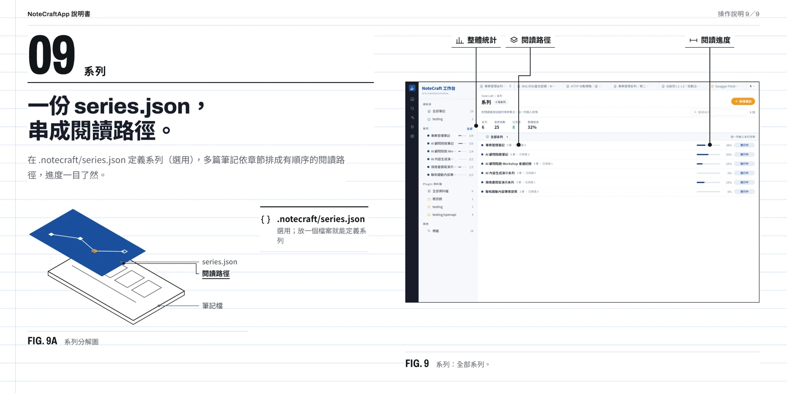

<!--
  截圖用相對路徑，GitHub 直接 render；npm.js 會依 package.json.repository 欄位
  自動 rewrite 成 raw.githubusercontent.com 對應路徑。所以只要記得 publish 前把
  package.json 的 repository 填成真實 GitHub URL 就行。
-->

<div align="center">
  
  <h1>NoteCraftApp</h1>
  <br />
  <p>
    <b>
      由 AI 生成視覺化與動態互動元件、嵌入筆記的個人筆記 Web App。以 Astro + MDX 為核心，用 <code>npx</code> 一行指令就能在任何 md／mdx 資料夾啟動三欄工作台；搭配 Claude Code，把筆記裡的標記自動變成互動圖表，還能一鍵轉成簡報。
    </b>
    <br />
    <a href="https://stevelin100132.github.io/notecraft/">Website</a> |
    <a href="https://stevelin100132.github.io/notecraft/docs/">Documentation</a> |
    <a href="https://stevelin100132.github.io/">About Author</a>
  </p>
  <br />
  <div>
    <a href="https://www.npmjs.com/package/notecraftapp"></a>
    <a href="#系統需求"></a>
    
    
    
    
    <a href="#license"></a>
    <a href="https://visitorbadge.io/status?path=https%3A%2F%2Fgithub.com%2FSteveLin100132%2Fnotecraft"></a>
  </div>
</div>
<br />



NoteCraftApp 是一款為寫技術筆記的人打造的筆記工作台。它直接讀你專案裡的 md／mdx 資料夾，提供資料夾樹、四種筆記檢視、系列閱讀進度、⌘K 全站搜尋與多筆記頁籤；在 MDX 裡用 `@ai-visualize` 標記描述想要的圖，Claude Code 就會生成 React 互動元件並寫回筆記。同一份筆記還能一鍵轉成簡報，結構化的 JSON 資料檔（ER 圖、OpenAPI 文件）則交給可安裝的 plugin 渲染。寫筆記、補圖表、轉簡報，都在同一本筆記裡完成。

**完整說明請看 [使用文件](https://stevelin100132.github.io/notecraft/docs/)**：安裝、設定、各項功能的用法與 CLI 參考都在那裡。

---

## 功能

- **工作台** — Rail＋檔案樹 Sidebar＋主區三欄；筆記列表有 List／Board／Table／Timeline 四種 view 與 Drawer 預覽，`⌘K` 跨頁跳轉。→ [工作台](https://stevelin100132.github.io/notecraft/docs/guides/notes-list/)
- **儀表板與更新月曆** — 閱讀狀態、AI 待生成、寫作頻率、系列進度、標籤分布、更新日誌。→ [儀表板](https://stevelin100132.github.io/notecraft/docs/guides/dashboard/)
- **AI 視覺化** — 在 MDX 用 `@ai-visualize` 描述想要的圖，Claude Code 生成 React 互動元件並寫回筆記；驗證沒過不寫回。→ [AI 視覺化](https://stevelin100132.github.io/notecraft/docs/guides/ai-markers/)
- **放大檢視** — 寬元件搬進可平移縮放的全螢幕畫布，互動完整保留，可匯出 PNG。→ [放大檢視](https://stevelin100132.github.io/notecraft/docs/guides/zoom/)
- **筆記轉簡報** — 一篇筆記變成 16:9 多頁簡報，筆記裡的互動元件原樣搬進投影片。→ [筆記轉簡報](https://stevelin100132.github.io/notecraft/docs/guides/deck/)
- **系列與頁籤** — 多篇筆記串成有順序的閱讀路徑；開過的筆記留下頁籤，切回來停在上次讀到的位置。→ [系列](https://stevelin100132.github.io/notecraft/docs/guides/series/)
- **Plugin** — ER 圖、OpenAPI 這類結構化 JSON 交給可安裝的渲染器畫成頁面。→ [Plugin](https://stevelin100132.github.io/notecraft/docs/guides/plugin-install/)
- **零鎖定** — 讀的是你現有的資料夾，產出是純靜態網站，生成的元件是 repo 裡的原始碼。

---

## 操作說明

### 01 更新月曆 — 每篇筆記，落在它更新的那一天



筆記依最後更新日排進日期格，色塊就是閱讀狀態；月檢視看整體節奏，週檢視看這幾天寫了什麼。→ [儀表板](https://stevelin100132.github.io/notecraft/docs/guides/dashboard/)

### 02 儀表板 — 寫了多少、讀到哪，打開就知道



筆記總數與閱讀狀態、AI 待生成、寫作頻率、最近更新、系列進度、標籤分布、更新日誌，集中在同一頁。→ [儀表板](https://stevelin100132.github.io/notecraft/docs/guides/dashboard/)

### 03 新增筆記 — 新增、標記、刪除，不必離開瀏覽器



`view` 模式下右上角會出現「+ 新增筆記」：自動產生 slug 並套用 frontmatter 模板，標籤用 chip 輸入並自動完成。→ [在工作台編輯](https://stevelin100132.github.io/notecraft/docs/guides/editing/)

### 04 筆記頁籤 — 切回來，停在上次讀到的地方



開過的筆記與資料檔都留在最上方，可固定、拖曳、右鍵管理；右側「全部頁籤」能篩選，也能重開剛關閉的。→ [頁籤](https://stevelin100132.github.io/notecraft/docs/guides/tabs/)

### 05 Board view — 拖曳卡片，就改了閱讀狀態



依未開始、閱讀中、已完成分成三欄，把卡片拖到另一欄，筆記的狀態就跟著更新。→ [筆記列表](https://stevelin100132.github.io/notecraft/docs/guides/notes-list/)

### 06 Drawer 預覽 — 單擊先預覽，確定了再打開



單擊一列就在右側看到摘要、Metadata、`@ai-visualize` 標記與同系列章節；雙擊或點列尾箭頭才進入筆記。→ [筆記列表](https://stevelin100132.github.io/notecraft/docs/guides/notes-list/)

### 07 List view — 四種分組，⌘K 隨時跳轉



依資料夾、系列、標籤、月份分組，篩選條件都寫在網址參數，分享連結就是同一個畫面。→ [⌘K 搜尋](https://stevelin100132.github.io/notecraft/docs/guides/palette/)

### 08 Plugin 管理 — ER 圖、API 文件，交給 Plugin 渲染



列出已安裝的外掛、映射規則與命中的資料檔；dev 環境下可以一鍵啟用或停用。→ [Plugin](https://stevelin100132.github.io/notecraft/docs/guides/plugin-install/)

### 09 系列 — 一份 series.json，串成閱讀路徑



在 `.notecraft/series.json` 定義系列（選用），多篇筆記依章節排成有順序的閱讀路徑，進度一目了然。→ [系列](https://stevelin100132.github.io/notecraft/docs/guides/series/)

---

## Quick Start

在你的 md／mdx 資料夾所在專案下：

```bash
# 開啟工作台（HMR＋可寫入）
npx notecraftapp view ./docs

# 要用 AI 視覺化與筆記轉簡報：把 skill 與 subagent 裝進專案的 .claude/
npx notecraftapp init-skill

# 要渲染 ER 圖或 OpenAPI 文件：從官方 store 裝 plugin
npx notecraftapp install-plugin
```

首次執行會複製套件到 `~/.notecraft/app-<version>/` 並跑一次 `npm install`（約 30 秒），之後每次啟動秒開。
五個子命令與全部參數見 [CLI 參考](https://stevelin100132.github.io/notecraft/docs/reference/cli/)。

---

## 排除檔案

筆記資料夾裡有不想讓 NoteCraft 讀的東西（草稿、私人筆記、測試用的大 JSON），在 `.notecraft/ignore.json` 寫規則，語法同 `.gitignore`：

```json
{
  "$schema": "https://cdn.jsdelivr.net/npm/notecraftapp/schemas/ignore.schema.json",
  "ignore": [
    "drafts/",
    "**/*.private.md",
    "CHANGELOG.md",
    "archive/*",
    "!archive/keep-this.mdx"
  ]
}
```

| 寫法 | 意義 |
| --- | --- |
| `CHANGELOG.md` | 不含 `/`：任何深度的同名檔或資料夾 |
| `/README.md` | 開頭 `/`：只比對筆記資料夾根目錄 |
| `drafts/` | 結尾 `/`：只比對資料夾，整棵子樹排除 |
| `*.test.mdx`、`**/tmp/` | `*`、`?`、`[abc]` 不跨層，`**` 跨任意層 |
| `!archive/keep-this.mdx` | 把先前排除的納回，後寫的勝 |
| `# 說明` | 註解 |

- 路徑相對筆記資料夾；`ignore.json` 與 `plugins.json` 放在同一個 `.notecraft/`（執行 `npx notecraftapp` 的資料夾）
- 被排除的檔**完全不讀**：不成為筆記、不被 plugin 認領、不出現在資料夾樹與新增筆記的選單、圖片不複製進產物、改了也不觸發 rebuild
- `.` 開頭的檔案與資料夾、`node_modules/`、`dist/` 一律排除，不必寫，也無法用 `!` 解除
- 資料夾整個被排除後，裡面的檔用 `!` 救不回（同 git）：要保留 `archive/` 裡的一篇，寫 `archive/*` 而不是 `archive/`
- 改了 `ignore.json` 會自動生效（`view` 重啟 dev server、`serve` 重新 build）；格式寫錯會讓 build 失敗並指出哪一條
- **它不是存取控制**：被排除的檔仍在硬碟上、仍會被 git commit；它保證的是 build 產物（`dist/`）裡沒有它們

---

## 系統需求

- **Node.js ≥ 22**
- macOS／Linux／Windows（Windows 11 已驗證 `view`、`build`、`serve`、`init-skill`、`install-plugin`）
- AI 視覺化與筆記轉簡報另需 [Claude Code](https://claude.com/claude-code)

---

## 開發者

想改 CLI 本身或 UI，見 [參與開發](https://stevelin100132.github.io/notecraft/docs/resources/contributing/)、[CLAUDE.md](./CLAUDE.md) 與 [CHANGELOG.md](./CHANGELOG.md)。

---

## License

MIT — 見 [LICENSE](./LICENSE)
