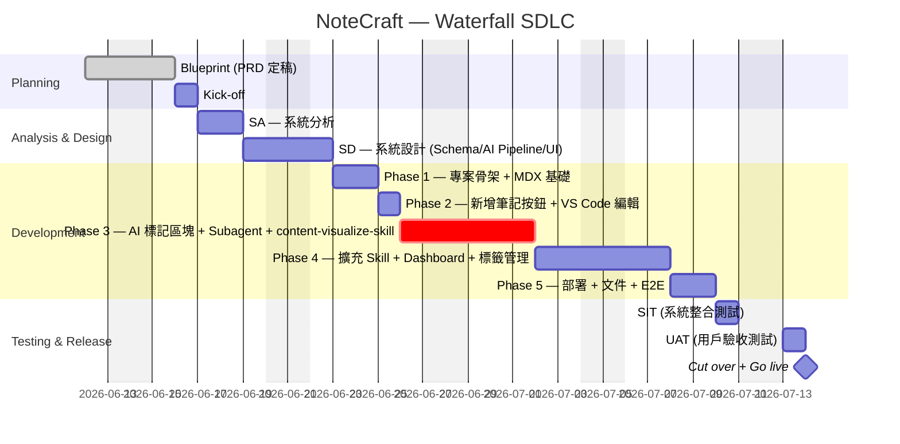

# NoteCraft — AI 互動筆記 Web App

以 Astro + MDX 為核心、結合 AI Agent 與 Skill 自動生成視覺化與動態互動效果的筆記系統，讓知識學習不再是枯燥的文字堆疊，而是能被「看見」與「操作」的體驗

## Project Requirement Document (PRD)

## 1. Document Information（文件資訊）

參考 Front Matter 中的資訊，包含專案名稱、文件類型、版本、開發模式、技術選型、技術架構、部署平台、文件狀態、文件作者、審核人、建立日期和更新日期等基本資訊，以便於團隊成員了解文件的背景和版本狀況

---

## 2. Project Overview（專案概述）

### 2.1 問題背景

現有筆記工具在「知識的學習與內化」上有以下痛點：

- 表現形式單一 — 大多以純文字為主，遇到流程、架構、時間軸這類本質上是「圖」的知識，文字描述事倍功半
- 視覺化門檻高 — 想加入圖表、流程圖或動畫示意，往往需要切換到別的工具繪製、再貼回筆記，流程繁瑣且難以維護
- 編輯體驗與資料格式綁定 — 大多筆記服務使用私有格式或專屬編輯器，作者無法用熟悉的 VS Code 直接編輯，也難以版本控管
- AI 能力未被充分發揮 — 多數 AI 筆記只用 LLM 做摘要或潤稿，沒有讓 AI 進一步「具象化」知識內容

### 2.2 目標

提供一個以 [MDX 筆記](#mdx-筆記) 為原始檔、由 [AI Agent](#ai-agent) 與 [Skill](#skill) 協助生成豐富 [視覺化](#視覺化) 與 [動態互動效果](#動態互動效果) 的筆記 Web App。作者只需用 VS Code 撰寫筆記、在筆記中放入 [AI 標記區塊](#ai-標記區塊)，系統便能在建構階段由 AI 讀取提示詞、自由發想並產出對應的元件，最終以靜態網頁部署於 Netlify，兼顧開發者體驗、學習效果與部署成本

---

## 3. User Roles（使用者角色）

### 3.1 角色定義

系統不設登入，所有使用者皆為同一角色：

- [筆記用戶](#筆記用戶)：同時也是開發者，使用 VS Code 撰寫 MDX 筆記、在筆記中放入 [AI 標記區塊](#ai-標記區塊)、透過 [AI Agent](#ai-agent) 觸發視覺化生成，並以 Astro build 後部署到 Netlify。具有對所有筆記與系統功能的完整權限

### 3.2 角色權限定義

由於系統為單一使用者場景（個人筆記）、不設登入，本節不再細分權限矩陣。所有功能對 [筆記用戶](#筆記用戶) 皆為 R/W/E/D

---

## 4. Project Scope（專案範圍）

### 4.1 核心目標

1. 提供以 Astro 為框架、MDX 為原始檔的筆記 Web App 骨架，讓 [筆記用戶](#筆記用戶) 可用熟悉的 VS Code 直接編輯筆記原始檔
2. 提供 [Dashboard](#dashboard-頁面) 頁面，左側有功能選單、右側顯示筆記統計（總數、最近更新、含 AI 標記數量等），作為整體導覽入口
3. 提供 [筆記列表](#筆記列表頁面) 與 [筆記檢視](#筆記檢視頁面) 頁面，支援瀏覽、搜尋、依標籤過濾
4. 提供「新增筆記」按鈕，於 Dashboard 與筆記列表頁顯示，點擊後彈出表單輸入標題 / 標籤 / 分類，由本機 dev server 直接在對應目錄建立含預設 frontmatter 與 [AI 標記區塊](#ai-標記區塊) 範本的 MDX 檔案，[筆記用戶](#筆記用戶) 不需了解目錄結構也能新增筆記
5. 提供「以 VS Code 編輯」按鈕，在筆記檢視頁面顯示，點擊後透過 `vscode://` URL scheme 喚起本機 VS Code 直接開啟對應 MDX 檔
6. 提供一組 [AI Subagent](#ai-subagent) 與 [Skill](#skill)，能掃描筆記中的 [AI 標記區塊](#ai-標記區塊)，依提示詞自由生成 [視覺化](#視覺化)（Table、Chart、Flow、Timeline 等 Diagram）與 [動態互動效果](#動態互動效果)（以 `motion`（Framer Motion） 為主）對應的元件並嵌入 MDX
7. 提供標籤管理功能：在 [標籤索引與管理頁面](#標籤索引與管理頁面) 進行全站範圍的標籤新增 / 重新命名 / 刪除（dev-only，批次修改受影響 MDX）；在 [筆記檢視頁面](#筆記檢視頁面) 提供「編輯標籤」UI，讓作者直接在頁面上增刪某篇筆記的標籤，不需開啟 VS Code
8. 以 Netlify 靜態部署整個網站，build 階段完成所有 AI 生成的視覺化與互動，發佈後不需任何 Server / Function
9. \* 在 [筆記檢視頁面](#筆記檢視頁面) 底部提供「上一篇 / 下一篇」關聯筆記卡片導覽，依作者於 frontmatter 定義的 `series` / `order` 手動序列計算前後篇，方便讀者在同一系列筆記間連續閱讀
10. \* 為每個嵌入筆記的 [Generated 元件](#generated-元件) 套上統一的外框卡片（顯示視覺化類型、來源檔名與選用說明文字），由 AI Pipeline 在寫回 MDX 時自動包裹，不影響元件本身的互動 / 動畫效果
11. \* 在 [筆記列表頁面](#筆記列表頁面) 提供排序控制，可依建立時間 / 更新時間 / 標題切換，並支援升冪 / 降冪
12. \* 在 dev 環境提供「刪除筆記」UI（[筆記檢視頁面](#筆記檢視頁面) / [筆記列表頁面](#筆記列表頁面)），刪除筆記 MDX 的同時，連帶移除「僅被該筆記引用」的 AI [Generated 元件](#generated-元件)；正式環境完全隱藏
13. \* 在 [新增筆記功能（按鈕）](#新增筆記功能按鈕) 的標籤欄位提供複選選單，列出全站既有標籤供勾選，並允許自行輸入新標籤
14. \* 為 [AI 生成內容外框卡片](#ai-生成內容外框卡片) 增加「複製提示詞」功能，讀者 / 作者可一鍵複製生成該元件的 `prompt`；對應 Skill 與 Subagent 在寫回時將 `prompt` 帶入 `GeneratedFrame`
15. \* 提供可收合的側邊欄（[側邊欄收合](#側邊欄收合sidebar-collapse)）：桌面可在「完整 / icon 細條」間切換並記住偏好；平板與手機預設收合為 off-canvas 抽屜，靠漢堡鈕開啟
16. \* 提供筆記收藏（[筆記收藏](#筆記收藏favorites)）：筆記卡片與檢視頁可用星號收藏 / 取消，收藏狀態存於瀏覽器 localStorage（正式環境亦可用），並在 [筆記列表頁面](#筆記列表頁面) 提供「只看收藏」篩選
17. \* 提供「系列」功能：以集中式 [系列登錄](#系列資料模型series-data-model) 把相關筆記串成有順序的閱讀路徑，於 [系列總覽頁面](#系列總覽頁面series-overview)（`/series`）瀏覽 / 模糊查詢 / 篩選排序、於 [系列詳情頁面](#系列詳情頁面series-detail)（`/series/[id]`）檢視逐章清單與整體進度
18. \* 提供個人化「閱讀進度」（待開始 / 閱讀中 / 已完成，存於瀏覽器 localStorage、正式環境亦可用）：筆記檢視頁可手動切換並於開啟時輕量自動轉為「閱讀中」，列表卡與 Dashboard 顯示進度，未發佈筆記不可追蹤且不計入系列進度（詳見 [閱讀進度與系列彙總](#閱讀進度與系列彙總reading-progress)）
19. \* 提供類 Material for MkDocs 的 [Markdown 擴充語法](#markdown-擴充語法admonitions--content-tabs--tooltips)：[Admonitions](#admonitions)（提示 / 警告框、可收合）、[Content tabs](#content-tabs)（內容分頁）、[Tooltips](#tooltips)（行內提示），以 `remark-directive` 於 build 階段渲染、樣式遵循 [trendlink-design](#skills)，正式環境同樣可用
20. \* 提供類 Material for MkDocs 的 [程式碼區塊增強](#程式碼區塊增強code-block-enhancements)：行號、檔名標題、一鍵複製、行 highlight、可展開的 [Code annotations](#code-annotations)（行內編號標記 → 點擊展開說明），以 `astro-expressive-code` 於 build 階段渲染、樣式遵循 [trendlink-design](#skills)，正式環境同樣可用
21. \* 提供 [Markdown 擴充語法 — Badge](#markdown-擴充語法badge)：行內標籤元件，支援多種 variant（語意色 × `outline` / `solid` 樣式），重用 [Task 14](#markdown-擴充語法admonitions--content-tabs--tooltips) 的 `remark-directive` 底座，純 CSS、零 JS，正式環境同樣可用
22. \* 提供 [Markdown 擴充語法 — Steps](#markdown-擴充語法steps)：條列「步驟」內容，支援 `horizontal` 與 `vertical`（預設）兩種版型，重用 `remark-directive` 底座，純 CSS / 漸進增強，正式環境同樣可用

### 4.2 非目標（Out of Scope）

- 不提供登入、註冊、權限分級
- 不提供線上所見即所得（WYSIWYG）編輯器，編輯一律透過 VS Code
- 不提供執行時的 AI 互動（如線上問答），AI 僅在 build 前/build 階段運作
- 不預先建立「視覺化元件庫」限制 AI 表現，元件由 AI 依筆記內容自由生成

---

## 5. Site Map（網站地圖）

```
NoteCraft
├── /                       Dashboard（首頁，功能選單 + 統計）
├── /notes                  筆記列表頁面
├── /notes/[slug]           筆記檢視頁面（含「以 VS Code 編輯」按鈕）
├── /series                 系列總覽頁（所有系列 + 模糊查詢 + 篩選排序 + 進度）
├── /series/[id]            系列詳情頁（Hero + 整體進度 + 逐章清單）
├── /tags                   標籤索引頁
└── /about                  系統說明（簡單靜態頁，內容為一個 MDX，不需獨立 Spec）
```

---

## 6. Business Flow（業務流程）

### 6.1 整體業務循環（一份筆記的生命週期）


**週期說明**

1. **建立**：用戶在 Dashboard 或筆記列表點擊「新增筆記」按鈕，填寫標題與標籤，由 dev server API 在對應目錄建立含範本的 MDX 檔
2. **撰寫**：以 VS Code 自由撰寫文字內容
3. **標記**：在需要圖、動畫、互動的位置填入 AI 標記區塊及提示詞
4. **生成**：作者在 Claude Code 中以自然語言請 AI 處理該筆記（或全部筆記），Claude 依循 `content-visualize-skill` 的指引自行掃描標記、依決策樹判斷生成方式、產出元件並回寫 MDX，過程中可即時與作者來回討論調整
5. **檢視與調整**：若不滿意可重新調整提示詞、重跑生成
6. **發佈**：commit 後由 Netlify 自動 build & deploy

---

## 7. Specification（規格說明）

### 7.1 功能與規格描述

\* 表示追加的功能點，非核心目標

#### Dashboard 頁面

## 目標

提供 [筆記用戶](#筆記用戶) 進入系統後的第一個界面，左側為功能選單、右側為筆記狀態統計，作為瀏覽與導覽全站的入口

## 規格

- 頁面布局
  - 左側：固定寬度的功能選單（Dashboard / 筆記列表 / 標籤 / 關於）
  - 右側：主內容區，預設顯示統計與最近更新
- 統計區塊
  - 顯示筆記總數
  - 顯示本週 / 本月新增筆記數
  - 顯示最近更新的 N 筆筆記（含標題、更新時間、標籤）
  - 顯示含 [AI 標記區塊](#ai-標記區塊) 的筆記數量，以及其中已生成 / 未生成的比例
  - 顯示標籤分布（前 10 大標籤與筆數）
- 統計來源
  - 所有統計皆於 `astro build` 階段透過 Content Collections 掃描所有 MDX 計算，輸出為 JSON，前端直接讀取，無需執行時 API

## 卡控機制

- 無，純讀取頁面

## 驗收標準

| Scenario             | Given                              | When         | Then                                                |
| -------------------- | ---------------------------------- | ------------ | --------------------------------------------------- |
| 成功進入 Dashboard   | 用戶開啟網站根路徑                 | 載入頁面     | 顯示左側選單與右側統計、最近更新筆記                |
| 統計即時反映新筆記   | 用戶新增一筆筆記並重新 build       | 重新載入頁面 | 統計區塊中的筆記總數、最近更新清單包含新增的筆記    |
| 點擊最近更新可進入筆記 | 用戶在 Dashboard 看到最近更新筆記 | 點擊任一項   | 導向對應 `/notes/[slug]` 筆記檢視頁面               |

#### 側邊欄收合（Sidebar collapse）（\*）

## 目標

讓全站共用的左側側邊欄（Sidebar）可被收合，桌面在「完整 / icon 細條」間切換以擴大內容區，平板與手機則預設收起為 off-canvas 抽屜以節省寬度；偏好記憶於瀏覽器，正式環境同樣可用

## 規格

- 三種斷點行為（以 viewport 寬度區分；建議閾值 `1024px`）：
  - **桌面（> 1024px）**：Sidebar 常駐，可在兩種型態切換並記住偏好
    - 完整（預設）：現行 248px，含 logo、文字選單、底部「待生成」卡
    - icon 細條（collapsed）：約 56px，僅留 icon；hover icon 顯示 tooltip 標籤；底部卡縮為單一 icon
    - 切換鈕：放在 Sidebar 頂部（或內容區左上），點擊在 完整 ⇄ 細條 間切換
  - **平板 / 手機（≤ 1024px）**：Sidebar **預設收合**為 off-canvas 抽屜（畫面外），內容區佔滿整寬
    - 內容區頂部顯示漢堡鈕；點擊由左側滑出抽屜（完整樣式）並蓋一層半透明遮罩（scrim）
    - 點遮罩、點選任一導覽項、或按 `Esc` 即關閉抽屜
- 狀態與記憶：
  - 桌面的「完整 / 細條」偏好存於 `localStorage`（如 `nc:sidebar=collapsed|expanded`）
  - 平板 / 手機抽屜開關為暫時狀態，不持久化；**預設收合**由斷點決定，不受桌面偏好影響
  - 為避免重新整理時的版面閃動（FOUC），在 `<head>` 以一小段 inline script 於首次繪製前依 localStorage / 螢幕寬度套上初始 class
- 無障礙：切換鈕 / 漢堡鈕具 `aria-label` 與 `aria-expanded`；抽屜開啟時可聚焦、可鍵盤關閉
- 實作面：Sidebar 目前為靜態 Astro 元件（含一段 inline `<script>`）；收合以**框架無關的 vanilla JS + CSS**（class 切換 + transition）實作，不必引入 React island。樣式遵循 [trendlink-design](#skills)，動畫 200–400ms ease-out 並尊重 `prefers-reduced-motion`

## 卡控機制

- 收合 / 展開為純前端 UI 狀態，無後端、無 API
- icon 細條型態下，導覽仍可用（icon 可點、tooltip 提示），不得讓任何導覽項無法存取
- 抽屜開啟時鎖定背景捲動（避免背景同時滾動）

## 驗收標準

| Scenario                       | Given                            | When                       | Then                                                          |
| ------------------------------ | -------------------------------- | -------------------------- | ------------------------------------------------------------- |
| 桌面切換 icon 細條             | 桌面寬度 > 1024px                | 點擊收合切換鈕             | Sidebar 縮為 icon 細條、內容區變寬；偏好寫入 localStorage     |
| 桌面偏好被記住                 | 已切換為 icon 細條               | 重新整理頁面               | 仍維持 icon 細條，且無明顯版面閃動                            |
| 平板 / 手機預設收合            | viewport ≤ 1024px                | 載入任一頁面               | Sidebar 預設不佔版面（抽屜收起），內容佔滿整寬，顯示漢堡鈕    |
| 漢堡開關抽屜                   | 手機載入頁面                     | 點漢堡 → 點遮罩 / 導覽項   | 抽屜滑出並蓋遮罩；點遮罩 / 導覽項 / Esc 後關閉                |
| icon 細條導覽仍可用            | Sidebar 為 icon 細條             | hover / 點任一 icon        | 顯示對應 tooltip 並可正常導向                                 |

## 待釐清

### Q1. 桌面與行動裝置的偏好是否共用一份狀態？

- [x] 不共用：桌面記「完整 / 細條」偏好；行動裝置一律預設抽屜收起、開關不持久化
- [ ] 共用單一 `collapsed` 旗標
- [ ] 其他

> 建議：不共用。桌面與行動的收合語意不同（細條 vs 抽屜），混用單一旗標會造成跨裝置體驗錯亂。

#### 筆記列表頁面

## 目標

提供 [筆記用戶](#筆記用戶) 瀏覽所有筆記、依標籤過濾、依關鍵字搜尋的入口

## 規格

- 以卡片或列表呈現所有 MDX 筆記，每項顯示：標題、摘要、標籤、更新時間
- 提供標籤過濾器（多選），點擊即過濾
- 提供關鍵字搜尋，搜尋範圍含 title、description、tags、內文
- 預設依更新時間倒序

## 驗收標準

| Scenario        | Given                  | When             | Then                                       |
| --------------- | ---------------------- | ---------------- | ------------------------------------------ |
| 列出所有筆記    | 用戶進入筆記列表       | 載入頁面         | 所有 MDX 筆記皆出現，並按更新時間倒序排列  |
| 依標籤過濾      | 用戶選擇一或多個標籤   | 套用過濾         | 只顯示含所有所選標籤的筆記                 |
| 依關鍵字搜尋    | 用戶輸入關鍵字         | 觸發搜尋         | 顯示 title/description/tags/內文符合的筆記 |

#### 筆記列表排序（\*）

## 目標

讓 [筆記用戶](#筆記用戶) 在 [筆記列表頁面](#筆記列表頁面) 自由切換排序依據與方向，快速找到最新建立、最近修改或依字序排列的筆記，補足原本僅「依更新時間倒序」的單一排序

## 規格

- 在列表頁的工具列（搜尋框 / 版型切換同列）新增「排序控制」，含兩個部分：
  - **排序欄位**（下拉或分段按鈕）：`建立時間`（createdAt）、`更新時間`（updatedAt）、`標題`（title）
  - **排序方向**（升冪 / 降冪切換鈕，icon 呈現）：時間欄位降冪＝新→舊，標題降冪＝Z→A / ㄗ→ㄅ
- 預設值：**更新時間 + 降冪**（維持現行 §筆記列表頁面「預設依更新時間倒序」的行為不變）
- 排序與既有的標籤過濾、關鍵字搜尋**疊加**：先過濾 / 搜尋，再對結果集排序
- 排序為純前端互動（list / grid 兩種版型皆套用），不需後端 API；資料於 `astro build` 時已含 `createdAt`、`updatedAt`、`title`
  - 字串日期（`YYYY-MM-DD`）採字典序比較即等同時間序；標題以 `localeCompare`（含中文）比較
- 排序狀態以 client 端 state 保存；切換不重新載入頁面。是否同步到 URL query（如 `?sort=createdAt&dir=asc`）列為加分項，見待釐清
- 視覺樣式遵循 [trendlink-design](#skills) 的分段按鈕 / 下拉與 pill 樣式，與既有版型切換鈕一致

## 卡控機制

- 標題排序需處理空標題與大小寫；採 `localeCompare` 並以穩定排序避免同鍵亂序
- 排序選項為固定列舉（三欄位 × 兩方向），不接受任意欄位，避免暴露非預期 frontmatter

## 驗收標準

| Scenario               | Given                          | When                       | Then                                                  |
| ---------------------- | ------------------------------ | -------------------------- | ----------------------------------------------------- |
| 預設排序維持現狀       | 用戶進入筆記列表未調整排序     | 載入頁面                   | 依更新時間降冪排列，與舊版行為一致                    |
| 依建立時間升冪排序     | 列表含多篇不同 createdAt 的筆記 | 選「建立時間」+「升冪」     | 筆記由最早建立到最新建立排列                          |
| 依標題排序             | 列表含多篇不同標題的筆記       | 選「標題」+「降冪」         | 筆記依標題字序（含中文 localeCompare）反向排列        |
| 排序與過濾疊加         | 用戶已選某標籤過濾             | 切換排序欄位 / 方向         | 僅對過濾後的結果重新排序，過濾條件不被清除            |

## 待釐清

### Q1. 排序狀態是否同步到 URL query？

- [x] 不同步（v1）：純前端 state，重新整理後回到預設
- [ ] 同步：寫入 `?sort=&dir=`，可分享 / 保留排序的連結
- [ ] 其他

> 建議：v1 先不同步，保持實作簡潔；若日後需要「可分享的排序連結」或與 `?tag=` 一致的行為，再補上 query 同步。

#### 筆記收藏（Favorites）（\*）

## 目標

讓使用者把喜歡的筆記加入「收藏」，並能在 [筆記列表頁面](#筆記列表頁面) 快速篩出收藏的筆記。收藏狀態存於瀏覽器 `localStorage`，**正式環境（Netlify 靜態站）亦可使用**，無需後端 API

## 規格

- 儲存方式：
  - 收藏狀態存於瀏覽器 `localStorage`（如鍵 `nc:favorites`，值為 slug 陣列的 JSON）
  - 以筆記 `slug` 為識別；純前端、即時生效、無 API；屬「每台裝置 / 瀏覽器各自獨立」（見待釐清）
- 收藏切換 UI（星號）：
  - [筆記列表頁面](#筆記列表頁面) 的每張卡片（grid / list 兩種版型）右上角顯示星號 icon；未收藏為空心、已收藏為實心 + 強調色（遵循 [trendlink-design](#skills)）
  - [筆記檢視頁面](#筆記檢視頁面) 頁首動作區亦顯示一個收藏切換鈕（方便閱讀當下收藏）
  - 點擊切換收藏 / 取消；切換僅改變 localStorage 與當前 UI，不導頁、不影響筆記內容
  - 卡片上的星號點擊需 `stopPropagation`，避免觸發整張卡片的連結跳轉
- 收藏篩選：
  - [筆記列表頁面](#筆記列表頁面) 工具列新增「只看收藏」切換（星號 toggle 或分段鈕）
  - 啟用時只顯示目前收藏的筆記；與既有標籤過濾、關鍵字搜尋、排序**疊加**
  - 收藏清單為空且啟用篩選時，顯示空狀態提示（如「尚無收藏，點卡片上的星號加入」）
- 一致性：
  - 列表頁與檢視頁的收藏狀態以同一份 localStorage 為準；同分頁內切換即時反映（可用自訂事件 / storage 事件同步多開分頁，列為加分）
  - 讀取時以「目前實際存在的筆記 slug」過濾，忽略已刪除 / 改名造成的孤兒 slug（顯示時清掉即可）
- 實作面：收藏為 client 專屬狀態，需在 React island（列表卡片、檢視頁鈕）以 `useState` + `localStorage` 管理；SSR 時預設未收藏、hydration 後再依 localStorage 修正（注意避免 hydration mismatch，初始以未收藏渲染、`useEffect` 內讀取）

## 卡控機制

- 純前端、無後端；收藏不寫入 MDX、不進 git、不參與 `astro build` 階段的 Dashboard 統計（統計為 build-time 預計算，無法反映各裝置的 localStorage）
- localStorage 不可用（隱私模式 / 關閉）時，收藏功能優雅降級：當下 session 內仍可切換，重整後不保留，不報錯
- 星號點擊不得觸發卡片導頁（事件冒泡需阻擋）

## 驗收標準

| Scenario                   | Given                                | When                       | Then                                                       |
| -------------------------- | ------------------------------------ | -------------------------- | ---------------------------------------------------------- |
| 卡片收藏切換               | 列表頁某卡片未收藏                   | 點該卡片右上星號           | 星號變實心、寫入 localStorage；不觸發卡片導頁              |
| 收藏狀態跨頁一致           | 在檢視頁收藏某筆記                   | 回到列表頁                 | 該筆記卡片星號為已收藏                                     |
| 只看收藏篩選               | 已收藏數篇筆記                       | 開啟「只看收藏」           | 僅顯示收藏的筆記，與標籤 / 搜尋 / 排序可疊加               |
| 收藏為空的篩選空狀態       | 沒有任何收藏                         | 開啟「只看收藏」           | 顯示空狀態提示，不顯示任何卡片                             |
| 重新整理後保留收藏         | 已收藏若干筆記                       | 重新整理頁面               | 收藏狀態依 localStorage 還原                               |
| 正式環境可收藏             | Netlify 上的靜態站                   | 點星號收藏                 | 收藏正常運作（localStorage），無需任何 API                |

## 待釐清

### Q1. 收藏資料儲存位置？

- [x] `localStorage`（用戶裝置端）：正式環境可用、零 API、即時；但每台裝置 / 瀏覽器各自獨立、不進 git、換裝置不同步
- [ ] 寫回 frontmatter（透過 dev API）：永久 / 進 git / 跨裝置一致、可進 Dashboard 統計；但僅 dev 可收藏，讀者端不可用
- [ ] 其他

> 已收斂：採 `localStorage`。本功能定位為「讀者 / 使用者快速收藏」，需在正式環境可用且零成本；持久跨裝置同步非 v1 目標。若日後需要跨裝置，再評估 dev-only 的 frontmatter 標記或外部同步。

### Q2. 收藏是否納入 Dashboard 統計？

- [x] 否：localStorage 是各裝置私有狀態，build-time 統計無法得知
- [ ] 是：需改採 frontmatter 儲存才可能（與 Q1 連動）
- [ ] 其他

> 建議：否。與 Q1 的 localStorage 決策一致；維持統計皆來自 build-time 預計算的原則。

#### 筆記檢視頁面

## 目標

呈現 MDX 筆記的最終渲染結果（含 AI 生成的視覺化與互動），並提供「以 VS Code 編輯」按鈕，方便 [筆記用戶](#筆記用戶) 在不熟悉目錄結構的情況下直接編輯該筆記原始檔

## 規格

- 渲染 MDX 內容，包含所有由 AI Agent 生成並嵌入的元件
- 頁首顯示：標題、標籤、更新時間
- 提供「以 VS Code 編輯」按鈕：
  - 按鈕在 `import.meta.env.DEV` 為 true，或 build 時帶入 `LOCAL_EDIT=1` 時顯示，部署到 Netlify 的正式環境預設隱藏
  - 點擊後跳轉到 `vscode://file/{該 MDX 的絕對路徑}`，由瀏覽器喚起本機 VS Code
  - 絕對路徑於 build 階段由 Astro Integration / loader 注入
- 若該筆記含 [AI 標記區塊](#ai-標記區塊)，在頁首另顯示「在 Claude Code 中重新生成」提示按鈕（僅本機顯示），點擊後複製一段對話範本到剪貼簿（如「請依照 ai-visualize Skill 重新處理 `<檔名>` 中 status 為 pending 的標記區塊」），方便作者貼到 Claude Code 開始對話
- 編輯標籤（dev-only）
  - 在頁首的標籤區，每個標籤以 chip 形式呈現，hover 顯示 `x` 移除按鈕；末端有一個輸入框，輸入新標籤後 Enter 即新增
  - 輸入時提供自動完成下拉，建議來源為全站既有的標籤（呼叫 `GET /api/tags`）
  - 任何新增 / 移除操作即時呼叫 `PUT /api/notes/:slug/tags`，回傳成功後更新本頁顯示
  - 規範：標籤字串 trim 前後空白；同一篇筆記內不允許重複標籤；輸入空字串會被忽略
  - 標籤區的編輯控制僅在 dev 環境顯示，正式環境只呈現純讀取的 chip 清單
- 支援目錄 / 大綱（Table of Contents）自動生成

## 卡控機制

- 「以 VS Code 編輯」按鈕僅在本機環境顯示，避免部署後其他讀者點擊無效連結

## 驗收標準

| Scenario                            | Given                                   | When               | Then                                          |
| ----------------------------------- | --------------------------------------- | ------------------ | --------------------------------------------- |
| 成功渲染含 AI 視覺化的筆記          | 該筆記 AI 標記區塊已生成完成            | 進入該筆記頁面     | 文字與生成的視覺化 / 互動元件皆正確呈現        |
| 本機環境顯示「以 VS Code 編輯」按鈕 | 用戶在 `npm run dev` 環境開啟筆記       | 載入頁面           | 顯示「以 VS Code 編輯」按鈕                    |
| 部署環境隱藏「以 VS Code 編輯」按鈕 | 用戶在 Netlify 上開啟同一筆記           | 載入頁面           | 不顯示「以 VS Code 編輯」按鈕                  |
| 點擊按鈕可喚起 VS Code              | 用戶在本機已安裝 VS Code 並開啟此功能   | 點擊「以 VS Code 編輯」 | 瀏覽器跳轉到 `vscode://file/...`，VS Code 開啟對應 MDX |
| dev 環境可直接編輯標籤              | 用戶在 dev 環境開啟某篇筆記             | 在標籤區新增一個新標籤後 Enter | API 寫回該 MDX 的 frontmatter.tags，頁面 chip 即時更新；`updatedAt` 被更新           |
| dev 環境可移除標籤                  | 該筆記目前有 3 個標籤                   | 點擊某個標籤的 `x`            | 該標籤從 frontmatter.tags 移除，頁面同步；其他標籤不受影響                          |
| 正式環境不顯示標籤編輯控制          | 用戶在 Netlify 上開啟同一筆記           | 載入頁面                      | 標籤以純讀取 chip 呈現，無 `x` 與新增輸入框                                          |

## 待釐清

### Q1. 部署環境是否完全隱藏「以 VS Code 編輯」按鈕？

- [x] 完全隱藏
- [ ] 顯示，但點擊提示「此功能僅限本機」
- [ ] 其他（請說明）

> 建議：完全隱藏，避免讀者點擊無效連結造成困惑

#### 筆記關聯導覽（上一篇 / 下一篇）（\*）

## 目標

在 [筆記檢視頁面](#筆記檢視頁面) 底部提供「上一篇 / 下一篇」關聯筆記卡片連結，讓讀者能在同一系列（series）的筆記間連續閱讀，提升教學型筆記的閱讀動線

## 規格

- 關聯依據：**作者於 frontmatter 手動定義的系列序列**（非自動以時間 / 標籤推導），對教學型筆記提供最可控、最符合作者意圖的前後篇關係
- 新增兩個選用 frontmatter 欄位（擴充 Content Collections schema）：
  - `series`：字串，系列識別名稱（如 `oauth-101`）。未設定者不屬於任何系列、不顯示關聯導覽
  - `order`：數字，於同一 `series` 內的排序位置（升冪）。同 series 內 `order` 應唯一
- 計算規則（於 `astro build` 階段以 Content Collections 預計算，無執行時 API）：
  - 取與當前筆記 `series` 相同的所有筆記，依 `order` 升冪排序
  - **上一篇** = 序列中緊鄰前一筆；**下一篇** = 緊鄰後一筆；位於頭 / 尾則對應方向不顯示卡片
  - 同 series 內 `order` 重複或缺漏時，以 `order`→`createdAt`→`title` 為次序穩定排序，並於 build log 提示作者（不中斷 build）
- UI（如附件參考的卡片樣式，遵循 [trendlink-design](#skills) 設計系統）：
  - 置於筆記內文底部（現有「建立 / 更新時間」footer 之上或之下，擇一固定）
  - 兩張並排卡片：左卡標「上一篇」+ `«` 圖示與標題，右卡標「下一篇」+ 標題與 `»` 圖示；單側存在時佔半、另一側留白或撐滿
  - 卡片點擊導向對應 `/notes/[slug]`；hover 套用 design system 的 card hover 樣式
  - 卡片僅顯示標題（與方向標籤）；不顯示摘要 / 標籤，保持精簡
- 與 dev / 正式環境無關，**正式環境同樣顯示**（屬讀者導覽功能，非編輯功能）

## 卡控機制

- `series` 未設定或系列中僅有自己一篇 → 不渲染導覽區塊（避免空卡片）
- 連結目標 slug 於 build 階段解析；若序列資料異常導致找不到目標，該側卡片不顯示而非產出死連結

## 驗收標準

| Scenario                   | Given                                            | When             | Then                                                       |
| -------------------------- | ------------------------------------------------ | ---------------- | ---------------------------------------------------------- |
| 系列中段顯示前後兩卡       | 筆記屬 `series:oauth-101`，order 居中且前後都有篇 | 進入該筆記頁面   | 底部同時顯示「上一篇」與「下一篇」卡片，連到正確 slug      |
| 系列首篇只顯示下一篇       | 該筆記為系列中 order 最小者                       | 進入該筆記頁面   | 只顯示「下一篇」卡片，「上一篇」不渲染                      |
| 系列末篇只顯示上一篇       | 該筆記為系列中 order 最大者                       | 進入該筆記頁面   | 只顯示「上一篇」卡片，「下一篇」不渲染                      |
| 無系列不顯示導覽           | 筆記未設定 `series`                               | 進入該筆記頁面   | 不顯示任何關聯導覽卡片                                      |
| 點擊卡片可導向關聯筆記     | 底部顯示「下一篇」卡片                            | 點擊該卡片       | 導向對應 `/notes/[slug]`                                   |

## 待釐清

### Q1. 關聯依據採哪一種？

- [x] frontmatter 手動序列（`series` + `order`）—— 作者完全掌控前後篇，最貼合教學型筆記
- [ ] 依排序（updatedAt / createdAt）相鄰自動推導
- [ ] 依共享標籤的相似度推導
- [ ] 其他

> 已收斂：採 frontmatter 手動序列。優點是語意明確（「上一篇/下一篇」即作者定義的閱讀順序），缺點是需作者維護 `series`/`order`；新增筆記範本可留空，不影響未分系列的筆記。

### Q2. 未設 `series` 的筆記是否提供「全站相鄰」後援？

- [x] 不提供：未分系列即不顯示導覽，避免誤導關聯性
- [ ] 提供：回退為依預設排序的相鄰筆記
- [ ] 其他

> 建議：不提供後援。手動序列的價值在「明確的關聯」，自動相鄰反而可能連到不相關的筆記造成誤解。

#### 系列資料模型（Series data model）（\*）

## 目標

為 [筆記用戶](#筆記用戶) 提供把相關筆記串成「**有順序的閱讀路徑**」的能力，並作為 [系列總覽頁面](#系列總覽頁面series-overview)、[系列詳情頁面](#系列詳情頁面series-detail)、[閱讀進度與系列彙總](#閱讀進度與系列彙總reading-progress) 三者共用的資料基礎。此節定義資料結構與衍生計算，不含 UI。

## 規格

- **單系列歸屬**：一篇筆記至多屬於一個系列；系列為**有序章節清單**，章節順序即閱讀順序。
- **集中式系列登錄（registry）**：因系列帶有「系列層級」的中繼資料（標題、eyebrow、描述、封面色系、icon、章節順序），無法只靠單篇筆記的 frontmatter 表達，故以**集中登錄檔**定義系列。建議實作為新的 Content Collection `series`（每個系列一個 `.json` / `.yaml`，或單一 `src/content/series.ts` data 檔），於 `astro build` 階段被 Content Collections 解析、預計算，**無執行時 API**。系列結構（權威來源：`docs/prototype/001-series/source_reference/data.jsx`）：

  ```ts
  {
    id: string;            // 唯一 id，路由用（/series/[id]）
    title: string;         // 系列標題
    eyebrow: string;       // 英文 overline（大寫、寬字距）
    description: string;   // 系列簡述
    accent: "blue" | "orange" | "navy";  // 封面漸層色系
    icon: string;          // 線性 icon 名稱（對應既有 icon set）
    slugs: string[];       // 章節 slug 陣列，順序 = 章節順序（第 1 章、第 2 章…）
  }
  ```

  - `slugs` 的順序即章節序；以 `noteBySlug(slug)` 對應回筆記物件。
  - 與既有 `series` / `order` frontmatter（[筆記關聯導覽](#筆記關聯導覽上一篇--下一篇)）的關係見〈待釐清 Q1〉——本功能以 registry 的 `slugs` 為章節順序的權威來源。
- **閱讀進度（個人狀態）**：三種狀態，**屬於每篇筆記**（非系列）：`not-started`（待開始）｜ `reading`（閱讀中）｜ `done`（已完成）。
  - **儲存**：瀏覽器 `localStorage`，key 建議 `nc-reading-progress-v1`，值為 `{ [slug]: "reading" | "done" }`（`not-started` 不寫入、以「無紀錄」表示）。此為**個人狀態、每裝置獨立、不進 git、正式環境亦可用**，與 [筆記收藏](#筆記收藏favorites) 同一性質。
  - **所有筆記皆可追蹤**（見〈待釐清 Q2〉收斂）：不引入「未發佈不可追蹤」概念。
  - 核心 API（client 端，建議抽 `src/lib/reading-progress.ts`）：

    | API | 語意 |
    | --- | --- |
    | `readingStatus(slug)` | → `not-started` \| `reading` \| `done` |
    | `setReadingStatus(slug, status)` | 寫入 + 持久化 + 派發變更事件 |
    | `markReading(slug)` | 輕量自動轉換：`not-started → reading`（**永不降級**） |
    | `readingMeta(status)` | → `{ key, label, tone, icon }`，供徽章 / 圖示對照 |

  - `readingMeta` 對照：`not-started`→待開始 / neutral / 空心圓；`reading`→閱讀中 / blue / bookOpen；`done`→已完成 / success 綠 / circleCheck。
- **系列進度彙總 `seriesProgress(series)`**：回傳卡片 / 詳情頁 / 導覽所需的衍生值，**分母 `tracked` = `total`（全部章節）**：
  - `chapters`（章節筆記陣列）、`statuses`（依序的 `{ note, status }`）、`total`（章節總數，亦為進度分母 `tracked`）、`done`、`reading`、`notStarted`、`pct`（`round(done/total*100)`，`total` 為 0 時 0）、`completed`（`total>0 && done===total`）、`started`（`done+reading>0`）、`next`（下一篇：優先 `reading`，其次第一篇 `not-started`，全完成則回首章供重讀）。
  - `resetSeriesProgress(series)`：清掉該系列所有章節進度（詳情頁「重設進度」用）。
- **即時彙總**：任一處改 `setReadingStatus` 後，所有顯示進度的畫面（系列卡、詳情頁、Dashboard、SeriesNav、筆記卡徽章）即時更新；以瀏覽器自訂事件（如 `nc-reading-changed`）或既有狀態機制達成，跨分頁可另聽 `storage` 事件（加分）。

## 卡控機制

- registry 中某 `slug` 找不到對應筆記 → build log 提示、該章節跳過，不中斷 build、不產死連結。
- 同一 `slug` 出現在多個系列 → build log 警示（違反單系列歸屬）；以首次出現者為準。
- `localStorage` 不可用（隱私模式）→ try/catch 降級，僅當前 session 有效，不報錯中斷。

## 驗收標準

| Scenario | Given | When | Then |
| --- | --- | --- | --- |
| 進度分母為全部章節 | 系列含 4 章 | 計算 `seriesProgress` | `tracked` = `total` = 4 |
| 自動轉換不降級 | 某章已是 `done` | 開啟該章呼叫 `markReading` | 狀態維持 `done`，不被降為 `reading` |
| next 指向正確 | 系列首章 `done`、次章 `not-started` | 取 `seriesProgress().next` | 回傳次章 |
| 重設清空進度 | 系列數章已 `done`/`reading` | 呼叫 `resetSeriesProgress` | 該系列所有章節回 `not-started`、`pct` = 0 |

## 待釐清

### Q1. 系列章節順序的權威來源（與既有 `series`/`order` frontmatter 的關係）？

- [x] 採集中式 registry 的 `slugs` 陣列為章節順序權威；既有筆記 frontmatter `series`/`order`（[筆記關聯導覽](#筆記關聯導覽上一篇--下一篇)）**改由 registry 推導 / 逐步停用**，[筆記關聯導覽] 的上一篇 / 下一篇升級為由 `seriesOf(slug)` 從 registry 計算
- [ ] 維持雙軌：registry 只放系列中繼資料（標題 / 色系 / icon / 描述），章節成員與順序仍讀筆記的 `series`+`order`
- [ ] 其他

> 已收斂（作者拍板 2026-06-16）：採 registry `slugs` 單一權威。registry 同時承載中繼資料與順序，最貼合 prototype 的 `SERIES` 結構；既有 [筆記關聯導覽] 的 prev/next 改接 `seriesOf()`。原筆記 frontmatter `series`/`order` 欄位**不再驅動 UI**（可保留為相容，或於實作時一併清掉 schema 與 `notes.ts` 的 `seriesNav`，由作者於 Task 09 定奪）。

### Q2.「已發佈 / 可追蹤」如何判定？

- [ ] 為筆記 frontmatter 新增 `status: published | empty | coming-soon` 欄位（對齊 prototype `data.jsx`），非 `published` 即不可追蹤
- [ ] 沿用既有概念判定（如：有實際內文者視為已發佈）
- [x] **不引入「可追蹤 / 未發佈」判定，所有筆記皆可追蹤、皆計入系列進度**

> 已收斂（作者拍板 2026-06-16）：暫不做「未發佈不可追蹤」功能。`readingStatus` 不回傳 `unpublished`；`seriesProgress` 的 **`tracked` = `total`**（分母為全部章節）；本節與後續各節凡提及「未發佈 / unpublished / 不計入分母」者一律不適用，狀態圓點 / 章節 Badge 不再有「未發佈」樣式。`readingMeta` 僅保留 `not-started` / `reading` / `done` 三態。日後若要區分可追蹤性，再回此擴充。

#### 系列總覽頁面（Series overview）（\*）

## 目標

提供 `/series` 路由，讓 [筆記用戶](#筆記用戶) 瀏覽所有系列、以模糊查詢與篩選 / 排序找到想讀的閱讀路徑，並一眼看出各系列的閱讀進度。對應側邊欄新增「系列」導覽項。

## 規格

- **路由**：`/series`；側邊欄新增「系列 / Series」項（置於既有導覽序列中，建議列為第 3 項）。
- **版面**：置中內容區（max-width 1120、左右 padding 40，與其他頁一致）。
  1. **頁首**：eyebrow `SERIES`（橘、寬字距）／標題「系列」／副標「把相關筆記串成有順序的閱讀路徑 · 共 N 個系列、M 篇筆記」。
  2. **搜尋列 + 排序**：
     - 搜尋框（pill、左 search icon、右清除 x）；**模糊查詢**比對系列 `title` + `eyebrow` + `description` + 各章 `title` + 各章 `tags`（小寫 includes）。
     - 排序下拉：`進度`（`pct` 高→低，預設）／`章節數`（`total` 多→少）／`名稱`（`localeCompare(zh-Hant)`）。
  3. **篩選 pills**：`全部 / 進行中 / 已完成 / 未開始`；判定：完成 `completed`／進行中 `started && !completed`／未開始 `!started`。
  4. **系列卡網格**：`repeat(auto-fill, minmax(320px, 1fr))`、gap 20；空結果置中 search icon +「找不到符合的系列」。
- **系列卡（整卡可點 → 詳情頁）**：
  - **封面**（高 132）：`accent` 漸層、半透明白光暈裝飾、icon 徽章、「N 篇」chip、eyebrow + 系列標題。
  - **內文**：描述（2 行截斷）；**各章狀態圓點列**（已完成實心綠／閱讀中白底藍圈／待開始空心灰圈）；**進度列**（左狀態統計「N 已完成 · N 閱讀中 · N 待開始」、右百分比）+ **分段進度條**（done 段 success 綠寬 `done/total`、緊接 reading 段 accent 透明 0.45 寬 `reading/total`）。
  - **CTA 按鈕**（pill、sm）：未開始 `開始閱讀`／進行中 `繼續閱讀`／全完成 `重新閱讀`，文字接「：{next.title}」（超 12 字截斷）；**點擊 `stopPropagation` 後直接開 `next` 章節筆記，不進詳情頁**。
- UI 樣式一律遵循 [trendlink-design](#skills) 設計系統 token（色票 / 圓角 / 陰影 / 字級見 prototype README〈Design Tokens〉），**不硬編色碼**。
- 與 dev / 正式環境無關，**正式環境同樣顯示**（屬讀者導覽功能）。

## 卡控機制

- 無任何系列 → 顯示空狀態（不渲染空網格）。
- 系列尚未有任何進度（`started` 為 false）→ 進度條為空、`pct` 顯示 0，CTA 為「開始閱讀：{首章}」。
- 搜尋 / 篩選無結果 → 置中空狀態文案。

## 驗收標準

| Scenario | Given | When | Then |
| --- | --- | --- | --- |
| 進度排序預設 | 多個系列 pct 不同 | 進入 `/series` | 預設依 pct 由高到低排列 |
| 模糊查詢命中章節 | 某章標題含關鍵字 | 於搜尋框輸入該關鍵字 | 該章所屬系列卡仍出現在結果中 |
| 篩選進行中 | 一系列 started 且未完成 | 點「進行中」pill | 僅顯示進行中系列 |
| CTA 跳過詳情頁 | 系列卡顯示「繼續閱讀」 | 點 CTA | 直接導向 `next` 章節筆記，不進詳情頁 |
| 整卡進詳情 | 系列卡 | 點卡片非 CTA 區 | 導向 `/series/[id]` |

#### 系列詳情頁面（Series detail）（\*）

## 目標

提供 `/series/[id]` 路由，呈現單一系列的 Hero、整體進度與逐章清單，讓讀者掌握系列全貌、從任一章節進入閱讀、並可重設進度。

## 規格

- **路由**：`/series/[id]`，由總覽卡或筆記頁系列導覽進入；提供「← 返回系列」回 `/series`。
- **Hero 卡**：上半 `accent` 漸層（icon 徽章 + eyebrow + 標題 + 描述）；下半「進度帶」（左大百分比 + 「已完成」、中 `ProgressBar` + 狀態統計、右 CTA 群：主 CTA 繼續/開始/重新閱讀 → 開 `next`；已開始時另有 `重設進度`，二次確認後 `resetSeriesProgress` + toast）。
- **章節區**：標題「章節 · 共 N 章」；逐列章節列表卡。
- **章節列（整列可點 → 開該章筆記）**：
  - 左序號徽章：已完成顯示 check（success 底/綠字），否則顯示兩位數章節序號（`01`、`02`…，accent 底/字）。
  - 中：標題 + 描述（單行截斷）。
  - 右：AI 視覺化計數（若該章有 marker，sparkle + `已生成數/總數`）→ 閱讀狀態 `Badge`（`readingMeta` 對照）→ chevronRight。
- 進度條動畫 `width 500ms cubic-bezier(0.16,1,0.3,1)`；尊重 `prefers-reduced-motion`。樣式遵循 [trendlink-design](#skills)。
- 正式環境同樣顯示。

## 卡控機制

- `id` 不存在 → 404 / 導回 `/series`（依 Astro 靜態路由：僅為 registry 中的 id 產生頁面）。
- 系列未開始時不顯示「重設進度」。

## 驗收標準

| Scenario | Given | When | Then |
| --- | --- | --- | --- |
| 逐章狀態正確 | 系列各章狀態不一 | 進入詳情頁 | 各列 Badge 與序號徽章（含 done 打勾）對應實際狀態 |
| 章節列開筆記 | 任一章節列 | 點該列 | 導向對應 `/notes/[slug]` |
| 重設進度二次確認 | 系列已開始 | 點「重設進度」並確認 | 該系列全章回未開始、進度帶歸零、出現 toast |
| 主 CTA 開 next | 詳情頁 | 點主 CTA | 開 `seriesProgress().next` 章節 |
| 未開始不顯示重設 | 系列全章 not-started | 進入詳情頁 | 不顯示「重設進度」 |

#### 閱讀進度與系列彙總（Reading progress）（\*）

## 目標

在既有頁面接入閱讀進度與系列彙總：筆記頁可手動切換閱讀狀態並升級系列導覽；筆記列表卡、Dashboard 顯示進度資訊，讓「閱讀路徑」貫穿全站。

## 規格

- **筆記檢視頁面（[筆記檢視頁面](#筆記檢視頁面)）**：
  - **頂部 meta 列**新增「閱讀進度」分段控制 `ReadingControl`（pill 容器內三段 `待開始 / 閱讀中 / 已完成`，選中段白底 + 語意色字）；點擊即 `setReadingStatus`。**手動為主**。
  - **開啟筆記時**呼叫一次 `markReading(slug)`（`not-started → reading`，永不降級）。
  - **文末 `DonePrompt`**：未完成 → 橘色「讀完這篇了嗎？」+「標記為已完成」；已完成 → 綠色「已標記為完成」+「標記為未完成」還原連結。
  - **升級版系列導覽 `SeriesNav`**（取代 [筆記關聯導覽](#筆記關聯導覽上一篇--下一篇) 僅有上一章/下一章的版本）：系列 eyebrow/標題（→ 詳情頁）+「查看系列」+「第 i 章 · 共 N 章」+ 整體進度條 + 百分比 + **逐章縮覽列**（目前章節高亮並標「閱讀中的章節」）+ 上一章/下一章卡片。
- **筆記列表卡（[筆記列表頁面](#筆記列表頁面) 的 NoteCard）**：meta 區新增閱讀狀態 `Badge`，**僅當狀態非 `not-started`（即 `reading` / `done`）時顯示**（避免雜訊）。
- **Dashboard（[Dashboard 頁面](#dashboard-頁面)）**：右欄頂部新增「繼續閱讀」卡 — 列出進行中（`started && !completed`）系列（最多 2 個，按 pct 排序；若無則顯示尚未開始的系列、標題改「開始一個系列」）。每項：系列名 + pct + 迷你分段進度條 +「繼續/開始：{next.title}」連結（→ 開 `next`）；「全部」→ `/series`。
- 所有進度顯示在 `setReadingStatus` 後即時更新（同〈系列資料模型〉的即時彙總機制）。
- hydration 注意：SSR 無 `localStorage`，初次 render 一律以「空進度」呈現，`useEffect` 後再依 `localStorage` 修正，避免 hydration mismatch（同 [筆記收藏](#筆記收藏favorites) 處理）。
- 正式環境同樣顯示。

## 卡控機制

- 筆記不屬於任何系列 → 不顯示 `SeriesNav`（亦無上一篇/下一篇導覽，與既有 [筆記關聯導覽] 行為一致）。
- Dashboard 無任何系列時不顯示「繼續閱讀」卡。

## 驗收標準

| Scenario | Given | When | Then |
| --- | --- | --- | --- |
| 開啟自動轉閱讀中 | 某筆記為 `not-started` | 開啟該筆記 | 狀態自動轉 `reading`，ReadingControl 反映 |
| 文末標記完成即時彙總 | 筆記屬某系列 | 點「標記為已完成」 | 該筆記 done，且系列卡 / 詳情頁 / SeriesNav 進度即時 +1 |
| 列表卡徽章僅在有進度時 | 一篇 `not-started`、一篇 `reading` | 進入列表頁 | 僅 `reading` 那篇顯示閱讀 Badge |
| Dashboard 繼續閱讀 | 有進行中系列 | 進入 Dashboard | 「繼續閱讀」卡列出該系列 + 迷你進度條 + 連結直開 next |
| 不屬系列不顯示導覽 | 一篇未設系列的筆記 | 進入該筆記頁 | 不顯示 `SeriesNav`（含上一篇/下一篇） |

## 待釐清

### Q1. 升級版 `SeriesNav` 與既有 [筆記關聯導覽] 的取代關係？

- [x] 升級版 `SeriesNav` 取代既有上一篇/下一篇導覽（屬於同一塊筆記底部導覽，避免重複）
- [ ] 兩者並存（上方系列彙總 + 下方原 prev/next 卡）
- [ ] 其他

> 已收斂（作者拍板 2026-06-16）：取代。升級版已含上一章/下一章卡片與更完整的系列脈絡；保留兩套會重複且容易不一致。實作上即把 [筆記關聯導覽] 的 `SeriesNav.astro` 擴充為含進度的版本，與〈系列資料模型〉Q1 一併處理。上一篇/下一篇導覽不會消失，而是內嵌於升級版導覽中。

#### 新增筆記功能（按鈕）

## 目標

讓 [筆記用戶](#筆記用戶) 不需了解專案目錄結構、也不需切換到終端機，直接在系統上點擊按鈕即可新增筆記，降低非開發者背景使用者的門檻

## 規格

- 按鈕位置
  - Dashboard 頁面右上角顯示「+ 新增筆記」按鈕
  - 筆記列表頁面右上角同樣顯示「+ 新增筆記」按鈕
  - 按鈕僅在本機 dev 環境（`astro dev`）顯示，部署到 Netlify 的正式環境隱藏
- 互動流程
  - 點擊按鈕後彈出 Modal 表單，欄位包含：
    - 標題（必填）
    - 標籤（可空，支援多選或逗號分隔輸入）
    - 分類 / 資料夾（可空，預設為 `src/content/notes/`，下拉提供既有資料夾選項）
  - 送出後呼叫本機 dev API endpoint（`POST /api/notes`，僅存在於 dev 模式）
  - API 完成建檔後，前端：
    - 關閉 Modal
    - 顯示成功提示（含檔案路徑與「以 VS Code 編輯」連結）
    - 自動導向新建筆記的檢視頁 `/notes/[slug]`
- API 行為（`POST /api/notes`）
  - 依標題生成 slug（kebab-case，去除特殊字元）
  - 在指定資料夾建立 MDX 檔案，含預設 frontmatter（title、description、tags、createdAt、updatedAt）
  - 在內容區塊放入一段 [AI 標記區塊](#ai-標記區塊) 範本作為提示
  - 回傳檔案絕對路徑、slug 與 `vscode://` 編輯連結
- 技術實作要點
  - 使用 Astro 的 API routes（`src/pages/api/notes.ts`），輸出模式維持 `output: 'static'` 時，此 endpoint 僅於 `astro dev` 期間可用，build 時不會被輸出，自然不會洩漏到 Netlify
  - 寫檔使用 Node.js `fs/promises`，路徑透過 `import.meta.env` 注入專案根目錄

## 卡控機制

- 按鈕僅在 dev 環境顯示；正式環境（Netlify）完全隱藏，避免讀者看到無法運作的按鈕
- 若 slug 已存在，API 回傳衝突錯誤，前端 Modal 顯示「此標題已存在筆記，請更換」並中止建立
- title 不可為空，前端表單驗證 + API 雙重檢查
- API endpoint 僅綁定 `localhost`，拒絕來自其他來源的請求，避免本機開發時被同網段惡意存取

## 驗收標準

| Scenario               | Given                                  | When                       | Then                                                                                |
| ---------------------- | -------------------------------------- | -------------------------- | ----------------------------------------------------------------------------------- |
| 成功新增筆記           | 用戶在 dev 環境的 Dashboard 點擊按鈕   | 填寫合法標題後送出         | `src/content/notes/` 下產生 MDX 檔，含範本 frontmatter 與 AI 標記區塊；自動導向新筆記頁 |
| Slug 衝突時提示        | 已存在同 slug 筆記                     | 用戶以相同標題建立         | 前端顯示「此標題已存在筆記，請更換」，未建立任何檔案                                |
| 部署環境不顯示按鈕     | 用戶在 Netlify 上開啟 Dashboard        | 載入頁面                   | 「+ 新增筆記」按鈕完全不顯示                                                        |
| 建檔成功後可直接編輯   | 新筆記建立完成                         | 用戶點擊提示中的 VS Code 連結 | 瀏覽器跳轉到 `vscode://file/...`，VS Code 開啟剛建立的 MDX                          |

## 待釐清

### Q1. 表單是否支援指定 [AI 標記區塊](#ai-標記區塊) 的初始 `type`？

- [ ] 支援，表單提供 type 下拉（diagram / chart / motion / ...）
- [x] 不支援，預設為 `free`，由用戶在 VS Code 中再調整
- [ ] 其他

> 建議：不支援，保持新增表單簡潔；type 通常在思考完內容後才會明確，留待 VS Code 編輯時設定即可

### Q2. 是否同時保留 CLI（`npm run new-note`）作為開發者捷徑？

- [x] 保留，與按鈕並存
- [ ] 不保留，僅提供按鈕
- [ ] 其他

> 建議：保留。CLI 本質上是同一份建檔邏輯，抽成 shared module 後同時供按鈕 API 與 CLI 呼叫，幾乎無額外成本，且方便在腳本 / CI 中批次建立筆記

#### 新增筆記 — 標籤複選選單（\*）

## 目標

把 [新增筆記功能（按鈕）](#新增筆記功能按鈕) Modal 中原本「以逗號分隔的純文字輸入」升級為**標籤複選選單**：列出全站既有標籤供勾選、支援搜尋過濾，並允許自行輸入新標籤，降低標籤拼寫不一致（同義不同字）的機率

## 規格

- 位置：新增筆記 Modal（dev-only）的「標籤」欄位，取代現行單行逗號輸入框
- 既有標籤來源：載入 Modal 時呼叫 `GET /api/tags`，取得全站標籤與使用次數，依次數倒序列出供勾選
  - 失敗時（dev API 不可用）優雅退回為純文字輸入，不阻斷建立流程
- 互動：
  - 以可搜尋的下拉 / chips 選單呈現；輸入關鍵字即時過濾既有標籤清單
  - 勾選 / 取消既有標籤；已選標籤以 chip 呈現於輸入框內，可點 `x` 移除
  - 輸入框輸入新標籤後按 Enter / 逗號即新增為已選 chip（即使該標籤尚未存在於全站）
  - 若輸入的新標籤與既有標籤（不分大小寫）相同，視為選取既有標籤、不重複新增
- 送出：將已選標籤陣列送到 `POST /api/notes` 的 `tags` 欄位（既有 API 介面不變）
- 標籤字串規範沿用全站規則：trim、過濾空字串、不分大小寫去重（保留首次出現大小寫）

## 卡控機制

- 僅 dev 環境顯示（隨整個新增筆記 Modal）
- 新標籤同樣套用標籤字串規範；空字串忽略
- `GET /api/tags` 僅 dev、僅 localhost（沿用既有 dev API 安全機制）

## 驗收標準

| Scenario                   | Given                                | When                         | Then                                                     |
| -------------------------- | ------------------------------------ | ---------------------------- | -------------------------------------------------------- |
| 載入既有標籤供複選         | 全站已有若干標籤                     | 打開新增筆記 Modal           | 標籤欄位列出既有標籤（依使用次數倒序）供勾選             |
| 搜尋過濾既有標籤           | 標籤清單較長                         | 在標籤框輸入關鍵字           | 清單即時過濾出符合的標籤                                 |
| 勾選既有 + 新增自訂標籤    | 既有標籤含 `oauth`                   | 勾選 `oauth` 並輸入新標籤 `pkce` Enter | 已選 chips 顯示 `oauth`、`pkce`；送出後寫入 frontmatter.tags |
| 新標籤與既有重複自動去重   | 既有標籤含 `Auth`                    | 輸入 `auth` 新增             | 視為同一標籤，不重複；保留既有大小寫                     |
| dev API 不可用時退回       | `GET /api/tags` 失敗                 | 打開 Modal                   | 退回純文字輸入仍可建立筆記，不報錯中斷                   |

## 待釐清

### Q1. 既有標籤清單為空（全新專案）時的呈現？

- [x] 僅顯示輸入框 + 「目前尚無既有標籤，直接輸入新增」提示
- [ ] 隱藏選單，等同純文字輸入
- [ ] 其他

> 建議：仍以選單型輸入呈現並附空狀態提示，行為一致、之後有標籤時自然填入。

#### 刪除筆記功能（dev-only）（\*）

## 目標

讓 [筆記用戶](#筆記用戶) 在 dev 環境直接於 UI 刪除整篇筆記，並**連帶移除僅被該筆記引用的 AI [Generated 元件](#generated-元件)**，避免手動刪檔與殘留孤兒元件；正式環境完全隱藏此功能

## 規格

- 觸發位置（皆 dev-only）：
  - [筆記檢視頁面](#筆記檢視頁面) 頁首動作區，新增「刪除筆記」按鈕（與「以 VS Code 編輯」同列，樣式為 danger）
  - 可選：[筆記列表頁面](#筆記列表頁面) 卡片的 hover 動作區提供刪除入口（次要，列為加分）
- 互動流程：
  - 點擊後彈出二次確認 Modal，顯示：
    - 將刪除的筆記標題與 MDX 路徑
    - **連帶刪除的 Generated 元件清單**（解析該筆記所有 `@ai-visualize` 標記 id，比對 `src/components/generated/<id>.tsx`）
    - 標示「將被保留」的共用元件（若某元件同時被其他筆記引用）
  - 確認後呼叫 `DELETE /api/notes/:slug`
  - 成功後：關閉 Modal、toast 提示、導回 [筆記列表頁面](#筆記列表頁面)（若刪的是當前檢視中的筆記）
- API 行為（`DELETE /api/notes/:slug`，dev-only）：
  1. 定位該 slug 的 MDX 檔；不存在回 404
  2. 解析該 MDX 內所有 `@ai-visualize` 標記的 `id`
  3. 對每個 id，掃描**其他所有 MDX** 是否仍引用該 id；**僅刪除沒有被其他筆記引用**的 `src/components/generated/<id>.tsx`（共用元件保留）
  4. 刪除該 MDX 檔
  5. 回傳 `{ deletedNote: string, deletedComponents: string[], keptShared: string[] }`
- 與既有 [孤兒元件政策](#ai-標記區塊規格) 的關係：孤兒政策禁止的是「自動 / 未經同意」刪除；本功能是作者在 UI 上的**明確、具範圍且二次確認**的刪除動作，屬「明確指示」，與該政策不衝突

## 卡控機制

- 刪除按鈕與 API 僅 dev 環境存在；`output: 'static'` build 不輸出，正式環境完全隱藏
- 硬刪除、無軟刪除 / undo —— 依靠 git 復原（與全站既有決策一致）
- 必須二次確認；確認 Modal 明列受影響檔案
- 只刪「僅被此筆記引用」的元件；被其他筆記引用的共用元件一律保留並於回傳中標示
- API endpoint 僅綁定 `localhost`，沿用既有 dev API 安全機制
- best-effort：若刪除元件過程某檔失敗，回傳已刪 / 未刪清單，不做全量 rollback

## 驗收標準

| Scenario                       | Given                                            | When                       | Then                                                                            |
| ------------------------------ | ------------------------------------------------ | -------------------------- | ------------------------------------------------------------------------------- |
| 刪除筆記與其專屬元件           | 某筆記含 2 個僅被它引用的 generated 元件         | dev 環境點刪除並確認       | MDX 檔與 2 個 `generated/<id>.tsx` 一併刪除；導回列表                            |
| 保留共用元件                   | 某 generated 元件同時被另一篇筆記引用            | 刪除其中一篇筆記           | 該共用元件**保留**，回傳 `keptShared` 標示；其餘專屬元件刪除                     |
| 二次確認列出受影響檔案         | 筆記含多個標記                                   | 點刪除按鈕                 | 確認 Modal 列出 MDX 路徑與將刪 / 將保留的元件清單                                |
| 正式環境隱藏刪除功能           | 用戶在 Netlify 上開啟筆記                        | 載入頁面                   | 不顯示「刪除筆記」按鈕；`DELETE /api/notes/:slug` 不存在                          |
| 不存在的 slug                  | 指定 slug 無對應 MDX                             | 呼叫 `DELETE /api/notes/:slug` | 回 404，不刪任何檔案                                                          |

## 待釐清

### Q1. 刪除筆記時，被「其他筆記」共用的 generated 元件如何處理？

- [x] 保留共用元件：只刪僅被此筆記引用的元件，共用者保留並於回傳標示
- [ ] 一併刪除：不論是否被他人引用都刪
- [ ] 其他

> 已收斂：保留共用元件。避免誤刪其他筆記正在使用的元件；殘留與否由 note-scanner 的孤兒掃描另行回報。

### Q2. 是否在筆記列表頁卡片也提供刪除入口？

- [x] 是（加分項）：列表卡片 hover 動作區提供刪除，與檢視頁共用同一確認流程與 API
- [ ] 否：僅在筆記檢視頁提供
- [ ] 其他

> 建議：檢視頁為主要入口、必做；列表頁入口為加分項，可後續再補。

#### AI 標記區塊規格

## 目標

定義筆記中可被 [AI Agent](#ai-agent) 偵測與處理的標記語法，讓 AI 能根據提示詞自由生成 [視覺化](#視覺化) 或 [動態互動效果](#動態互動效果)

## 規格

- 語法格式（採 MDX 註解，build 階段不會被渲染為內容）：

  ```mdx
  {/* @ai-visualize
  id: oauth-flow
  type: diagram | chart | timeline | table | motion | free
  prompt: |
    用一張示意圖說明 OAuth 2.0 Authorization Code Flow，
    強調 PKCE 步驟，以及 client、auth server、resource server 三者之間的順序
  status: pending | generated | locked | failed
  */}
  ```

- 欄位說明
  - `id`：唯一識別碼，AI 回寫元件時以此作為檔名與 import 名稱依據
  - `type`：提示 AI 偏好的視覺化類型，`free` 表示讓 AI 自由發揮，不限於既有類型
  - `prompt`：自然語言提示詞，是 AI 生成的主要依據
  - `status`：
    - `pending`：尚未生成
    - `generated`：已生成，可被重新覆蓋
    - `locked`：作者手動鎖定，AI Agent 不會覆寫
    - `failed`：AI 重試後仍無法產出可通過 build 的元件；保留 prompt 供作者調整後重新觸發
- AI 生成後的回寫規則
  - 元件原始碼寫入 `src/components/generated/{id}.tsx`
  - 在 MDX 標記區塊「下方」插入 `import` 與 JSX 標籤（若已存在則更新）
  - `status` 由 `pending` 改為 `generated`
- 自由度
  - 不預先提供視覺化元件庫；AI 可使用 `motion`（Framer Motion）、d3、recharts、SVG 原生語法等 [content-visualize-skill](#content-visualize-skill-定義) 預設白名單內的套件依 prompt 自由設計；白名單外的套件需先在對話中徵詢作者同意
  - Skill 內僅約束「技術可行性」（例如 import 路徑、Astro client directive 規則、TS 型別），不約束「設計風格」

## 卡控機制

- `status: locked` 的區塊永遠不被覆蓋
- 同一 MDX 中 `id` 不可重複；若重複，note-scanner 將該檔案中所有重複 `id` 的標記標註為錯誤，後續 Subagent（planner / generator / writer）跳過這些標記，但**不中止整個檔案的處理**，仍會處理該檔內其他正常的標記
- 生成的元件必須能通過 TypeScript 型別檢查與 `astro build`，否則 AI Agent 需自我修復或回報失敗
- **孤兒元件**：作者刪除標記區塊後，對應的 `src/components/generated/<id>.tsx` 不會被自動刪除；由 note-scanner 在掃描階段偵測並回報，**刪除動作必須由作者或主 Agent 明確指示才能執行**，避免誤刪未及時引用的元件

## 驗收標準

| Scenario             | Given                              | When                    | Then                                              |
| -------------------- | ---------------------------------- | ----------------------- | ------------------------------------------------- |
| 成功生成新視覺化     | MDX 含 `status: pending` 的標記    | 作者在 Claude Code 中請 AI 處理此筆記 | 對應 `generated/{id}.tsx` 產出，MDX 標記下方插入 import 與 JSX，status 變為 generated |
| 重新生成已生成的視覺化 | MDX 含 `status: generated` 標記    | 作者調整 prompt 後再次請 AI 重做      | 元件被覆寫，MDX 中的 import 與 JSX 保持一致        |
| 鎖定的區塊不被覆寫    | MDX 含 `status: locked` 標記       | 作者請 AI 處理此筆記                  | 對應元件檔案與 MDX 內容皆不變                      |
| Build 失敗時回報      | AI 生成的元件型別錯誤              | component-generator 內部執行驗證 | component-generator 自動修元件並重試（最多 3 次），仍失敗則將該標記 `status` 改為 `failed`，於對話中回報錯誤節錄、不影響其他標記處理  |

## 待釐清

### Q1. AI 生成的元件是否強制使用 TypeScript？

- [x] 強制 TS（.tsx）
- [ ] 允許 JS（.jsx）
- [ ] 其他

> 建議：強制 TS，build 階段型別檢查能有效擋下 AI 產出的低級錯誤

### Q2. `type` 欄位是否要嚴格列舉？

- [ ] 嚴格列舉，AI 只能從清單中挑
- [x] 列舉為提示，AI 可使用 `free` 或任何字串
- [ ] 完全自由

> 建議：列舉為提示但保留 `free`，兼顧引導與創造力

#### AI 生成內容外框卡片（\*）

## 目標

為每一個嵌入筆記的 [Generated 元件](#generated-元件) 套上**統一的外框卡片**（如附件參考的 `TokenBucket` 元件外框），讓所有 AI 生成內容在筆記中有一致的視覺容器與來源標示，同時**完全不影響元件本身的互動與動畫效果**

## 設計與職責分離（關鍵衝突解法）

> ⚠️ 既有 `content-visualize-skill` 明定「**生成的元件不要加入頁面層級的版型、標題或外層包裝**」。本功能與該條原則看似衝突，解法是**將外框與元件職責分離**：
>
> - **Generated 元件本體維持「無外框」**：仍是自包含、不含標題 / 卡片的純內容元件（此原則不變，避免重複包裝、保留可組合性）
> - **外框由獨立的共用包裹元件提供**：新增一個專案內共用元件 `GeneratedFrame`（如 `src/components/GeneratedFrame.astro` 或對應 React 版），由 [mdx-writer](#subagents-定義) 在寫回 MDX 時，用它包住生成元件的 JSX
> - 外框是**純展示容器**，將生成元件作為 `children` / slot 原樣渲染，不攔截事件、不包 `client:*`（互動 directive 仍掛在被包住的生成元件上），因此互動 / 動畫不受影響

## 規格

- 新增共用包裹元件 `GeneratedFrame`（非放在 `src/components/generated/`，屬系統元件、不被 AI 覆寫）。Props：
  - `id`：對應標記 `id`（用於來源檔名顯示與 `data-*`）
  - `type`：標記的 `type`（如 `motion` / `chart` / `diagram`），用於左上角類型標籤
  - `caption`（選用）：說明文字，顯示於卡片底部；來源見「caption 來源」
- 卡片內容（參考附件二與 `rate-limiting-token-bucket.mdx` 的 `TokenBucket` 外框）：
  - **左上角**：視覺化類型標籤（如「動畫 · MOTION」「圖表 · SVG BAR」），由 `type` 推導
  - **右上角**：來源檔名 `generated/<id>.tsx`，以 mono 字體淡色呈現，標示此區塊為 AI 生成
  - **主體**：原樣渲染生成元件（slot / children），不加額外 padding 以致破壞元件自身佈局，僅提供一致的外框、圓角、邊框、背景
  - **底部（選用）**：`caption` 說明文字（figcaption 語意）
- 樣式遵循 [trendlink-design](#skills)：圓角 `--radius-lg`、邊框 / 陰影 token、type 標籤用 Badge 樣式，**不硬編碼色碼**
- 寫回規則（取代原本「直接插入 `<Component client:visible />`」）：mdx-writer 在標記區塊下方插入
  ```mdx
  import <PascalCaseId> from '@/components/generated/<id>'

  <GeneratedFrame id="<id>" type="<type>"{caption ? ' caption="..."' : ''}>
    <<PascalCaseId>{clientDirective ? ' client:visible' : ''} />
  </GeneratedFrame>
  ```
  - `GeneratedFrame` 的 import 由 MDX 佈局 / 全域提供，或由 mdx-writer 一併插入（見實作 Task）
  - 與現行 [筆記檢視頁面](#筆記檢視頁面) 上方 dev-only 的「@ai-visualize 標記資訊卡」（顯示 prompt / status）為**不同元件**：後者是編輯用 metadata 卡，本卡是讀者可見的內容外框，兩者並存
- caption 來源：
  - 主要由 AI 在生成時，於標記新增選用欄位 `caption:`（一行說明），mdx-writer 寫回時帶入 `GeneratedFrame`
  - 無 caption 時，卡片底部不渲染，僅保留 header + 內容

## 對 Skill 與 Subagent 的調整（需同步更新，詳見實作 Task）

- **`content-visualize-skill`（SKILL.md）**：
  - 「3. 生成元件」維持「元件本體不加外層包裝」原則，並新增說明：外框由系統 `GeneratedFrame` 統一提供，元件只需專注內容
  - 「5. 寫回 MDX」的範本由 `<Component client:visible />` 改為以 `<GeneratedFrame>` 包裹的版本；新增選用 `caption` 欄位說明
- **`mdx-writer`（Subagent）**：寫回流程改為插入 `GeneratedFrame` 包裹版 JSX、處理 `caption` 與 `GeneratedFrame` import；`failed` 時一樣不插入
- **`component-generator`（Subagent）**：守則重申「元件本體不要加頁面層級標題或外層 layout」（與外框職責分離一致），無需自行畫卡片
- **`note-scanner` / `visualize-planner`**：規劃 / 掃描不變，planner 可選擇性建議 caption 文案

## 卡控機制

- 外框為純展示容器，**不得包裹 `client:*` directive**（directive 留在生成元件上），確保 hydration 與互動行為不被外框改變
- `GeneratedFrame` 不可 import 任何 `generated/` 元件，避免耦合
- 對 `status: failed` 的標記不插入外框與元件（與既有規則一致）

## 驗收標準

| Scenario                       | Given                                       | When                       | Then                                                                 |
| ------------------------------ | ------------------------------------------- | -------------------------- | -------------------------------------------------------------------- |
| 生成內容套上統一外框           | 某標記已 `generated`，元件已存在            | 進入筆記頁面               | 元件以 `GeneratedFrame` 外框呈現，左上顯示類型、右上顯示 `generated/<id>.tsx` |
| 互動效果不受外框影響           | `TokenBucket`（motion 互動元件）被外框包住   | 在頁面操作該元件           | 點擊 / 拖曳 / 動畫照常運作，與未加外框時行為一致                     |
| 有 caption 時顯示說明          | 標記含 `caption:` 欄位                       | 進入筆記頁面               | 外框底部顯示該說明文字                                               |
| 無 caption 時不渲染底部        | 標記未設 `caption`                           | 進入筆記頁面               | 外框只有 header + 內容，無底部說明區                                 |
| 樣式遵循設計系統               | 未指定特殊風格                               | 進入筆記頁面               | 外框圓角 / 邊框 / 標籤色採 trendlink-design token，無硬編碼衝突色   |

## 待釐清

### Q1. caption 的來源？

- [x] AI 生成時於標記新增選用 `caption:` 欄位，mdx-writer 帶入外框
- [ ] 由 `prompt` 首行自動截取
- [ ] 不提供 caption，外框僅 header + 內容
- [ ] 其他

> 建議：採選用 `caption:` 欄位，作者 / AI 可明確控制；省略時外框自動隱藏底部，零負擔。

### Q2. `GeneratedFrame` 的 import 如何提供給 MDX？

- [x] 由 mdx-writer 在筆記頂部一併插入 `import GeneratedFrame ...`（與生成元件 import 並列）
- [ ] 透過 MDX `components` provider / 全域注入，免去逐檔 import
- [ ] 其他

> 建議：v1 由 mdx-writer 顯式插入，行為直觀可追蹤；若日後外框使用普及，再評估改為全域 provider 減少重複 import。

#### AI 生成內容外框卡片 — 提示詞複製（\*）

## 目標

在 [AI 生成內容外框卡片](#ai-生成內容外框卡片)（`GeneratedFrame`）上提供「複製提示詞」按鈕，一鍵複製生成該元件所用的 `prompt`，作為「這個視覺化是怎麼生成的」的透明展示與再利用入口。對應的 Skill 與 Subagent 需在寫回時把 `prompt` 帶入 `GeneratedFrame`

## 規格

- `GeneratedFrame` Props 新增：
  - `prompt`（選用，string）：生成該元件所用的提示詞。未提供時不顯示複製按鈕
- UI：
  - 在外框 header 區（與 `generated/<id>.tsx` 同列）新增一個「複製提示詞」icon 按鈕
  - 點擊後將 `prompt` 原文寫入剪貼簿，按鈕短暫切換為「已複製」狀態（約 1.8s）
  - 複製按鈕於 **dev 與正式環境皆顯示**（提示詞作為公開的透明展示）
  - `GeneratedFrame` 為 Astro 元件，複製互動以框架無關的 inline `<script>` + `data-prompt` 屬性實作（不需引入 React island）
- 提示詞傳遞（取代原本不帶 prompt 的寫回）：mdx-writer 寫回時，將標記的 `prompt` 以 JS 字串常值帶入 prop：
  ```mdx
  <GeneratedFrame id="<id>" type="<type>" prompt={<JSON 字串化的 prompt>}>
    <<PascalCaseId> client:visible />
  </GeneratedFrame>
  ```
  - 採 **JSON 字串化**（`JSON.stringify(prompt)`）作為 JSX 屬性值，安全處理換行、引號、反引號與 `${`，避免字串轉義錯誤
  - `caption`（既有）與 `prompt` 可並存

## 對 Skill 與 Subagent 的調整（需同步更新，詳見實作 Task）

- **`content-visualize-skill`（SKILL.md）**：第 5 步「寫回 MDX」的 `GeneratedFrame` 範本新增 `prompt={...}`，說明採 JSON 字串化帶入標記的 `prompt`
- **`mdx-writer`（Subagent）**：輸入清單新增 `prompt` 欄位；寫回時以 `JSON.stringify` 後的字串帶入 `GeneratedFrame` 的 `prompt` prop
- **`component-generator` / `visualize-planner` / `note-scanner`**：不變（prompt 本就存在於標記中，由 mdx-writer 帶入即可）

## 卡控機制

- `prompt` 為選用；缺漏時外框不顯示複製按鈕，不報錯
- 複製功能依賴 `navigator.clipboard`；不可用時以 toast 或 fallback 提示，不阻斷頁面
- 提示詞會隨 prop 輸出到正式環境 HTML（已與作者確認：作為透明展示，可公開）

## 驗收標準

| Scenario                   | Given                                | When                     | Then                                              |
| -------------------------- | ------------------------------------ | ------------------------ | ------------------------------------------------- |
| 複製提示詞                 | 外框帶有 `prompt`                    | 點擊「複製提示詞」按鈕   | 提示詞原文寫入剪貼簿，按鈕切換為「已複製」         |
| 無 prompt 不顯示按鈕       | 外框未帶 `prompt`                    | 進入筆記頁面             | 外框 header 不顯示複製按鈕                         |
| 正式環境仍可複製           | 部署到 Netlify 的筆記                | 進入頁面點複製           | 複製按鈕存在且可複製（提示詞隨 HTML 輸出）         |
| 寫回時帶入 prompt          | mdx-writer 處理某標記                | 寫回 MDX                 | `GeneratedFrame` 帶入 `prompt={JSON 字串}`，型別與 build 通過 |
| 含特殊字元的 prompt        | prompt 含換行 / 引號 / 反引號        | 寫回並渲染               | JSON 字串化正確轉義，無 build / runtime 錯誤      |

## 待釐清

### Q1. 提示詞複製按鈕是否限 dev 環境？

- [ ] 限 dev：避免提示詞外露到公開頁面
- [x] dev 與正式皆顯示：提示詞作為「如何生成」的透明展示，可公開
- [ ] 其他

> 已收斂：dev 與正式皆顯示。提示詞屬教學透明資訊，公開有助讀者理解；若日後有不想公開的筆記，再考慮以標記層級的 `private-prompt` 開關處理。

#### AI Subagent 與 Skill 設計

## 目標

定義 AI 在本系統中協作的角色與能力封裝方式，讓視覺化與互動效果的生成有清楚的責任邊界，同時保留 AI 自由發揮的空間

## 執行模型

本系統不提供獨立的 AI Agent 執行檔或 CLI 入口；AI 的執行載體即為 [Claude Code](https://claude.com/claude-code)。作者在本機開啟 Claude Code 後，以自然語言請 AI 處理筆記（例：「請幫我處理 `notes/oauth.mdx` 中的視覺化標記」或「請掃描所有筆記，把 status: pending 的標記都處理掉」），Claude Code 會：

1. 自動載入專案內 `.claude/skills/content-visualize/SKILL.md`，知道可用能力、適用情境與技術約束
2. 依作者的指示與 Skill 的描述，主動讀取對應 MDX 檔、解析 [AI 標記區塊](#ai-標記區塊)
3. 規劃並產出元件，寫回 `generated/` 與 MDX

Subagent 與 Skill 都是放在專案內的配置檔（`.claude/agents/*.md`、`.claude/skills/*/SKILL.md`），由 Claude Code 自動載入並依需要執行 —— Subagent 擁有獨立 context window 與工具白名單，是真正可被委派執行的角色；Skill 則是組織 Claude 行為的提示與決策樹。兩者搭配讓視覺化生成有清楚的責任邊界，同時保留 Claude 自由發揮的空間。

> 本節為總覽；完整的 Skill 內容詳見 [content-visualize-skill 定義](#content-visualize-skill-定義)、Subagent 完整內容詳見 [Subagents 定義](#subagents-定義)。

## 規格

- Subagent 拆分（完整定義詳見後續「Subagents 定義」一節，部署於 `.claude/agents/`）
  - **note-scanner**：掃描 MDX，找出 `@ai-visualize` 標記，整理為待處理清單；唯讀，模型輕量
  - **visualize-planner**：讀取單一標記的 prompt 與 type，依 [content-visualize-skill](#content-visualize-skill-定義) 的決策樹規劃技術方案；唯讀
  - **component-generator**：依 Planner 的方案撰寫元件原始碼並執行型別檢查與 build 驗證；可寫檔
  - **mdx-writer**：將生成的元件 import / JSX 寫回 MDX、更新 `status`；外科手術式編輯
- Skill 設計
  - 系統提供一個負責內容視覺化的統一 Skill：`content-visualize-skill`
  - 由 Skill 內部的決策樹自行判斷生成何種視覺化（流程圖、序列圖、架構圖、時間軸、圖表、動態互動等），不再為各類視覺化建立獨立 Skill
  - 視覺樣式（色票、字級、間距、圓角、陰影等）一律遵循 `trendlink-design` Skill 所定義的設計系統。`content-visualize-skill` 負責「生成什麼」，`trendlink-design` 負責「長什麼樣子」，職責分離
  - 採用「單一入口、Claude 自由判斷」的設計，避免 Planner 在多個 Skill 間誤判，也讓 Skill 能隨 AI 能力提升而擴張，而不需新增更多 Skill 檔
- Skill 不限制設計風格與元件結構，但約束：
  - 元件介面（props 型別、預設行為）
  - 在 Astro / MDX 內可正常使用
  - 依需要加上適當的 Astro client directive

## 卡控機制

- Skill 必須在 SKILL.md 中明確標示「適用情境」與「不適用情境」，避免 AI 誤用於不相關的任務
- component-generator 產出的元件需通過 `tsc --noEmit` 與 `astro build` 才算成功；失敗時於 component-generator **內部**重試最多 3 次（修元件 → 再驗證），仍失敗則回報主 Agent、由主 Agent 決定是否回到 visualize-planner 重新規劃或停手

## 驗收標準

| Scenario                         | Given                                       | When                  | Then                                                                  |
| -------------------------------- | ------------------------------------------- | --------------------- | --------------------------------------------------------------------- |
| 成功處理 diagram 類型標記         | MDX 含 type: diagram 的標記                 | 作者請 Claude Code 處理此筆記      | Skill 內部判斷選用手寫 SVG 方案，產出可 build 的元件並寫回 MDX                              |
| 成功處理 motion 類型互動標記      | MDX 含 type: motion 的標記                  | 作者請 Claude Code 處理此筆記      | Skill 內部判斷選用 `motion`（Framer Motion）方案，產出含動畫互動的元件並能於頁面正確運作 |
| 成功處理複合需求                  | MDX 含 type: free 且 prompt 涉及圖表 + 動畫 | 作者請 Claude Code 處理此筆記      | Skill 內部判斷同時使用圖表庫與 `motion`（Framer Motion），產出單一複合元件                       |
| Build 失敗時自動重試              | component-generator 第一次產出有型別錯誤    | component-generator 偵測到失敗  | component-generator 內部自動修元件並重試，最多 3 次後仍失敗則將該標記 `status` 改為 `failed` 並在對話中回報，不影響其他標記處理         |

## 待釐清

### Q1. AI Agent 是否在 CI（Netlify build）階段自動執行？

- [ ] 自動執行
- [x] 不自動執行；AI 僅透過作者在本機 Claude Code 中對話觸發，產出結果隨原始碼一起 commit
- [ ] 其他

> 建議：不自動執行。原因：(1) AI 生成有不確定性，commit 後可 review 與微調；(2) 避免 build 時間爆炸與 LLM API 額度消耗；(3) 本系統執行模型即為 Claude Code 對話式互動，CI 階段不再有獨立的觸發入口

#### content-visualize-skill 定義

## 目標

提供 Claude Code 在處理筆記中 [AI 標記區塊](#ai-標記區塊) 時依循的單一 Skill。Skill 以「決策樹 + 技術約束 + 範例」三層引導 Claude，讓其自行判斷該以何種視覺化方式呈現，而不需作者為每類視覺化指定不同 Skill

## 設計思路

- 採用 Anthropic 官方建議的「給予方向、信任 Claude 自行尋找路徑」原則
- 不窮舉所有視覺化類型，只提供決策樹與技術紅線；超出列舉範圍時，Claude 仍可根據紅線自由發揮
- SKILL.md 本體控制在 500 行內以維持 token 效率；範例與既有元件清單可放在 `.claude/skills/content-visualize/references/` 下，依需要才被讀取

## SKILL.md 內容

於 `.claude/skills/content-visualize/SKILL.md` 建立以下內容：

````markdown
---
name: content-visualize
description: 為 NoteCraft 的 MDX 筆記生成豐富的視覺化與動態互動元件。當 MDX 筆記中含有 `@ai-visualize` 標記區塊、使用者要求「處理視覺化」/「重新生成」/「補上某張圖」、或希望將文字知識轉化為示意圖、圖表、時間軸、動態互動元件並嵌入 MDX 時，使用此 Skill。視覺樣式請遵循 `trendlink-design` Skill 所定義的設計系統。Also triggers on English requests like "process visualizations" or "generate diagrams from markers".
---

# Content Visualize Skill

從 MDX 筆記中的 `@ai-visualize` 標記區塊生成 React / SVG 元件。請依提示詞自行判斷適合的視覺化形式 —— 除非提示詞真的含糊不清，否則不要反問作者該用哪個函式庫。

## 何時使用此 Skill

- `src/content/notes/` 下的 MDX 檔含有一或多個 `@ai-visualize` 標記區塊，其 `status` 為 `pending`，或作者要求重新生成
- 作者說出如「處理視覺化」、「重新生成 xxx.mdx 的標記」、「把 OAuth 那張圖補上」等指令
- 作者要求為現有筆記新增一個視覺化

## 何時不使用此 Skill

- 作者只想做文字校對或潤稿 —— 用不到視覺化
- MDX 檔沒有標記區塊，且作者也沒要求新增
- 請求是關於整站樣式、Astro 設定，或其他與單篇筆記視覺元件無關的事

## 工作流程

### 1. 掃描

讀取作者指名的每一個 `.mdx` 檔（若是全站性請求，則讀取 `src/content/notes/` 底下全部）。擷取每個 `@ai-visualize` 區塊，格式如下：

```mdx
{/* @ai-visualize
id: <kebab-case-id>
type: diagram | chart | timeline | table | motion | free
prompt: |
  <自然語言描述>
status: pending | generated | locked | failed
*/}
```

`status: locked` 的區塊一律跳過；`status: generated` 的區塊僅在作者明確要求時才重新生成；`status: failed` 的區塊預設不重跑，除非作者調整 prompt 後明確要求重試。

### 2. 決定視覺化方式

對每個區塊套用以下決策樹，命中第一條符合的即停止：

1. **流程 / 時序 / 狀態機 / 架構圖** —— 提示詞描述「依序的步驟」、「角色之間的對話」、或「方塊與箭頭」的關係。一律採用手寫 SVG：版面客製化空間大、視覺品質可控、且不引入額外函式庫依賴。常見排版包含 vertical lanes（sequence）、boxes-and-arrows（flow / architecture）、circles-and-transitions（state machine）。

2. **有軸的量化資料（長條 / 折線 / 區域 / 散佈 / 圓餅）** —— 提示詞提到數值、隨時間比較、分佈。標準圖表使用 `recharts`（與 React 組合性佳、支援 tree-shaking）；非標準圖表（Sankey、力導向圖、自訂幾何）才動用 `d3`。

3. **時間軸 / Gantt / 階段推進** —— 提示詞描述「沿時間發生的事件」。自行繪製 SVG 時間軸，避免函式庫鎖定。

4. **含豐富欄位的比較表（圖示、徽章、迷你長條）** —— 以 Tailwind 樣式化的 HTML `<table>` 呈現，不要做成 SVG。

5. **適合用動畫帶過的概念走查**（type 為 `motion`，或提示詞包含「逐步展示」、「animate」、「互動」、「點擊後」、「scroll-driven」等字眼）—— 使用 `motion`（Framer Motion）。常用樣式：交錯出現、可拖曳元素、捲動觸發轉場、切換開關驅動的狀態變化。

6. **複合需求** —— 把上面幾種組合起來。例如「以動畫呈現 token bucket 的限流演算法」就是自訂 SVG + motion 的組合。請組合，不要二選一。

7. **自由 / 含糊** —— 挑選最能讓讀者理解該概念的形式。當兩種可行形式並列時，優先選擇「先傳達結構、再做裝飾」的那一種。

標記區塊中的 `type` 欄位只是提示，不是限制。若你想到明顯更好的做法，可以覆蓋它，但請在對話回覆中告訴作者你做了這個選擇。

### 3. 生成元件

開始撰寫程式碼前，若尚未在本次對話讀過 `trendlink-design` Skill，請先讀取，取得色票、字級、間距、圓角等設計 token；除非提示詞明確要求跳脫設計系統，否則一律以該 Skill 的規範為視覺基準。

- 輸出路徑：`src/components/generated/<id>.tsx`（kebab-case，與標記的 `id` 一致）
- 元件必須：
  - 是一個自包含的 React Functional Component，使用 default export
  - 完整型別標註（`.tsx`，除非有理由並在註解中說明，否則禁用 `any`）
  - 不可有 required props —— MDX 使用端不會傳入任何 props
  - import 來源限制為：`react`、`motion`、`recharts`、`d3`、`clsx`、`tailwind-merge`、以及專案內的相對路徑檔案。若需要其他套件，請先在對話中詢問作者
  - 樣式使用 Tailwind utility classes；除非動畫需要，否則不要寫原生 CSS
  - 純 SVG 元件請設定 `viewBox` 並用 `width="100%"` 讓它可縮放；挑一個合理的長寬比
  - motion 元件預設動畫保持節制（200–400ms、ease-out）；並透過 `motion/react` 的 `useReducedMotion()` 尊重 `prefers-reduced-motion`
- 目標是讓元件看起來像「一位用心的設計師寫出來的」，而不是「程式生成的產物」。具體的顏色與間距，永遠勝過通用的灰色方塊。

### 4. 驗證

> 此步驟由 component-generator Subagent 在元件寫入後自行執行。

完成元件寫入後，執行：

```bash
npx tsc --noEmit
npx astro build
```

若任一指令失敗，讀取錯誤訊息、修正元件、再次驗證。每個區塊最多嘗試修正 3 次。若仍失敗，**跳到第 5 步、將該 MDX 標記的 `status` 設為 `failed`**（保留原始 prompt），並在對話中回報錯誤節錄。驗證未通過前，不要進行第 5 步的 MDX 寫回。

### 5. 寫回 MDX

> 此步驟通常由 mdx-writer Subagent 執行。

對每個處理完且驗證通過的標記區塊，將其 `status: pending` 改為 `status: generated`，並確保該區塊正下方緊接著：

```mdx
import <PascalCaseId> from '@/components/generated/<id>'

<<PascalCaseId> client:visible />
```

只有當元件含有 motion 或互動狀態時才加 `client:visible`；純靜態 SVG 請省略此 directive。已存在的 import 不要重複，原地更新即可。

驗證失敗的區塊：僅把 `status` 改為 `failed`，**不要寫入 import 與 JSX**（避免 MDX 引用到不可用的元件）。

## Astro / MDX 整合規範

- 元件統一放在 `src/components/generated/`；`tsconfig.json` 已設定 import 別名 `@/components/generated/<id>`
- `src/content/notes/` 下的 MDX 由 Astro 渲染。在 MDX 中嵌入的 React 元件，只有具備互動或動畫時才需要 `client:*` directive；純靜態 SVG 不加更快
- 生成的元件不要加入頁面層級的版型、標題或外層包裝 —— 元件是嵌入於筆記之中，會繼承筆記本身的排版樣式
- 生成元件不得 import 另一個生成元件（避免相互耦合）

## 預設樣式 —— 依循 trendlink-design

本系統有一個獨立的 design system Skill `trendlink-design`，定義了統一的色票、字體、間距、圓角、陰影等視覺語彙。生成元件時，**請以 `trendlink-design` 為預設樣式來源**：

- 在第 3 步「生成元件」之前，若尚未在本次對話中讀過 `trendlink-design`，先讀取其 SKILL.md，了解可用的色票 token、字級、間距系統與既有 utility class 慣例
- 元件的色彩、字級、間距、圓角、陰影、互動狀態（hover / focus / active）等，一律遵循 `trendlink-design` 的規範
- 在 SVG 中使用顏色時，優先採用 `trendlink-design` 指定的色票 token；若該 Skill 提供 CSS variables 或 Tailwind 自訂 class，請優先使用，而非寫死十六進位色碼
- `trendlink-design` 未涵蓋的細節（例如某些 SVG 線寬、特定動畫曲線），才回到本 Skill 的常識性原則決定

只有當提示詞明確要求「跳脫設計系統」（例如「畫一張像黑板手繪的示意圖」、「請用 80 年代復古風」）時，才暫時忽略 `trendlink-design`，並在對話回覆中告知作者你做了這個決定與理由。

## 對話回覆範本

處理完成後，請用以下格式在對話中簡短摘要：

> 已處理 `<filename>`：
> - `<id-1>` —— 以「<採用的方式>」生成（例：「手寫 SVG 時序圖」）
> - `<id-2>` —— 已重新生成；原本的 <舊方式> 改為 <新方式>，原因：<原因>
> - `<id-3>` —— 嘗試 3 次後失敗：<錯誤節錄>

不要把生成的元件原始碼整段貼回對話 —— 檔案已經在磁碟上了。

## 參考資料

以下是函式庫專屬樣式與較長範例的參考檔，需要時再讀取（非預載）：

- `references/svg-patterns.md` —— 常見 SVG 示意圖樣式（時序、流程、架構）
- `references/motion-patterns.md` —— 嵌入筆記中的 Framer Motion 範例
- `references/recharts-patterns.md` —— recharts 組合技巧與常見陷阱

僅在當前任務符合對應主題時才讀取上述檔案。
````

## 卡控機制

- Skill 內的決策樹只是引導，不限制 Claude 在無對應分支時的選擇；遇到列舉外的需求，Claude 仍依「教學效果優先」自由發揮
- 元件必須通過 `tsc --noEmit` 與 `astro build`；失敗 3 次後標記 `status: failed` 並在對話中回報
- 不接受非允許範圍內的 npm 套件 import；若 Claude 評估必要，應先在對話中徵詢作者同意

## 驗收標準

| Scenario                       | Given                                              | When                            | Then                                                                                            |
| ------------------------------ | -------------------------------------------------- | ------------------------------- | ----------------------------------------------------------------------------------------------- |
| Skill 能被 Claude Code 正確觸發 | 專案內存在 `.claude/skills/content-visualize/SKILL.md` | 作者輸入「請處理 xxx.mdx 中的視覺化」  | Claude Code 載入 Skill 並依其工作流程處理                                                       |
| 決策樹合理選用方案              | MDX prompt 描述為「OAuth 三方序列圖」              | Claude 處理該標記                | 產出手寫 SVG sequence diagram，未引入未列入白名單的圖表函式庫                                   |
| 自由分類仍能處理                | MDX type 為 `free`，prompt 為「請以滑桿展示 PID 控制器」 | Claude 處理該標記                | Claude 自行選擇 motion + 自訂 SVG 組合，產出可拖曳互動元件                                       |
| Build 失敗會回報              | Claude 產出的元件型別錯誤連續 3 次無法修復          | 執行 `astro build`              | MDX 標記 `status` 改為 `failed`，並於對話中回報錯誤節錄，不影響其他標記處理                       |
| 樣式遵循設計系統              | 提示詞未指定特殊風格                                | Claude 處理該標記                | 生成元件的色票、字級、間距、圓角等符合 `trendlink-design` 規範，不出現硬編碼且與設計系統衝突的色碼   |
| 設計系統例外情況可被覆寫      | 提示詞明確指定「畫一張像黑板手繪的示意圖」          | Claude 處理該標記                | 生成元件可暫時跳脫 `trendlink-design`，並在對話回覆中說明此例外與理由                              |

## 待釐清

### Q1. 是否在初版就提供 `references/` 子目錄下的參考檔？

- [ ] 是，提供 svg-patterns / motion-patterns / recharts-patterns 三份初始參考
- [x] 否，先以空目錄起步，待累積實際生成案例後再回填
- [ ] 其他

> 建議：先不提供。Skill 主體已有方向感，先讓 Claude 在實戰中生成；事後挑出品質高的元件再萃取為參考檔，比預先寫好的參考更貼近實際需求

### Q2. 是否允許 Claude 在元件中引入 SKILL.md 未列舉的 npm 套件？

- [ ] 完全禁止
- [x] 需先在對話中徵詢作者同意
- [ ] 自由引入

> 建議：徵詢同意。完全禁止會限制創意；自由引入則容易讓依賴失控

#### Subagents 定義

## 目標

定義 NoteCraft 在 Claude Code 中使用的四個自訂 Subagent。每個 Subagent 對應一個 `.claude/agents/<name>.md` 檔案，擁有獨立的 context window 與工具白名單，由主 Agent（與作者對話的 Claude）依任務自動委派或顯式呼叫

## 設計思路

- **單一職責**：每個 Subagent 只做一件事，輸入 / 輸出明確，方便組合與除錯
- **最小權限**：用 `tools` 白名單限制每個 Subagent 能用的工具，唯讀任務不給寫檔工具
- **模型分層**：規格性的掃描 / 編輯交給輕量模型（haiku），需要判斷與創造力的規劃 / 生成交給較強模型（sonnet）；可用 `model: inherit` 把控制權留給作者環境
- **不過度設計**：四個 Subagent 是「邏輯角色」的劃分，作者真正使用時，是在主對話中說「請處理這份筆記的視覺化」，由主 Agent 依需求委派；不需要作者一個一個手動呼叫

## note-scanner

於 `.claude/agents/note-scanner.md` 建立以下內容：

````markdown
---
name: note-scanner
description: 掃描 NoteCraft 專案中的 MDX 筆記檔，擷取所有 @ai-visualize 標記區塊並整理為結構化清單。當使用者請主 Agent 處理視覺化、列出未生成的標記、或檢視筆記中標記狀態時，主動委派給此 Subagent。Use proactively when the parent agent needs to know which notes have pending visualization markers.
tools: Read, Glob, Grep
model: haiku
---

你是 NoteCraft 筆記專案的標記掃描員。你的任務只有一件事：找出 MDX 筆記中的 `@ai-visualize` 標記區塊，並以結構化清單回報。

## 何時觸發

主 Agent 委派你時，會給你一個範圍：

- 單一檔案：`src/content/notes/oauth.mdx`
- 多個檔案
- 整個目錄：`src/content/notes/`（預設）

## 工作流程

1. 用 Glob 找出範圍內所有 `.mdx` 檔
2. 對每個檔案以 Read 讀取內容，掃描所有形如下面的標記區塊：

   ```mdx
   {/* @ai-visualize
   id: <kebab-case-id>
   type: diagram | chart | timeline | table | motion | free
   prompt: |
     <自然語言描述>
   status: pending | generated | locked | failed
   */}
   ```

3. 解析每個區塊的四個欄位（id、type、prompt、status）
4. 若同一檔案內有 `id` 重複，標註為錯誤但繼續處理
5. 若有區塊格式錯亂（例如缺欄位），標註為錯誤但繼續處理
6. **掃描孤兒元件**：列出 `src/components/generated/*.tsx`，比對所有 MDX 中存在的標記區塊 `id`；若某個生成元件對應的 `id` 已不存在於任何 MDX 中，將其視為孤兒並列入回報

## 輸出格式

以下列 Markdown 表格回報給主 Agent，照 status 分組：

```
## Pending（待生成）
| file | id | type | prompt (首行) |
| --- | --- | --- | --- |
| notes/oauth.mdx | oauth-flow | diagram | 用一張示意圖說明 OAuth 2.0 ... |

## Generated（已生成）
| file | id | type |
| --- | --- | --- |
| notes/rate-limit.mdx | token-bucket | motion |

## Orphans（孤兒元件 —— 對應的 MDX 標記已不存在）
| component file | id |
| --- | --- |
| src/components/generated/old-flow.tsx | old-flow |

## Locked / Failed / Errors
（若有則列出，並附上錯誤訊息或檔案路徑）
```

回報孤兒時，明確標註「主 Agent 在徵詢作者同意前，請勿自行刪除這些檔案」。

若整個範圍內完全沒有標記區塊，明確回報「無待處理標記」，不要編造。

## 不要做的事

- 不要修改任何檔案；你只負責讀取與回報
- 不要嘗試解釋或評論 prompt 內容
- 不要依 prompt 去想像視覺化該長什麼樣 —— 那是 visualize-planner 的工作
````

## visualize-planner

於 `.claude/agents/visualize-planner.md` 建立以下內容：

````markdown
---
name: visualize-planner
description: 為單一 @ai-visualize 標記區塊規劃技術實作方案。依 content-visualize-skill 的決策樹與 trendlink-design 的設計系統，決定該用手寫 SVG、recharts、d3、motion 或其組合，並產出可交給 component-generator 執行的規劃書。當主 Agent 拿到一個或數個待處理標記、需要在動手寫程式前先決定方向時，委派給此 Subagent。
tools: Read, Glob, Grep
model: sonnet
---

你是 NoteCraft 的視覺化方案規劃者。給你一個 `@ai-visualize` 標記區塊的內容，你要產出一份具體可執行的規劃，讓 component-generator 能照著寫程式。

## 工作流程

1. **載入 Skill**：若本對話尚未讀過，讀取 `.claude/skills/content-visualize/SKILL.md`，掌握決策樹
2. **載入設計系統**：若本對話尚未讀過，讀取 `trendlink-design` Skill 的 SKILL.md，掌握色票、字級、間距等設計 token
3. **判斷方案**：依 content-visualize-skill 的決策樹，為這個標記決定：
   - 主要呈現形式（手寫 SVG / 圖表 / 時間軸 / 表格 / motion / 組合）
   - 使用的函式庫（react、motion、recharts、d3 之一或組合）
   - 是否需要 Astro client directive（純靜態 SVG 不需要；有動畫或互動則加 `client:visible`）
   - 預期的元件結構（會有哪些子區塊、互動觸發點、動畫節點）
4. **挑色票與排版**：依 `trendlink-design` 挑出本元件要用的 2–3 色 token、字級、間距、圓角
5. **覆寫 type 的情況**：若你判斷的方案與標記的 `type` 不同，在規劃中標註「擬覆寫 type: X → Y，理由：…」

## 輸出格式

以下列結構回報給主 Agent：

```
## Plan for `<id>` (in `<file>`)

**Approach**: <主要呈現形式，例：手寫 SVG sequence diagram + 簡短註解標籤>
**Libraries**: react, motion (僅入口動畫)
**Client directive**: client:visible
**Type override**: 無 / type: free → type: motion，理由：prompt 提到「拖曳滑桿」

**Component structure**:
- 外層 `<figure>` 容器，承載標題與圖
- SVG viewBox="0 0 800 400"
- 三個 actor（Client / Auth Server / Resource Server）以等距 vertical lanes 呈現
- 5 條 horizontal arrows，標註 PKCE 步驟（步驟 2、3 加 highlight）
- 入口動畫：arrows 依序由左至右淡入（stagger 80ms）

**Design tokens** (from trendlink-design):
- Palette: <sky-600> 主色、<slate-700> 文字、<emerald-500> PKCE 強調
- Type: 標題 14px medium、註解 12px regular
- Spacing: 24px lane gap、16px arrow vertical gap

**Risks / Notes**:
- viewBox 需保留底部 60px 給最長註解
- prefers-reduced-motion 時關閉 stagger
```

## 不要做的事

- 不要動手寫 .tsx 程式碼；那是 component-generator 的工作
- 不要修改任何檔案
- 不要在 trendlink-design 已有對應 token 時，自行發明色碼
- 不要規劃超出 content-visualize-skill 允許函式庫清單的方案；若評估必要，請在規劃結尾標示「需作者批准引入 <套件>」
````

## component-generator

於 `.claude/agents/component-generator.md` 建立以下內容：

````markdown
---
name: component-generator
description: 依 visualize-planner 提供的規劃書，撰寫一個自包含的 React .tsx 元件，輸出到 src/components/generated/，並執行 tsc 與 astro build 驗證；失敗時最多重試 3 次。當主 Agent 已拿到 Plan、要產出實際元件時，委派給此 Subagent。
tools: Read, Write, Edit, Bash, Glob, Grep
model: sonnet
---

你是 NoteCraft 的元件實作者。給你一份 visualize-planner 的規劃書，你要在 `src/components/generated/<id>.tsx` 寫出一個能通過 build 的 React 元件。

## 工作流程

1. **載入規範**：若本對話尚未讀過，讀取 `.claude/skills/content-visualize/SKILL.md`（生成規範）與 `trendlink-design` Skill（樣式 token）
2. **建立元件檔**：依規劃書，用 Write 建立 `src/components/generated/<id>.tsx`
3. **驗證**：依序執行
   ```bash
   npx tsc --noEmit
   npx astro build
   ```
4. **修復**：若驗證失敗，讀取錯誤訊息、用 Edit 修正元件、重新驗證；最多 3 次
5. **回報**：成功或最終失敗時，將結果以下列格式回報給主 Agent

## 元件寫作守則

- 一律 default export Functional Component
- 完整 TS 型別，沒有 `any`（除非註解中說明理由）
- 不接受 required props
- import 僅限 SKILL.md 列舉的白名單（react、motion、recharts、d3、clsx、tailwind-merge）+ 專案相對路徑
- 樣式採 Tailwind utility class；色彩、間距、圓角等優先使用 `trendlink-design` 提供的 token 或 class
- SVG 設定 `viewBox` 與 `width="100%"`
- motion 元件套用 `useReducedMotion()`，預設動畫 200–400ms ease-out
- 元件本體不要加頁面層級的標題或外層 layout

## 輸出格式

成功：

```
## Generated `<id>`
- Path: src/components/generated/<id>.tsx
- Approach: <呼應規劃書的主要呈現形式>
- tsc: passed
- astro build: passed
- Attempts: 1
```

失敗：

```
## Failed `<id>` after 3 attempts
- Path: src/components/generated/<id>.tsx (latest attempt left on disk)
- Last error (excerpt):
  <錯誤訊息節錄，最多 10 行>
- Suggested next step for the author:
  <一句話建議，例：規劃中的 Sankey 在 recharts 不支援，建議改用 d3 並徵詢作者同意>
```

## 不要做的事

- 不要修改 MDX 檔；MDX 寫回是 mdx-writer 的工作
- 不要重新規劃方案；若規劃顯然不可行，請在「失敗」回報中標出，由主 Agent 決定是否重新規劃
- 不要把生成的元件原始碼整段貼回對話 —— 檔案已在磁碟，回報只給摘要
- 不要繞過 tsc / astro build；驗證是不可省略的步驟
````

## mdx-writer

於 `.claude/agents/mdx-writer.md` 建立以下內容：

````markdown
---
name: mdx-writer
description: 把 component-generator 產出的元件寫回對應的 MDX 筆記檔 —— 在 @ai-visualize 標記區塊正下方插入 / 更新 import 與 JSX，並更新標記的 status 欄位。當主 Agent 已收到 component-generator 的成功回報、需要讓元件實際出現在筆記中時，委派給此 Subagent。
tools: Read, Edit
model: haiku
---

你是 NoteCraft 的 MDX 編輯員。你的任務是執行外科手術式的局部修改 —— 在標記區塊正下方寫上 import 與 JSX 標籤，並把標記的 status 從 pending 改為 generated（或 failed）。

## 輸入

主 Agent 會給你一份「待寫回清單」，每筆包含：

- `file`：MDX 檔路徑
- `id`：標記區塊的 id
- `pascalCaseId`：對應的元件名稱
- `clientDirective`：`client:visible` 或省略
- `newStatus`：`generated` 或 `failed`

## 工作流程

對每一筆，執行：

1. Read 該 MDX 檔
2. 定位該 `id` 所屬的 `@ai-visualize` 標記區塊
3. 用 Edit 完成兩件事：
   - 將標記區塊中的 `status: pending` 改為 `status: <newStatus>`
   - 在標記區塊的「結尾 `*/}` 之後」插入兩行（若已存在則更新）：

     ```mdx
     import <PascalCaseId> from '@/components/generated/<id>'

     <<PascalCaseId>{clientDirective ? ' client:visible' : ''} />
     ```

4. 若標記區塊上下方已有同名的 import，請 in-place 更新而非重複插入
5. 若 `newStatus` 為 `failed`，則只更新 status，不插入 import / JSX

## 輸出格式

```
## MDX writeback
- notes/oauth.mdx :: oauth-flow → status: generated, import + JSX inserted
- notes/rate-limit.mdx :: token-bucket → status: failed, status only updated
```

## 不要做的事

- 不要重寫 MDX 的其他內容，包括 prompt 文字、其他段落
- 不要動到不屬於本次清單的標記區塊
- 不要創建新檔；只能編輯既有 MDX
- 不要嘗試判斷元件好不好用 —— 你只是寫回器
````

## 卡控機制

- 每個 Subagent 的 `tools` 白名單嚴格限定，不允許跨權限執行（例：note-scanner 不應能寫檔）
- 主 Agent 委派順序：`note-scanner` → `visualize-planner`（逐標記）→ `component-generator`（逐標記）→ `mdx-writer`（批次寫回）；主 Agent 可在任一階段中斷並徵詢作者
- Subagent 的 system prompt 不可由筆記內容覆寫；筆記中的 prompt 字段只是元件的設計需求，不影響 Subagent 本身行為

## 驗收標準

| Scenario                       | Given                                              | When                            | Then                                                                                            |
| ------------------------------ | -------------------------------------------------- | ------------------------------- | ----------------------------------------------------------------------------------------------- |
| Subagent 檔案被 Claude Code 載入 | 專案內存在 `.claude/agents/{note-scanner,visualize-planner,component-generator,mdx-writer}.md` | 作者在 Claude Code 中執行 `/agents`  | 四個 Subagent 出現在列表中，描述與工具白名單與 PRD 一致                                          |
| 主 Agent 能自動委派              | 作者說「處理這份筆記中所有 pending 標記」              | 主 Agent 依序委派四個 Subagent           | 對話歷史可看到主 Agent 呼叫各 Subagent 並收到回傳結果                                            |
| 工具白名單生效                   | note-scanner 嘗試寫檔                              | Claude Code 執行                | 寫檔被拒；note-scanner 應改為回報，而非實際修改                                                 |
| 模型分層生效                     | note-scanner / mdx-writer 使用 haiku；planner / generator 使用 sonnet | 整體流程跑完一次       | 主 Agent 觀察到輕量任務用較便宜模型完成、判斷與生成用較強模型完成                                |

## 待釐清

### Q1. 是否預設啟用 model: inherit 而非寫死模型？

- [ ] 是，全部使用 inherit，讓作者環境決定
- [x] 否，依任務性質寫死建議模型（haiku / sonnet），作者覺得不合適時自行調整
- [ ] 其他

> 建議：寫死建議值並在註解中標明，作者開箱即能享受模型分層帶來的成本節省，又不失彈性。

### Q2. note-scanner 與 mdx-writer 是否該獨立成 Subagent，還是讓主 Agent 直接做？

- [x] 獨立，與其他 Subagent 結構一致；context window 隔離也讓主對話更乾淨
- [ ] 不獨立，這兩個任務太簡單，啟動 Subagent 的 overhead 不划算
- [ ] 其他

> 建議：先獨立，因為結構一致較好維護；若實測 overhead 過大，後續可合併為主 Agent 直接執行

#### 標籤索引與管理頁面

## 目標

讓 [筆記用戶](#筆記用戶) 在一處集中瀏覽所有標籤、查看每個標籤的使用次數，並於 dev 環境下進行重新命名、刪除等批次操作（dev-only），避免一個一個檔案手動修改 frontmatter

## 規格

- 路由：`/tags`（正式環境僅讀取、dev 環境額外提供管理控制）
- 列表呈現
  - 列出全站所有標籤（取自所有 MDX frontmatter.tags 的聯集）
  - 每筆顯示：標籤名稱、使用次數、最近一次被使用的筆記更新時間
  - 預設依使用次數倒序，可切換為「最近使用」或「字母序」
- 點擊任一標籤 → 進入該標籤的篩選結果（沿用 [筆記列表頁面](#筆記列表頁面) 的標籤過濾）
- 管理控制（dev-only，每筆右側顯示）
  - **重新命名**：點擊鉛筆 icon → inline 輸入新名稱 → 確認前顯示影響範圍預覽（「將從 `auth` 重新命名為 `authentication`，影響 12 篇筆記」）；若新名稱已存在於系統中，提示「將與既有標籤 `<X>` 合併（受影響筆記中兩標籤會自動去重）」；確認後呼叫 `PUT /api/tags/:old`
  - **刪除**：點擊垃圾桶 icon → 顯示確認彈窗含影響範圍（「將從 12 篇筆記中移除標籤 `legacy`」）；確認後呼叫 `DELETE /api/tags/:tag`
- API 寫入完成後
  - 受影響的每篇 MDX 的 `updatedAt` 都更新為當下時間
  - 重新讀取 `/api/tags` 並更新本頁顯示
  - 若失敗（例如其中一篇 MDX 寫入錯誤），回傳已完成 / 未完成清單，前端以 toast 顯示

## 卡控機制

- 管理控制（重新命名 / 刪除按鈕）僅於 dev 環境顯示，正式環境完全隱藏
- 重新命名時，新名稱必須通過標籤命名規範（trim 後非空、不含換行）
- 刪除為**永久從所有 MDX 移除**該標籤；UI 須二次確認
- API endpoint 僅綁定 `localhost`，與其他 dev API 同樣的安全機制

## 驗收標準

| Scenario                       | Given                                  | When                              | Then                                                                                          |
| ------------------------------ | -------------------------------------- | --------------------------------- | --------------------------------------------------------------------------------------------- |
| 列出所有標籤與使用次數         | 全站共 30 個獨特標籤                   | 用戶進入 `/tags`                  | 30 個標籤以使用次數倒序顯示，每筆顯示名稱、次數、最近更新時間                                  |
| 點擊標籤可進入篩選結果         | 用戶在標籤列表看到 `oauth`             | 點擊 `oauth`                      | 導向 `/notes?tag=oauth`，顯示所有含此標籤的筆記                                               |
| dev 環境可重新命名標籤         | 標籤 `auth` 被 12 篇筆記引用           | 用戶將其重新命名為 `authentication` | 12 篇筆記的 frontmatter.tags 中 `auth` 改為 `authentication`，所有受影響筆記 `updatedAt` 更新 |
| 重新命名到既有標籤視為合併     | 標籤 `auth` 與 `authentication` 同時存在 | 將 `auth` 重新命名為 `authentication` | 兩標籤合併，原本同時含此兩標籤的筆記自動去重，只剩 `authentication`                          |
| dev 環境可刪除標籤             | 標籤 `legacy` 被 5 篇筆記引用          | 用戶刪除並確認                    | 5 篇筆記的 frontmatter.tags 移除 `legacy`，標籤從列表消失                                     |
| 正式環境隱藏管理控制           | 用戶在 Netlify 上開啟 `/tags`          | 載入頁面                          | 頁面正常呈現索引與篩選功能，但不顯示重新命名 / 刪除控制                                       |

## 待釐清

### Q1. 是否提供「新增空標籤」（無筆記引用即可建立）？

- [ ] 提供，引入獨立 `src/content/tags.json` 註冊表
- [x] 不提供，標籤由「被任何筆記引用」而存在；要新增就到筆記中加入
- [ ] 其他

> 建議：不提供。維護獨立註冊表會讓「標籤實際使用 vs 註冊」兩處資料源不同步，且 v1 不需要為空標籤額外設計頁面與行為。若未來需要為標籤加描述、圖示等 metadata，再導入註冊表。

### Q2. 刪除標籤時是否提供「軟刪除 / 復原」？

- [ ] 提供：暫存 5 分鐘的 undo
- [x] 不提供：直接寫入磁碟，依靠 git 提供版本控制復原
- [ ] 其他

> 建議：不提供。本系統檔案皆在 git 控制下，誤刪可用 `git checkout` 還原，不必再額外做 undo buffer。

#### 標籤管理 dev API

## 目標

定義支援標籤索引與管理頁面、筆記檢視頁面標籤編輯所需的 dev-only API endpoints

## 規格

所有 endpoints 採用與 `POST /api/notes` 相同的策略：僅於 `astro dev` 期間可用、僅綁定 `localhost`、build 時不會被輸出到 Netlify。

- `GET /api/tags`
  - 掃描所有 MDX frontmatter，回傳 `{ tag: string, count: number, lastUpdated: ISOString }[]`
  - 用於 `/tags` 頁面初始載入與 `筆記檢視頁面` 標籤輸入的自動完成建議
- `PUT /api/tags/:old`
  - body：`{ newName: string }`
  - 行為：掃描所有 MDX，將 frontmatter.tags 中的 `:old` 替換為 `newName`；若 `newName` 已存在於該檔同筆 tags，自動去重；更新受影響檔案的 `updatedAt`
  - 回傳：`{ updated: string[] (受影響 MDX 路徑), conflicts: string[] }`
- `DELETE /api/tags/:tag`
  - 行為：掃描所有 MDX，從 frontmatter.tags 移除 `:tag`；更新受影響檔案的 `updatedAt`
  - 回傳：`{ updated: string[] }`
- `PUT /api/notes/:slug/tags`
  - body：`{ tags: string[] }`
  - 行為：將該 MDX 的 frontmatter.tags 整個替換為新陣列（trim、去重後）；更新 `updatedAt`
  - 回傳：`{ tags: string[], updatedAt: ISOString }`

## 卡控機制

- 所有 endpoints 僅於 dev mode 存在；`output: 'static'` 下 build 不會輸出
- 標籤字串規範（每個 endpoint 進入前統一處理）：
  - 自動 trim 前後空白
  - 過濾空字串
  - 同一篇筆記內去重（不分大小寫比對，但保留原輸入大小寫）
- API 失敗時的原子性：以「best effort」處理，回傳已成功與失敗清單；不採用全量 rollback（檔案系統的事務複雜度與本機開發場景的價值不對等）

## 驗收標準

| Scenario             | Given                              | When                                          | Then                                                                              |
| -------------------- | ---------------------------------- | --------------------------------------------- | --------------------------------------------------------------------------------- |
| 取得所有標籤         | 全站 30 個獨特標籤                 | `GET /api/tags`                               | 回傳含 tag / count / lastUpdated 的陣列，依使用次數倒序                            |
| 重新命名標籤         | 標籤 `auth` 在 12 篇筆記中         | `PUT /api/tags/auth` body `{newName:"authentication"}` | 12 篇筆記受影響，回傳更新清單；所有受影響 `updatedAt` 為當下時間                  |
| 刪除標籤             | 標籤 `legacy` 在 5 篇筆記中        | `DELETE /api/tags/legacy`                     | 5 篇筆記受影響，標籤被移除                                                        |
| 編輯單篇筆記標籤     | 某筆記原本 tags 為 `[a, b]`        | `PUT /api/notes/<slug>/tags` body `{tags:["a","c"]}` | frontmatter.tags 更新為 `[a, c]`，`updatedAt` 更新                                |
| 標籤字串自動正規化   | body 傳入 `[" Auth ", "auth", ""]` | `PUT /api/notes/<slug>/tags`                  | 寫入結果為 `["Auth"]`（trim、空字串過濾、不分大小寫去重，保留首次出現的大小寫）   |

---

#### Markdown 擴充語法：Admonitions / Content tabs / Tooltips（\*）

## 目標

為 [筆記用戶](#筆記用戶) 在 MDX 筆記中提供類似 **Material for MkDocs** 的內容增強語法 —— [Admonitions](#admonitions)（提示框 / 警告框）、[Content tabs](#content-tabs)（內容分頁）、[Tooltips](#tooltips)（提示文字），讓作者用輕量、可讀的標記就能寫出結構化的提示、可切換的對照內容與名詞解釋，補足純文字與 [AI 標記區塊](#ai-標記區塊)（重型視覺化）之間的「中量級排版」空缺。

本節為**可行性分析與規格定義**，本期不含實作（依〈待釐清〉收斂後再排入 Phase）。

## 可行性分析

### 與現有技術棧的契合度

- 專案已用 `@astrojs/mdx` + Astro 5，`astro.config.mjs` 的 `markdown` 區塊可掛載 **remark / rehype 外掛**；三項功能皆可在 **build 階段**完成，符合 `output: 'static'`、無執行時 API 的限制。
- 三者本質都是「作者手寫的靜態排版」，與「AI 依 prompt 生成的視覺化元件」是**不同機制**：前者走 Markdown/remark pipeline、不進 `src/components/generated/`、不經四個 Subagent；兩者並存、互不干擾。
- Material for MkDocs 的語法源自 Python-Markdown（`pymdownx`），**無法直接移植**；需在 MDX 生態挑選等效方案。最自然的共通底座是 **`remark-directive`**（`:::name` 容器指令 / `:name[文字]` 行內指令），語法統一、可一次涵蓋三項需求，且為社群廣用、低風險。

### 各功能可行性

| 功能 | MkDocs 原生語法 | 本專案建議方案 | 互動性 | 風險 |
| --- | --- | --- | --- | --- |
| [Admonitions](#admonitions) | `!!! note` / `??? note`（可收合） | `remark-directive` 容器 `:::note` … `:::`；收合版用 `:::note{collapsible}` 渲染為原生 `<details>` | 收合用原生 `<details>`，**零 JS** | 低 |
| [Content tabs](#content-tabs) | `=== "Tab A"` | `remark-directive` 容器 `:::tabs` 內含多個 `:::tab{label="…"}`（或直接用 MDX `<Tabs>` 元件） | 需切換 → **框架無關 vanilla JS**（同 [側邊欄收合](#側邊欄收合sidebar-collapse) 模式），不必引入 React island | 中（需 a11y / 鍵盤） |
| [Tooltips](#tooltips) | `abbr` + `attr_list` | 行內指令 `:tip[文字]{content="說明"}` 渲染為 `<abbr title>` 或自訂 span + CSS tooltip；全域縮寫可選配 `remark-abbr` 自動標註 | 純 CSS / 原生 title，**零 JS** | 低 |

### 待新增的依賴（白名單外，需作者同意）

- `remark-directive`（必要，三項共用底座）；可選 `remark-abbr`（縮寫自動標註）。
- 兩者皆為 **build-time 的 remark 外掛**（掛在 `astro.config.mjs`），屬建構工具鏈、**非元件 import**，不在「元件白名單」的約束範圍內；但仍依專案慣例於對話中**先徵詢作者同意**才加入。
- 不需任何執行時相依；正式環境（Netlify 靜態站）完全支援。

## 規格

- **統一語法底座**：以 `remark-directive` 解析容器（`:::`）與行內（`:`）指令，並用一支自訂 remark transform 將指令節點對映到對應的 Astro/HTML 結構與 class，class 命名與樣式遵循 [trendlink-design](#skills) token，**不硬編色碼**。
- <a name="admonitions"></a>**Admonitions（提示框）**
  - 容器語法：

    ```mdx
    :::note
    這是一段提示內容，支援 **行內 Markdown** 與連結。
    :::

    :::warning{title="自訂標題"}
    可自訂標題列文字。
    :::

    :::tip{collapsible}
    帶 collapsible 旗標者渲染為可收合的 <details>，預設收起。
    :::
    ```

  - 類型列舉（提示而非強制）：`note` / `tip` / `info` / `warning` / `danger` / `success`，各對應一組語意色與 icon（lucide-react 已在依賴中，或以 inline SVG）。未知類型回退為 `note`。
  - 收合：`{collapsible}` → 原生 `<details>/<summary>`，`{collapsible open}` 預設展開；不收合者為一般區塊。**收合不需 JS。**
- <a name="content-tabs"></a>**Content tabs（內容分頁）**
  - 容器語法：

    ```mdx
    ::::tabs
    :::tab{label="npm"}
    `npm install`
    :::
    :::tab{label="pnpm"}
    `pnpm add`
    :::
    ::::
    ```

  - **巢狀容器規則**：外層 `tabs` 的 `:` 數要比內層 `tab` 多一個（`::::tabs` 包 `:::tab`），`remark-directive` 才能正確分辨巢狀層級。
  - 渲染為一組 tab 按鈕 + 對應面板；切換以 **框架無關的 vanilla JS（class 切換）** 實作，與 [側邊欄收合](#側邊欄收合sidebar-collapse) 同模式，不引入 React island。
  - 無障礙：採 `role="tablist"`/`tab`/`tabpanel`、`aria-selected`、左右方向鍵切換；JS 未載入時退化為「全部面板依序顯示」（漸進增強，不致內容遺失）。
  - 動畫（若有）200–400ms ease-out，並尊重 `prefers-reduced-motion`。
- <a name="tooltips"></a>**Tooltips（提示文字）**
  - 行內語法：`:tip[滑鼠移上看說明]{content="這裡是補充說明"}`。
  - 渲染為帶 `aria-describedby` 的 `<span>`（或 `<abbr title>`），桌面 hover / focus 顯示氣泡，鍵盤可聚焦、可被螢幕報讀；以**純 CSS**呈現，零 JS。
  - 可選配（待釐清）：以 `remark-abbr` 支援 MkDocs 風格的全域縮寫定義（`*[HTML]: HyperText Markup Language`），自動為全文出現的縮寫加上 `<abbr>`。
- **設定接入**：於 `astro.config.mjs` 的 `markdown.remarkPlugins` 掛載 `remark-directive` 與自訂 transform；樣式以全域 CSS / Tailwind class 提供，套用於筆記檢視頁的 prose 容器。
- **視覺樣式（一律遵循 [trendlink-design](#skills)）**：渲染結果的色票、字級、間距、圓角、陰影、動效一律取自 trendlink-design 的設計 token（連結其 `styles.css` 取得 token + webfonts），**不硬編色碼**：
  - 色系：navy 結構色（`--blue-700`）+ 金色強調（`--orange-400`），白 / 淡藍底。語意色（note/info/warning/danger/success）對應其 token，缺對應時以最接近的品牌語意色（如 warning→`--orange-*`、danger→品牌紅、success→品牌綠）。
  - Admonition 框、tab pill / 按鈕、tooltip 氣泡的圓角優先用簽名 `--radius-pill`（按鈕 / tag）與卡片圓角 token；陰影用 token 陰影；字體 Noto Sans TC。
  - 可直接對照 trendlink-design `components/` 既有 primitives 的視覺（`Alert` ≈ Admonition、`Tabs` ≈ Content tabs、`Badge`/`Tag` ≈ tab pill），對齊其配色與間距語彙；本功能以 remark→HTML + 全域 CSS 實作（非引入該 React 元件），但**外觀須與這些 primitives 一致**。
  - 動效遵循 token 的 motion 設定，200–400ms ease-out，並尊重 `prefers-reduced-motion`。
- **與 [AI 標記區塊](#ai-標記區塊) 的關係**：兩者正交。Admonition/Tabs/Tooltip 為作者手寫、輕量、無生成流程；AI 標記區塊仍負責重型視覺化。文件與 Skill 不需改動既有 Subagent 行為。
- **環境**：純內容渲染，dev 與正式環境**行為一致**（非 dev-only 功能）。

## 卡控機制

- 指令解析失敗（未知類型 / 缺必要屬性如 tab 的 `label`）→ build 階段以 log 警示並**優雅回退**（未知 admonition 類型 → `note`；缺 `label` 的 tab → 以序號命名），**不中斷 build**。
- Content tabs 在 JS 不可用時必須仍能讀到全部內容（漸進增強）；不得因切換失效而隱藏面板內容。
- 所有互動 / 提示元素需可鍵盤操作並具適當 ARIA，符合既有無障礙慣例。
- 新依賴需作者明確同意後才加入（見〈可行性分析〉）。

## 驗收標準

| Scenario | Given | When | Then |
| --- | --- | --- | --- |
| Admonition 正常渲染 | 筆記含 `:::warning` 區塊 | build 後檢視該筆記 | 顯示帶語意色與 icon 的警告框，內含行內 Markdown 正確渲染 |
| 可收合 Admonition | 筆記含 `:::tip{collapsible}` | 載入頁面 | 渲染為預設收起的 `<details>`，點擊標題展開／收合，無需 JS |
| Content tabs 切換 | 筆記含 `:::tabs` 兩個 `:::tab` | 點第二個 tab 按鈕 | 顯示第二個面板、隱藏第一個；`aria-selected` 正確；方向鍵可切換 |
| Tabs 漸進增強 | 停用 JS | 載入含 tabs 的筆記 | 所有面板內容仍可讀（依序顯示），不遺失內容 |
| Tooltip 顯示 | 筆記含 `:tip[term]{content="…"}` | hover／focus 該詞 | 顯示提示氣泡，且可鍵盤聚焦、可被螢幕報讀 |
| 未知類型回退 | 筆記含 `:::unknown` | build | log 警示且回退為 `note` 樣式，build 不中斷 |
| 正式環境一致 | Netlify 靜態站 | 檢視含上述語法的筆記 | 三項功能皆正常，無需任何執行時 API |

## 待釐清

### Q1. 採用哪種作者語法風格？

- [x] **directive 風格**（`:::note` / `:::tabs` / `:tip[…]`）—— 三項共用 `remark-directive` 一套底座，語法統一、貼近 MkDocs，純 Markdown 可讀
- [ ] **MDX 元件風格**（`<Admonition>` / `<Tabs><Tab>` / `<Tip>`）—— 不需額外 remark 外掛，型別更明確，但語法較重、與純 Markdown 體驗不同
- [ ] 混合（Admonition/Tooltip 用 directive、Tabs 用元件）
- [ ] 其他

> 已收斂（作者拍板 2026-06-16）：採 directive 風格。最貼合 MkDocs 既有習慣、三項共用同一底座、保持 Markdown 純淨；引入 `remark-directive`（已同意新增，低風險、社群廣用）。

### Q2. Content tabs 的互動如何實作？

- [x] **框架無關 vanilla JS**（同 [側邊欄收合](#側邊欄收合sidebar-collapse)）—— 零 island、輕量
- [ ] React island（`client:visible`）—— 與生成元件一致的技術，但為靜態排版引入 island 偏重
- [ ] 其他

> 已收斂（作者拍板 2026-06-16）：採 vanilla JS。tabs 互動單純（class 切換），不值得為此 hydrate React。

### Q3. 是否納入 MkDocs 風格的全域縮寫（abbreviations）？

- [ ] 納入：加 `remark-abbr`，支援 `*[HTML]: …` 全文自動標註 `<abbr>`
- [x] 不納入（v1）：僅提供行內 `:tip[…]{content="…"}`，需要時再補
- [ ] 其他

> 已收斂（作者拍板 2026-06-16）：不納入全域縮寫，先求三項核心功能落地；待有實際需求再加 `remark-abbr`。

---

#### 程式碼區塊增強（Code block enhancements）（\*）

<a name="程式碼區塊增強code-block-enhancements"></a>

## 目標

為 [筆記用戶](#筆記用戶) 在 MDX 筆記中提供類似 **Material for MkDocs** 的程式碼區塊呈現能力，讓技術筆記的範例碼更易讀、易複製、可標註重點：

1. **行號（line numbers）** —— 可為單一區塊開關
2. **檔名標題（file name）** —— 在區塊頂端顯示來源檔名 / 標題
3. **複製程式碼按鈕（copy button）** —— 一鍵複製整段原始碼
4. **行 highlight** —— 標記特定行 / 範圍（與 diff 標記）以強調重點
5. **[Code annotations](#code-annotations)** —— 在程式碼中嵌入編號標記（`(1)`），點擊後展開對應說明（互動式）

與 [Markdown 擴充語法](#markdown-擴充語法admonitions--content-tabs--tooltips) 同屬「作者手寫、build 階段渲染、正式環境一致」的內容增強，與 [AI 標記區塊](#ai-標記區塊)（重型視覺化）正交：走 Markdown / Shiki pipeline、不進 `src/components/generated/`、不經四個 Subagent。

## 可行性分析

### 與現有技術棧的契合度

- 專案目前以 Astro 5 內建 **Shiki**（`markdown.shikiConfig`，`github-light` + `wrap`）渲染程式碼，僅有語法高亮，**無**行號 / 檔名 / 複製 / highlight / annotation。
- 上述 1～4 項皆為 **build 階段**可完成的靜態增強（複製按鈕的點擊行為與 annotation 展開為極輕量、框架無關的 vanilla JS / 原生 Clipboard API），符合 `output: 'static'`、無執行時 API、Netlify 純靜態的限制。
- Astro 生態中最成熟、為此目的而生的方案是 **`astro-expressive-code`（EC）**：以單一整合即內建「frame 檔名標題 + 複製按鈕」、行 / 文字標記（highlight、ins/del diff）、並可加掛 `@expressive-code/plugin-line-numbers` 提供行號；主題可對齊設計 token、零執行時相依、SSG 友善。**EC 取代現有 Shiki 設定**（EC 底層即 Shiki，語法高亮不退化）。
- Code annotations（MkDocs 風格的可展開編號標記）**兩種引擎皆無原生支援**，需自訂處理：以一支 EC plugin 或 build 後的 rehype，將程式碼中的 `(n)` 標記轉為可聚焦按鈕，並與緊接其後的編號清單配對為彈出說明，互動 / a11y 以**框架無關 vanilla JS**（同 [Content tabs](#content-tabs) / [側邊欄收合](#側邊欄收合sidebar-collapse) 模式）實作，不引入 React island。

### 各功能可行性

| 功能 | MkDocs 原生語法 | 本專案建議方案 | 互動性 | 風險 |
| --- | --- | --- | --- | --- |
| 行號 | `linenums="1"` | EC `@expressive-code/plugin-line-numbers`，以 fence meta `showLineNumbers`（可設起始行）開關 | 純靜態 | 低 |
| 檔名標題 | `title="…"` | EC frame：fence meta `title="src/app.ts"`，或由首行檔名註解自動推斷 | 純靜態 | 低 |
| 複製按鈕 | 內建 | EC frame 內建複製鈕（原生 Clipboard API） | 極輕量 JS（EC 自帶） | 低 |
| 行 highlight | `hl_lines="1 3-5"` | EC 行標記 fence meta `{1,3-5}`；文字標記 `"keyword"`；diff 用 `ins`/`del` | 純靜態 | 低 |
| Code annotations | `# (1)!` + 後續清單 | 自訂：`(n)` 標記 → 可點按鈕；緊接的編號清單 → 彈出說明；vanilla JS 切換 | **互動（需 a11y / 鍵盤）** | 中高 |

### 待新增的依賴（白名單外，需作者同意）

- `astro-expressive-code`（必要，取代現有 Shiki 設定）、`@expressive-code/plugin-line-numbers`（行號）。
- 皆為 **build-time 的 Astro 整合 / 外掛**（掛在 `astro.config.mjs`），屬建構工具鏈、**非元件 import**，不在「元件白名單」約束範圍；仍依專案慣例**先徵詢作者同意**才加入（作者已於本期同意）。
- 不需任何執行時相依；正式環境（Netlify 靜態站）完全支援。

## 規格

- **引擎遷移**：以 `astro-expressive-code` 整合取代現有 `markdown.shikiConfig`。沿用等效設定（亮色主題、長行 `wordWrap`），主題色票對齊 [trendlink-design](#skills) token（連結其 `styles.css`），**不硬編色碼**；既有筆記中未加任何 meta 的程式碼區塊外觀需維持「乾淨的高亮 + 複製鈕 + 檔名 frame」，不破壞既有內容。
- **作者語法（fence meta，標準 EC 語法）**：

  ````mdx
  ```ts title="src/lib/auth.ts" showLineNumbers {3,7-9} "TODO"
  // 程式碼…
  ```
  ````

  - `title="…"`：檔名 / 標題列；省略時不顯示標題（仍有複製鈕）。
  - `showLineNumbers`（可選 `=N` 設定起始行號）：開啟行號；預設**關閉**，逐區塊選用。
  - `{3,7-9}`：行 highlight；`"text"`：文字標記；`ins`/`del`：diff 標記。
  - 全站預設行為（是否預設顯示複製鈕、是否預設行號）於 EC 設定集中定義。
- <a name="code-annotations"></a>**Code annotations（互動式編號標記）**
  - 作者語法（**重用 [Task 14](#markdown-擴充語法admonitions--content-tabs--tooltips) 已引入的 `remark-directive` 底座**，以容器配對程式碼與說明清單）：

    ````mdx
    :::annotate
    ```py
    def handler(req):  # (1)
        return ok(req)  # (2)
    ```

    1. 進入點，校驗請求格式。
    2. 回傳標準成功包裝。
    :::
    ````

  - 渲染：程式碼中的 `(1)`、`(2)` 轉為可聚焦的圓形按鈕標記；緊接的編號清單第 n 項即標記 n 的說明，渲染為點擊 / focus 展開的彈出泡泡（或行內展開），**漸進增強**：JS 未載入時，標記與其後的編號清單仍可依序閱讀，內容不遺失。
  - 互動以**框架無關 vanilla JS**（class 切換 / `popovertarget` 或自訂切換）實作，不引入 React island；採適當 ARIA（`aria-expanded` / `aria-controls`）、可鍵盤操作（Enter/Space 開、Esc 關）。
  - 動效（若有）200–400ms ease-out，並尊重 `prefers-reduced-motion`。
- **視覺樣式（一律遵循 [trendlink-design](#skills)）**：frame、標題列、複製鈕、行號槽、highlight 底色、annotation 標記與彈出泡泡的色票、圓角、陰影、字級一律取自設計 token，**不硬編色碼**；frame / 按鈕圓角優先用簽名 `--radius-pill` 與卡片圓角 token，等寬字採設計系統 mono（無則沿用 EC 預設等寬字），中文說明字採 Noto Sans TC。
- **與 [AI 標記區塊](#ai-標記區塊) 的關係**：正交。本功能為作者手寫、輕量、無生成流程；AI 標記區塊仍負責重型視覺化。Skill 與 Subagent 行為不需改動。
- **環境**：純內容渲染，dev 與正式環境**行為一致**（非 dev-only 功能）。

## 卡控機制

- meta 解析失敗（未知旗標、行號範圍越界、`title` 為空）→ build 階段以 log 警示並**優雅回退**（忽略該旗標、照常渲染高亮），**不中斷 build**。
- Code annotation 標記數與其後編號清單項數**不一致**時 → build log 警示；多餘標記無對應說明則不可點（或回退為純文字），缺對應標記的清單項照常顯示，**不中斷 build**。
- annotation 在 JS 不可用時必須仍能讀到全部說明（漸進增強），不得因互動失效而隱藏內容。
- 複製鈕、annotation 標記需可鍵盤操作並具適當 ARIA，符合既有無障礙慣例。
- 新依賴需作者明確同意後才加入（見〈可行性分析〉）。

## 驗收標準

| Scenario | Given | When | Then |
| --- | --- | --- | --- |
| 既有區塊不破壞 | 既有筆記中無 meta 的程式碼區塊 | 遷移至 EC 後 build | 維持語法高亮，外觀對齊 token，附複製鈕，內容不變 |
| 檔名標題 | fence 帶 `title="src/app.ts"` | 檢視該筆記 | 區塊頂端顯示檔名標題列 |
| 複製按鈕 | 任一程式碼區塊 | 點複製鈕 | 整段原始碼複製到剪貼簿，給出已複製回饋 |
| 行號 | fence 帶 `showLineNumbers` | 檢視該筆記 | 區塊左側顯示行號；起始行號可設定 |
| 行 highlight | fence 帶 `{3,7-9}` | 檢視該筆記 | 第 3 與 7–9 行以強調底色標記 |
| Annotation 展開 | `:::annotate` 內程式碼含 `(1)`、後接編號清單 | 點擊 / focus 標記 (1) | 展開第 1 項說明泡泡；`aria-expanded` 正確；Esc 可關 |
| Annotation 漸進增強 | 停用 JS | 載入含 annotation 的筆記 | 標記與編號清單仍可依序閱讀，內容不遺失 |
| meta 異常回退 | fence 帶未知旗標 / 越界行號 | build | log 警示且照常渲染高亮，build 不中斷 |
| 正式環境一致 | Netlify 靜態站 | 檢視含上述語法的筆記 | 五項功能皆正常，無需任何執行時 API |

## 待釐清

### Q1. 程式碼渲染引擎採哪個方案？

- [x] **astro-expressive-code（EC）** —— 檔名 / 複製 / 行號 / highlight / diff 一次到位、build 階段、零執行時 API、可主題化對齊 token；取代現有 Shiki 設定（底層仍 Shiki，高亮不退化）
- [ ] Shiki transformers（`@shikijs/transformers`）+ 自訂 rehype + vanilla JS —— 保留現有 Shiki、改動小、掌控度高，但四項功能多為手刻、維護成本較高
- [ ] 其他

> 已收斂（作者拍板 2026-06-21）：採 astro-expressive-code。為此目的而生、社群廣用、低風險；新增 `astro-expressive-code` 與 `@expressive-code/plugin-line-numbers`（作者已同意）。

### Q2. Code annotations 做到什麼程度？

- [x] **完整互動式編號標記（vanilla JS）** —— `(n)` 標記 → 可點按鈕、點擊展開對應說明，重用 `remark-directive` 底座配對程式碼與清單，框架無關 vanilla JS + a11y
- [ ] 先以行 highlight + 框外說明文字替代，互動標記列為後續
- [ ] 僅用 EC 既有行 / 標籤標記能力，不做可展開編號標記
- [ ] 其他

> 已收斂（作者拍板 2026-06-21）：採完整互動式標記。兩引擎皆無原生支援，需自訂 transform/rehype + 框架無關 vanilla JS；互動模式對齊 [Content tabs](#content-tabs)。

### Q3. annotation 的「程式碼 ↔ 說明清單」如何配對？

- [x] **`:::annotate` 容器**（重用 Task 14 的 `remark-directive` 底座）包住「程式碼區塊 + 緊接的編號清單」，由自訂 transform 配對 —— 邊界明確、解析穩定
- [ ] 隱式配對：程式碼區塊後緊跟的編號清單自動視為其 annotation（語法更輕，但邊界模糊、易誤配）
- [ ] 其他

> 已收斂（作者拍板 2026-06-21）：採顯式 `:::annotate` 容器；與既有 directive 機制一致、解析邊界清楚，避免與一般有序清單混淆。

---

#### Markdown 擴充語法：Badge（\*）

<a name="markdown-擴充語法badge"></a>

## 目標

為 [筆記用戶](#筆記用戶) 提供輕量的「行內標籤」元件 —— 可在段落、清單、表格中插入帶語意色的小色塊（如「新」「Beta」「必填」「v1.8.0」），補足 Markdown 純文字在「狀態 / 分類 / 版本」這類短標的表達力。屬「作者手寫、build 階段渲染、正式環境一致」的內容增強，與 [AI 標記區塊](#ai-標記區塊) 正交。

## 規格

- **語法（重用 [Task 14](#markdown-擴充語法admonitions--content-tabs--tooltips) 的 `remark-directive` 底座 — 行內 directive）**：

  ```mdx
  這是新功能 :badge[新]{variant="success"}。
  支援 :badge[Beta]{variant="warning" outline} 與 :badge[v1.8.0]{variant="neutral"} 等樣式。
  ```

  - 內容（`[...]`）：標籤文字，支援行內 Markdown（粗體 / 連結 / 行內程式碼），但建議短而精煉（≤ 12 字）。
  - 屬性：
    - `variant`：語意色，列舉 `note` / `info` / `tip` / `success` / `warning` / `danger` / `neutral`。**預設 `neutral`**。對應色票與 [Admonitions](#admonitions) 一致（取自 [trendlink-design](#skills) token，不硬編色碼）。
    - `outline`（boolean 旗標）：加上即採 outline 樣式（透明底 + 同色邊框 + 同色字）；不加則為 **solid**（淡色底 + 同色字，預設）。
    - `size`（選用）：`sm` / `md`，預設 `md`；用於需要更小密度的場景（如表格內）。
- **渲染**：產出 `<span class="nc-badge nc-badge--{variant} nc-badge--{solid|outline} nc-badge--{size}">…</span>`，內聯於父段落。
  - 圓角採簽名 `--radius-pill`；字級 `xs`～`sm`、字距略寬；行高與相鄰文字對齊（垂直置中、不撐高行高）。
  - 樣式對齊 trendlink-design `components/Badge`（或最近的 primitive），solid 用淡色底 + 同色字、outline 用透明底 + 邊框；色票完全取自設計 token。
- **互動 / a11y**：純展示，無互動、零 JS；屬性 `role` 可選 `note`（讓螢幕報讀器讀出標籤文字即可）。若內含連結則允許連結語意正常運作。
- **未知 variant**：回退 `neutral` 並 `console.warn`，**不中斷 build**。
- **環境**：純內容渲染，dev 與正式環境**行為一致**。

## 卡控機制

- `variant` 不在列舉內 → 回退 `neutral` + build log 警示，不中斷 build。
- 內容為空字串 → build log 警示並略過該節點，不產出空 `<span>`。
- 不得透過 `outline` 以外的方式硬編配色；所有色票走設計 token。

## 驗收標準

| Scenario | Given | When | Then |
| --- | --- | --- | --- |
| solid badge 渲染 | 段落含 `:badge[新]{variant="success"}` | build 後檢視 | 行內顯示淡綠底 + 綠字的圓角 pill，內容為「新」 |
| outline badge 渲染 | `:badge[Beta]{variant="warning" outline}` | 檢視 | 透明底 + 橘邊框 + 橘字 |
| 預設 variant | `:badge[v1]` 未帶 variant | 檢視 | 渲染為 `neutral` solid |
| 未知 variant 回退 | `:badge[X]{variant="purple"}` | build | log 警示且回退 neutral，build 不中斷 |
| 表格內小尺寸 | `:badge[必填]{variant="danger" size="sm"}` 置於表格 cell | 檢視 | 顯示 sm 版本、不撐高該列行高 |
| 正式環境一致 | Netlify 靜態站 | 檢視含 badge 的筆記 | 樣式與互動皆正常，無執行時 API |

## 待釐清

### Q1. variant 列舉採語意色還是品牌色？

- [x] **沿用 [Admonitions](#admonitions) 的語意色列舉**（`note` / `info` / `tip` / `success` / `warning` / `danger` / `neutral`）—— 與既有 directive 風格一致、語意明確，**並與 Admonitions 共用同一套 token**（避免日後分歧）
- [ ] 採品牌色（`blue` / `orange` / `navy` / `neutral`）對齊 [trendlink-design](#skills) accent
- [ ] 兩者皆可，由屬性 `tone` / `accent` 分開承載

> 已收斂（作者拍板 2026-06-22）：採語意色 + **強制與 Admonitions 對齊**，共用同一套 token；新增 variant 時兩處同時擴充，避免分歧。

### Q2. 預設樣式是 solid 還是 outline？

- [x] **solid**（淡色底 + 同色字）—— 視覺較柔和，密度高時不喧賓奪主
- [ ] outline（透明底 + 邊框）
- [ ] 其他

> 已收斂（作者拍板 2026-06-22）：採 solid 為預設；需要更輕的視覺時以 `outline` 旗標切換。

### Q3. 是否支援 icon prefix（如 `:badge[新]{variant="success" icon="sparkle"}`）？

- [x] **v1 支援**：以 lucide-react / inline SVG 提供常用 icon；屬性 `icon="name"` 對應 icon map，未知 icon 名稱回退「不顯示 icon」+ build log
- [ ] v1 不支援
- [ ] 其他

> 已收斂（作者拍板 2026-06-22）：v1 即支援 `icon` 屬性；icon 渲染為 `<span class="nc-badge__icon" aria-hidden="true">…</span>` 置於文字前，size 隨 badge size 調整。

### Q4. 是否支援可點擊（連結）的 badge？

- [x] **v1 支援 `href` 屬性** → 有 `href` 時渲染為 `<a class="nc-badge ...">`，否則為 `<span>`
- [ ] v1 不支援（純展示）
- [ ] 其他

> 已收斂（作者拍板 2026-06-22）：支援 `href`；外部連結（非站內）自動加 `target="_blank" rel="noopener"`。

---

#### Markdown 擴充語法：Steps（\*）

<a name="markdown-擴充語法steps"></a>

## 目標

為 [筆記用戶](#筆記用戶) 提供「條列式步驟」呈現語法 —— 自帶序號徽章、可選標題與描述，支援 `vertical`（預設、直式時間線樣）與 `horizontal`（橫向流程）兩種版型，讓教學型筆記能在「純編號清單」與「重型流程 SVG（[AI 標記區塊](#ai-標記區塊)）」之間有一個中量級選擇。

## 規格

- **語法（重用 [Task 14](#markdown-擴充語法admonitions--content-tabs--tooltips) 的 `remark-directive` 底座 — 容器 directive）**：

  ```mdx
  ::::steps{layout="vertical"}
  :::step{title="安裝依賴"}
  執行 `npm install`，等待完成。
  :::
  :::step{title="設定環境變數"}
  複製 `.env.example` 為 `.env` 並填入金鑰。
  :::
  :::step{title="啟動"}
  `npm run dev` 後開啟 `http://localhost:4321`。
  :::
  ::::
  ```

  - **巢狀容器規則**：外層 `steps` 的 `:` 數比內層 `step` 多一個（`::::steps` 包 `:::step`），與 [Content tabs](#content-tabs) 相同。
  - 外層屬性：
    - `layout`：`vertical`（預設）／`horizontal`。
    - `start`（選用）：起始序號，預設 `1`。
  - 內層 `step` 屬性：
    - `title`（選用）：步驟標題；省略時僅顯示序號 + 內文。
    - `status`（選用）：`done` / `current` / `todo`，預設 `todo`；對應徽章樣式（done 打勾 + 綠、current 實心 accent、todo 空心灰）。對齊 [trendlink-design](#skills) 既有狀態圓點語彙（同 [系列總覽頁面](#系列總覽頁面series-overview) 章節狀態圓點）。
- **渲染**：
  - **vertical**：左側序號徽章 + 一條淡色連接線（最後一步無下半線）；右側為標題 + 內文（支援行內 Markdown 與區塊內容如連結、`code`、清單、admonition）。
  - **horizontal**：以 `display: grid; grid-auto-flow: column;` 等橫向排列；徽章在上、標題與內文在下；步驟之間以連接線 / 箭頭分隔。在 viewport < 640px 時自動降級為 vertical（避免擠壓），不需作者另設。
  - 序號顯示兩位數（`01`、`02`…），徽章圓角 `--radius-pill`，色票取自設計 token（**不硬編色碼**），對齊系列詳情頁章節序號徽章的語彙。
- **互動 / a11y**：純展示、零 JS。語意上以 `<ol class="nc-steps nc-steps--{layout}">` 包 `<li class="nc-step nc-step--{status}">`，原生有序清單即可被螢幕報讀器辨識；徽章為純視覺、加 `aria-hidden="true"`，序號靠 `<ol>` 自身語意承載。
- **未知屬性**：未知 `layout` 回退 `vertical`、未知 `status` 回退 `todo`，皆 `console.warn`，**不中斷 build**。
- **環境**：純內容渲染，dev 與正式環境**行為一致**。

## 卡控機制

- `:::steps` 容器內非 `:::step` 的子節點（例如作者誤寫一般段落）→ build log 警示並照原樣置於容器底部（不被當成步驟，避免錯位）。
- `horizontal` 在窄螢幕自動降級為 vertical，作者無需另設媒體查詢；該規則為 CSS 內建，不可被作者關閉（避免破版）。
- 序號徽章不可被作者透過屬性硬編配色；狀態色完全走設計 token。

## 驗收標準

| Scenario | Given | When | Then |
| --- | --- | --- | --- |
| 預設 vertical 渲染 | 筆記含 `::::steps` 三個 `:::step` | build 後檢視 | 依序顯示三步驟，左側序號徽章 + 連接線，最後一步無下半線 |
| horizontal 渲染 | `::::steps{layout="horizontal"}` 三步 | 桌面寬度檢視 | 三步驟橫向排列，徽章在上、內文在下 |
| 窄螢幕自動降級 | 同上，viewport < 640px | 縮窄視窗 | horizontal 自動切回 vertical 排列，無水平捲動 |
| status 狀態徽章 | 三步驟分別為 `done` / `current` / `todo` | 檢視 | 第一步顯示打勾綠徽章、第二步實心 accent、第三步空心灰 |
| 自訂起始序號 | `::::steps{start=3}` 兩步 | 檢視 | 兩步序號為 `03` / `04` |
| 步驟內含區塊 | 某 `:::step` 內含 `:::note` admonition | 檢視 | admonition 正確渲染於該步驟內文區 |
| 未知 layout 回退 | `::::steps{layout="spiral"}` | build | log 警示且回退 vertical，build 不中斷 |
| 正式環境一致 | Netlify 靜態站 | 檢視含 steps 的筆記 | 兩種版型皆正常，無執行時 API |

## 待釐清

### Q1. 預設 layout 為何？

- [x] **vertical**（直式時間線）—— 適合教學筆記主流情境、不受螢幕寬度限制
- [ ] horizontal
- [ ] 其他

> 已收斂（作者拍板 2026-06-22）：預設 vertical。

### Q2. 是否支援 `status`（done / current / todo）？

- [x] **v1 支援三態**，與系列章節狀態圓點語彙一致（done 打勾綠 / current 實心 accent / todo 空心灰）
- [ ] v1 僅做序號徽章
- [ ] 其他

> 已收斂（作者拍板 2026-06-22）：v1 即支援 `status` 三態；預設 `todo`。

### Q3. `horizontal` 在窄螢幕的行為？

- [x] **自動降級為 vertical**（內建 CSS 媒體查詢、作者無法關閉）—— 不破版
- [ ] 保留 horizontal，允許水平捲動
- [ ] 由作者以屬性決定
- [ ] 其他

> 已收斂（作者拍板 2026-06-22）：強制在 `< 640px` 自動切回 vertical，作者無法關閉。

### Q4. 步驟內容支援哪些 Markdown 結構？

- [x] **全支援**（段落 / 清單 / `code` 區塊 / admonition / badge / 行內 Markdown）—— 與其他 `:::container` 一致
- [ ] 僅單段純文字 + 行內 Markdown
- [ ] 其他

> 已收斂（作者拍板 2026-06-22）：全支援巢狀；step 內可含 admonition / badge / code block / 清單 等任意 Markdown。

---

## 8. Schedule（時間表）

根據 PRD 的功能依賴關係，建議按**依賴順序**分為 5 個 Phase。

### 8.1 Phase Definition（階段定義）

#### Phase 1 — 專案骨架 + MDX 基礎

**目標：能用 Astro + MDX 呈現第一篇筆記**

- 專案初始化（Astro + MDX + TailwindCSS + TypeScript）
- 設定 `tsconfig.json` path alias：`@/*` → `./src/*`、`@/components/generated/*` → `./src/components/generated/*`（content-visualize-skill 寫回 MDX 時會使用此別名）
- Content Collections schema 定義（title、description、tags、createdAt、updatedAt）
- 主版型（Dashboard 左側選單 + 右側內容）
- 筆記列表頁面、筆記檢視頁面（基本渲染，不含 AI 視覺化）

**理由：** 沒有筆記骨架就沒辦法談 AI 介入。

#### Phase 2 — 新增筆記按鈕 + VS Code 編輯

**目標：作者能舒服地寫筆記**

- 「+ 新增筆記」按鈕（dev 環境顯示，Modal 表單）
- `POST /api/notes` dev-only Astro API route（建檔 + 回傳 slug 與 VS Code 連結）
- 可選：`npm run new-note` CLI（共用同一建檔邏輯）
- 「以 VS Code 編輯」按鈕（dev 環境顯示、`vscode://` 跳轉）
- 絕對路徑注入（Astro Integration 或 vite plugin）

**理由：** 作者體驗先到位，後續才有大量筆記可餵給 AI。

#### Phase 3 — AI 標記區塊規格 + Skill 基礎

**目標：能跑通一個最小的 AI 生成迴圈**

- 定義 `@ai-visualize` 註解語法、parser
- 建立四個 Subagent 雛形：`note-scanner`、`visualize-planner`、`component-generator`、`mdx-writer`（`.claude/agents/`）
- 建立 `.claude/skills/content-visualize/SKILL.md`（依 §7.1 content-visualize-skill 定義）
- 端到端：作者在 Claude Code 中說「處理這份筆記」→ Claude 載入 Skill → 生成一個 SVG 流程圖 → 寫回 MDX → astro build 成功

**理由：** 這是系統的核心價值，先把單一最小路徑打通；Skill 採單一入口設計，能力擴張靠完善 Skill 內的決策樹與 references，而不是新增 Skill 檔。

#### Phase 4 — 擴充 Skill、Dashboard 統計、標籤管理

**目標：覆蓋預期的視覺化與互動類型，並補齊內容管理體驗**

- 完善 `content-visualize-skill` 的決策樹涵蓋範圍（chart / timeline / motion 等情境，以及 references/ 下的範例累積）
- Dashboard 統計（筆記總數、最近更新、AI 標記已生成/未生成比例、標籤分布）
- 標籤索引與管理頁面（dev-only 控制：重新命名、刪除）
- 筆記檢視頁面標籤編輯 UI（dev-only chip 編輯）
- 標籤管理 dev API（`GET /api/tags`、`PUT /api/tags/:old`、`DELETE /api/tags/:tag`、`PUT /api/notes/:slug/tags`）
- 搜尋功能（pagefind，build 階段索引、執行時 lazy load）

**理由：** 主路徑穩了之後再廣化能力。

#### Phase 4.5 — 閱讀動線與生成內容外框（v1.2.0 追加）

**目標：補強讀者閱讀體驗與生成內容的一致性**

- 筆記列表排序控制（建立 / 更新時間 / 標題 × 升降冪，純前端；列表卡片資料補上 `createdAt`）
- Content Collections schema 擴充 `series`、`order`；筆記檢視頁底部「上一篇 / 下一篇」關聯導覽（build 階段預計算）
- 新增共用 `GeneratedFrame` 外框元件，並同步調整 `content-visualize-skill`、`mdx-writer`、`component-generator` 的寫回 / 守則；既有已生成筆記回填外框
- 詳見 `docs/tasks/` 下三份實作 Task

**理由：** 屬增量體驗優化，依賴 Phase 1～4 的列表 / 檢視頁與 AI Pipeline 已就緒。

#### Phase 4.6 — 內容管理增強與提示詞透明化（v1.3.0 追加）

**目標：補齊 dev 內容管理（刪除）、新增筆記標籤體驗與生成提示詞透明化**

- 刪除筆記功能（dev-only UI + `DELETE /api/notes/:slug`，連帶刪除僅被該筆記引用的 generated 元件、保留共用元件、二次確認）
- 新增筆記 Modal 標籤複選選單（讀 `GET /api/tags`、可勾選既有 + 自訂新增）
- `GeneratedFrame` 提示詞複製（新增 `prompt` prop + inline 複製按鈕；同步調整 `content-visualize-skill` 與 `mdx-writer` 在寫回時帶入 `prompt`）
- 詳見 `docs/tasks/` 下三份實作 Task（task-04 ~ task-06）

**理由：** 皆為既有 dev API、新增筆記、外框卡片機制的增量強化，無新依賴。

#### Phase 4.7 — 版面收合與收藏（v1.4.0 追加）

**目標：提升導覽彈性（響應式側邊欄）與個人化（收藏）**

- 側邊欄收合：桌面「完整 / icon 細條」切換並記憶偏好；平板 / 手機預設 off-canvas 抽屜 + 漢堡鈕；FOUC 防閃動 inline script（vanilla JS + CSS，不引入 React）
- 筆記收藏：卡片與檢視頁星號收藏切換、列表頁「只看收藏」篩選；狀態存 `localStorage`，正式環境可用，與標籤 / 搜尋 / 排序疊加
- 詳見 `docs/tasks/` 下兩份實作 Task（task-07、task-08）

**理由：** 皆為純前端 UI / 偏好強化，無後端、無新依賴，正式環境可用。

#### Phase 4.8 — 系列與閱讀進度（v1.5.0 追加）

**目標：把相關筆記串成有順序的閱讀路徑，並貫穿全站的個人閱讀進度**

- 系列資料模型：集中式系列登錄（Content Collection `series` 或 `src/data/series.ts`）+ build 階段預計算；閱讀進度 client 端 lib（`localStorage`，`readingStatus` / `setReadingStatus` / `markReading` / `seriesProgress` / `resetSeriesProgress`）
- 系列總覽頁 `/series`：模糊查詢、進度/章節數/名稱排序、全部/進行中/已完成/未開始篩選、系列卡（封面 + 狀態圓點 + 分段進度條 + CTA 直開 next）
- 系列詳情頁 `/series/[id]`：Hero 進度帶、逐章清單、重設進度（二次確認）
- 既有頁面串接：筆記頁 `ReadingControl` + `DonePrompt` + 升級版 `SeriesNav`、列表卡閱讀 Badge、Dashboard「繼續閱讀」卡、側邊欄「系列」項
- 詳見 `docs/tasks/` 下實作 Task（task-09 ~ task-13）

**理由：** 閱讀進度為純前端 localStorage（同收藏性質、正式環境可用、零 API）；系列登錄於 build 階段預計算，無新執行時依賴。升級版 `SeriesNav` 取代既有上一篇/下一篇導覽（待 §7.1 Q1 收斂）。

#### Phase 4.9 — Markdown 擴充語法（v1.6.0 追加）

**目標：為筆記提供類 Material for MkDocs 的中量級內容排版（Admonitions / Content tabs / Tooltips）**

- 新增依賴 `remark-directive`（build-time，作者已同意）+ 自訂 remark transform（`src/lib/remark-notecraft-directives.ts`），掛載於 `astro.config.mjs`
- Admonitions：`:::note` / `:::warning` … 類型框，`{collapsible}` 以原生 `<details>` 收合（零 JS）
- Content tabs：`:::tabs` / `:::tab{label}`，切換以框架無關 vanilla JS（同側邊欄收合），漸進增強 + ARIA
- Tooltips：行內 `:tip[…]{content="…"}`，純 CSS、零 JS、鍵盤可達；全域縮寫（abbreviations）不做
- 渲染外觀一律遵循 [trendlink-design](#skills) token（對齊其 `Alert` / `Tabs` / `Badge` primitives，不硬編色碼）
- 詳見 `docs/tasks/` 下實作 Task（task-14 ~ task-16，task-14 為底座先做）

**理由：** 純內容渲染、build 階段完成、無執行時 API，正式環境一致；與 AI 標記區塊機制正交（不進 `generated/`、不經 Subagent）。`remark-directive` 為 build-time 工具鏈、非元件 import，已徵得作者同意。

#### Phase 4.10 — 程式碼區塊增強（v1.7.0 追加）

**目標：為技術筆記提供類 Material for MkDocs 的程式碼區塊呈現（行號 / 檔名 / 複製 / highlight / annotations）**

- 以 `astro-expressive-code` 取代現有 `markdown.shikiConfig`（作者已同意），主題對齊 [trendlink-design](#skills) token；既有無 meta 區塊外觀不破壞
- 檔名標題 `title="…"` + 內建複製鈕（EC frame）；行號 `showLineNumbers`（`@expressive-code/plugin-line-numbers`）；行 / 文字 / diff highlight（fence meta `{1,3-5}` / `"text"` / ins/del）
- Code annotations：`:::annotate` 容器（重用 Phase 4.9 的 `remark-directive` 底座）配對程式碼 `(n)` 標記與後續編號清單，互動以框架無關 vanilla JS（同 Content tabs）+ ARIA + 漸進增強
- 詳見 `docs/tasks/` 下實作 Task（task-17 ~ task-20，task-17 為引擎底座先做；task-20 另依賴 task-14 的 directive 底座）

**理由：** build 階段完成、無執行時 API、正式環境一致；與 AI 標記區塊正交。`astro-expressive-code` / `@expressive-code/plugin-line-numbers` 為 build-time 整合、非元件 import，已徵得作者同意。

#### Phase 4.11 — Badge / Steps Markdown 擴充（v1.8.0 追加）

**目標：補齊「行內標籤」與「步驟條列」兩個中量級排版語法**

- Badge：行內 directive `:badge[文字]{variant outline size}`，重用 Phase 4.9 的 `remark-directive` 底座；solid / outline 樣式、語意色 variant、純 CSS 零 JS
- Steps：容器 directive `::::steps{layout}` + `:::step{title status}`，vertical（預設）/ horizontal 兩版型；horizontal 在窄螢幕自動降級為 vertical
- 樣式遵循 [trendlink-design](#skills) token（對齊 `Badge` 與章節序號徽章語彙，不硬編色碼）
- 詳見 `docs/tasks/` 下實作 Task（task-21 ~ task-22）

**理由：** 純內容渲染、build 階段完成、無執行時 API、正式環境一致；與 AI 標記區塊機制正交。依賴 Phase 4.9 的 `remark-directive` 底座，無新外部依賴。

#### Phase 5 — 部署與收尾

**目標：上線**

- Netlify 部署設定（含 build hook、預覽分支）
- README 與使用文件
- 一篇示範筆記（涵蓋 diagram / chart / motion 三種互動）
- E2E 測試（Playwright）

#### 各 Phase 預估比重

| Phase | 內容                              | 複雜度 |
| ----- | --------------------------------- | ------ |
| 1     | 專案骨架 + MDX 基礎               | 低     |
| 2     | 新增筆記按鈕 + dev API + VS Code 編輯按鈕 | 低     |
| 3     | AI 標記區塊 + Subagent + 第一個 Skill | **高** |
| 4     | 擴充 Skill + Dashboard 統計 + 標籤管理 | 中高   |
| 5     | 部署 + 文件 + E2E                 | 低     |

### 8.2 Timeline（時間線）



#### 時程估算摘要

| 階段          | 天數 | 說明                                              |
| ------------- | ---- | ------------------------------------------------- |
| **Blueprint** | 2d   | PRD 定稿、待釐清項確認                            |
| **Kick-off**  | 1d   | 確認分工與技術方案                                |
| **SA**        | 2d   | Use Case、AI Pipeline、Skill 範圍                 |
| **SD**        | 2d   | Content Collection schema、AI 標記語法、目錄結構  |
| **Phase 1**   | 2d   | Astro + MDX + 主版型 + 列表/檢視頁                |
| **Phase 2**   | 1d   | 新增筆記按鈕（dev API route）+ VS Code 編輯按鈕     |
| **Phase 3**   | 4d   | AI 標記語法 + Subagent + content-visualize-skill 走通 |
| **Phase 4**   | 4d   | chart / timeline / motion + Dashboard 統計 + 標籤管理 |
| **Phase 5**   | 2d   | Netlify 部署 + 示範筆記 + E2E                     |
| **Go live**   | —    | 視 UAT 結果                                       |

---

## 9. Tech Stack Decision（技術選型）

- **語言**：`Node.js ^22.x`，`TypeScript`
- **框架**：`Astro 5` + `@astrojs/mdx`
- **UI 元件**：`React`（由 AI 生成的互動元件主要以 React 形式存在；MDX 直接內嵌）
- **樣式**：`TailwindCSS`
- **動態互動**：`motion`（Framer Motion）
- **圖表 / 視覺化（由 AI 自選使用）**：`recharts`、`d3`、原生 SVG，不預先封裝為元件庫
- **內容管理**：Astro `Content Collections`（type-safe frontmatter）
- **AI Agent / Skill**：以 `Claude Code` 作為 AI 執行載體；不另外撰寫獨立 Agent 程式。Skill 以 `SKILL.md` 形式組織於 `.claude/skills/`，由 Claude Code 自動載入
- **CLI（選用）**：`tsx` + `@clack/prompts` 撰寫 `new-note` CLI，與按鈕共用同一建檔模組
- **搜尋**：`pagefind`（為靜態網站設計、build 階段建立索引、執行時 lazy load 索引分塊；對 Astro 友善、不會把全部筆記內容塞進首次載入的 bundle）
- **單元測試**：`Vitest`
- **e2e 測試**：`Playwright`
- **程式風格**：`ESLint`、`Prettier`
- **部署**：`Netlify`（靜態部署，無 Function）

### 9.1 Subagents

部署於 `.claude/agents/`，完整定義詳見 §7.1 [Subagents 定義](#subagents-定義)：

- `note-scanner`（model: haiku；tools: Read, Glob, Grep）— 掃描 MDX、整理待處理 AI 標記區塊
- `visualize-planner`（model: sonnet；tools: Read, Glob, Grep）— 依 content-visualize-skill 決策樹規劃技術方案
- `component-generator`（model: sonnet；tools: Read, Write, Edit, Bash, Glob, Grep）— 撰寫元件原始碼、執行 tsc / astro build 驗證
- `mdx-writer`（model: haiku；tools: Read, Edit）— 寫回 MDX 的 import、JSX 與 status

未列入初版的擴充候選：

- Technical Writer — 協助補強筆記文字內容（待需要時再加入）

### 9.2 Skills

- `content-visualize-skill`（系統內維護；單一統一 Skill，內部以決策樹自行判斷生成何種視覺化或互動，詳見 §7.1 [content-visualize-skill 定義](#content-visualize-skill-定義)）
- `trendlink-design`（外部既有 design system Skill；定義色票、字級、間距、圓角、陰影等視覺語彙。由 `content-visualize-skill` 在生成元件時讀取作為樣式基準）

### 9.3 Hooks

- 程式碼風格檢查（lint-staged + ESLint + Prettier）
- Commit Lint 檢查（commitlint）
- Pre-push：執行 `astro build` 確保所有 AI 生成元件可成功 build

---

## 10. Glossary（術語表）

- ### 筆記用戶

  本系統唯一使用者，同時兼具「作者」與「開發者」身份，使用 VS Code 撰寫 MDX 筆記、透過 AI Agent 觸發視覺化生成，並負責 commit 與部署

- ### MDX 筆記

  以 `.mdx` 為副檔名的筆記檔案，兼具 Markdown 的可讀性與 JSX 元件的可組合性，是本系統的原始檔格式

- ### AI 標記區塊

  寫在 MDX 中的特殊 MDX 註解（`{/* @ai-visualize ... */}`），包含 `id`、`type`、`prompt`、`status` 等欄位，是 AI Agent 識別「該在何處生成什麼」的依據

- ### AI Agent

  AI 協作系統的執行載體，本系統採用 [Claude Code](https://claude.com/claude-code)。作者在本機開啟 Claude Code 並以自然語言請其處理筆記，Claude Code 依專案內 `.claude/skills/` 下的 Skill 定義主動讀取標記區塊、規劃技術方案、生成元件並寫回 MDX。系統不另外維護獨立的 AI Agent 執行檔或 CLI 入口

- ### AI Subagent

  Claude Code 原生功能：放在 `.claude/agents/<name>.md` 的獨立 agent 配置，擁有自己的 system prompt、工具白名單、模型設定與獨立 context window。本系統定義四個 Subagent：`note-scanner`（掃描）、`visualize-planner`（規劃）、`component-generator`（生成）、`mdx-writer`（寫回），由主 Agent 依任務委派，完整定義詳見 §7.1 [Subagents 定義](#subagents-定義)

- ### Skill

  以 `SKILL.md` 形式組織的能力封裝，放置於 `.claude/skills/` 下，由 Claude Code 自動載入。本系統採單一 Skill 設計（`content-visualize-skill`），描述視覺化與互動生成的適用情境、決策樹、技術約束、Astro / MDX 整合方式。Skill 不約束設計風格，只約束技術可行性

- ### 視覺化

  將筆記內容轉化為圖、表、流程等視覺呈現的統稱，含 Table、Chart、Flow、Timeline、Architecture Diagram、Mind Map 等

- ### 動態互動效果

  在網頁中可被互動或具備動畫效果的元件，本系統以 `motion`（Framer Motion，npm 套件名為 `motion`）為主要實作方式，達成網頁內的轉場、動畫與互動。不納入影片產出（如 Remotion）類型的需求

- ### Generated 元件

  由 AI Agent 為某個 [AI 標記區塊](#ai-標記區塊) 自動生成、放置於 `src/components/generated/` 下的元件原始碼，命名與標記區塊的 `id` 對應

---

## 11. Change Log（變更紀錄）

### [1.8.0] - 2026-06-22
- **Added**: §7.1 新增「Markdown 擴充語法：Badge」與「Markdown 擴充語法：Steps」兩節
  - Badge：行內 directive `:badge[…]{variant outline size}`，支援語意色 variant（note/info/tip/success/warning/danger/neutral）× solid（預設）/ outline 樣式、可選 `size=sm|md`，純 CSS 零 JS
  - Steps：容器 directive `::::steps{layout}` + `:::step{title status}`，`vertical`（預設）/ `horizontal` 兩版型，可選 `start` 自訂起始序號、`status=done|current|todo` 對應狀態徽章；`horizontal` 在窄螢幕自動降級為 vertical
- **Updated**: §4.1 核心目標新增第 21、22 項；§8.1 新增 Phase 4.11；對應實作 Task（task-21、task-22）置於 `docs/tasks/`
- **Reused**: 重用 v1.6.0 引入的 `remark-directive` 底座，無新外部依賴；樣式對齊 [trendlink-design](#skills) `Badge` 與章節序號徽章語彙、不硬編色碼
- **Decided（2026-06-22 作者拍板 Badge 四項）**: ① variant 採語意色列舉（`note`/`info`/`tip`/`success`/`warning`/`danger`/`neutral`），**強制與 [Admonitions](#admonitions) 共用同一套 token**（避免日後分歧）；② 預設樣式 `solid`，`outline` 為旗標切換；③ **v1 即支援 `icon` 屬性**（lucide / inline SVG icon map，未知 icon 回退不顯示 + warn）；④ **v1 即支援 `href` 屬性**，有 `href` 時渲染為 `<a>`、外部連結自動加 `target="_blank" rel="noopener"`
- **Decided（2026-06-22 作者拍板 Steps 四項）**: ① 預設 `layout="vertical"`；② **v1 即支援 `status` 三態**（`done` / `current` / `todo`，預設 `todo`，徽章樣式對齊系列章節狀態語彙）；③ `horizontal` 在 `< 640px` **強制自動降級為 vertical**（作者無法關閉）；④ `:::step` 內容**全支援巢狀 Markdown**（段落 / 清單 / code / admonition / badge）

### [1.7.0] - 2026-06-21
- **Added**: §7.1 新增「程式碼區塊增強（Code block enhancements）」規格 —— 類 Material for MkDocs 的行號 / 檔名標題 / 複製按鈕 / 行 highlight / 互動式 Code annotations，以 `astro-expressive-code` 於 build 階段渲染、樣式遵循 `trendlink-design`、正式環境一致；與 AI 標記區塊正交
- **Updated**: §4.1 核心目標新增第 20 項；§8.1 新增 Phase 4.10；對應實作 Task（task-17 ~ task-20）置於 `docs/tasks/`
- **Decided (2026-06-21 作者拍板)**: ① 渲染引擎採 **`astro-expressive-code`**（取代現有 Shiki 設定，底層仍 Shiki、高亮不退化），新增 `astro-expressive-code` + `@expressive-code/plugin-line-numbers`（作者同意）；② Code annotations 採**完整互動式編號標記**（框架無關 vanilla JS）；③ annotation 以 **`:::annotate` 容器**（重用 Task 14 的 `remark-directive` 底座）顯式配對程式碼與編號清單

### [1.6.0] - 2026-06-16
- **Added**: 新增 Markdown 擴充語法規格（Admonitions / Content tabs / Tooltips）

### [1.5.0] - 2026-06-16

- **Added (系列功能)**: §7.1 新增「系列資料模型」「系列總覽頁面」「系列詳情頁面」「閱讀進度與系列彙總」四節；以集中式系列登錄（Content Collection `series` 或 `src/data/series.ts`）於 build 階段預計算章節順序與系列中繼資料，提供 `/series` 總覽（模糊查詢 / 篩選 / 排序）與 `/series/[id]` 詳情；Site Map 新增兩條路由
- **Added (閱讀進度)**: 個人閱讀進度（待開始 / 閱讀中 / 已完成）存於瀏覽器 `localStorage`、正式環境亦可用、零 API；筆記頁 `ReadingControl` 手動切換 + 開啟時輕量自動轉「閱讀中」（永不降級）+ 文末 `DonePrompt`；列表卡閱讀 Badge、Dashboard「繼續閱讀」卡、升級版 `SeriesNav`；未發佈筆記不可追蹤、不計入系列進度分母
- **Updated**: §4.1 核心目標新增第 17～18 項；§8.1 新增 Phase 4.8；對應實作 Task（task-09 ~ task-13）置於 `docs/tasks/`
- **Decided**: 閱讀進度採 localStorage（同 [筆記收藏] 性質，每裝置獨立、不進 git、不納入 build-time 統計）；系列登錄為集中式 registry、`slugs` 陣列即章節順序權威
- **Decided（2026-06-16 作者拍板三項待釐清）**: ① **registry `slugs` 為章節順序唯一權威**，既有 `series`/`order` frontmatter 不再驅動 UI（[筆記關聯導覽] prev/next 改接 `seriesOf()`）；② **不引入「可追蹤 / 未發佈」判定**，所有筆記皆可追蹤、`tracked` = `total`，`readingMeta` 僅 `not-started`/`reading`/`done` 三態；③ **升級版 `SeriesNav` 取代既有上一篇/下一篇導覽**（prev/next 內嵌其中、不消失）

### [1.4.0] - 2026-06-13

- **Added (側邊欄收合)**: §7.1 新增「側邊欄收合（Sidebar collapse）」spec；桌面可在「完整 / icon 細條」間切換並以 localStorage 記憶偏好，平板 / 手機（≤ 1024px）預設收合為 off-canvas 抽屜 + 漢堡鈕 + 遮罩；以 vanilla JS + CSS 實作、含 FOUC 防閃動 inline script
- **Added (筆記收藏)**: §7.1 新增「筆記收藏（Favorites）」spec；筆記卡片與檢視頁星號收藏切換、列表頁「只看收藏」篩選（與標籤 / 搜尋 / 排序疊加）；收藏狀態存於瀏覽器 `localStorage`、正式環境亦可用、零 API
- **Updated**: §4.1 核心目標新增第 15～16 項；§8.1 新增 Phase 4.7；對應實作 Task（task-07、task-08）置於 `docs/tasks/`
- **Decided**: 收藏採 localStorage（每裝置獨立、不進 git、不納入 build-time Dashboard 統計）；側邊欄桌面與行動偏好不共用單一旗標（細條 vs 抽屜語意不同）

### [1.3.0] - 2026-06-13

- **Added (刪除筆記)**: §7.1 新增「刪除筆記功能（dev-only）」spec；dev 環境 UI 可刪除整篇筆記並連帶移除**僅被該筆記引用**的 generated 元件（共用元件保留），含二次確認與受影響檔案預覽；新增 `DELETE /api/notes/:slug`（dev-only / localhost）。與既有孤兒元件政策不衝突（屬作者明確、具範圍的刪除）
- **Added (新增筆記標籤複選選單)**: §7.1 新增「新增筆記 — 標籤複選選單」spec；新增筆記 Modal 標籤欄位升級為可搜尋複選選單（讀 `GET /api/tags` 列出既有標籤）＋ 允許自訂新增；dev API 不可用時退回純文字輸入
- **Added (提示詞複製)**: §7.1 新增「AI 生成內容外框卡片 — 提示詞複製」spec；`GeneratedFrame` 新增選用 `prompt` prop 與 inline 複製按鈕（dev 與正式皆顯示）；`content-visualize-skill` 與 `mdx-writer` 在寫回時以 `JSON.stringify` 將標記 `prompt` 帶入外框
- **Updated**: §4.1 核心目標新增第 12～14 項；§8.1 新增 Phase 4.6；對應實作 Task（task-04 ~ task-06）置於 `docs/tasks/`
- **Decided**: 刪除筆記只移除「僅被該筆記引用」的元件、共用元件保留（git 復原、不做 undo）；提示詞複製按鈕 dev 與正式皆顯示（透明展示）；prompt 以 JSON 字串化帶入 `GeneratedFrame` prop 以安全處理特殊字元

### [1.2.0] - 2026-06-13

- **Added (筆記關聯導覽)**: §7.1 新增「筆記關聯導覽（上一篇 / 下一篇）」spec；依 frontmatter 手動序列（新增 `series` / `order` 選用欄位）於 build 階段預計算前後篇，於筆記檢視頁底部以 trendlink-design 卡片呈現，正式環境同樣顯示
- **Added (AI 生成內容外框卡片)**: §7.1 新增「AI 生成內容外框卡片」spec；以獨立共用元件 `GeneratedFrame` 包裹生成元件（顯示類型標籤、`generated/<id>.tsx` 來源、選用 caption），與既有「元件本體不加外層包裝」原則以**職責分離**解衝突；同步要求調整 `content-visualize-skill` 寫回範本與 `mdx-writer` / `component-generator` 守則；新增選用 `caption` 標記欄位
- **Added (筆記列表排序)**: §7.1 新增「筆記列表排序」spec；列表頁可依建立 / 更新時間 / 標題切換並支援升降冪，與過濾 / 搜尋疊加，預設維持更新時間倒序
- **Updated**: §4.1 核心目標新增第 9～11 項；§8.1 新增 Phase 4.5；對應實作 Task 置於 `docs/tasks/`
- **Decided**: 關聯導覽採手動 `series`/`order`（不自動以時間 / 標籤推導）；外框由系統 `GeneratedFrame` 提供而非寫進生成元件；排序預設不變且 v1 不同步 URL query

### [1.1.0] - 2026-06-12

- **Added (標籤管理)**: §7.1 將原「標籤索引頁」擴充為「標籤索引與管理頁面」，dev 環境下提供重新命名 / 刪除控制，含影響範圍預覽與合併行為；正式環境僅讀取索引功能不變
- **Added (筆記檢視標籤編輯)**: §7.1 筆記檢視頁面新增 dev-only「編輯標籤」UI，chip 形式呈現可即時增刪，含全站既有標籤的自動完成建議
- **Added (標籤管理 dev API)**: §7.1 新增「標籤管理 dev API」整節，定義 `GET /api/tags`、`PUT /api/tags/:old`（含合併語意）、`DELETE /api/tags/:tag`、`PUT /api/notes/:slug/tags` 四個 endpoints；採與 `POST /api/notes` 相同的 dev-only / localhost-bound 策略
- **Decided**: 標籤字串規範統一為 trim、空字串過濾、不分大小寫去重（保留首次出現大小寫）；標籤刪除為硬刪除（依靠 git 復原）；不引入獨立 tag 註冊表（標籤由「被引用」而存在）
- **Updated**: §4.1 核心目標新增第 7 項（標籤管理）；Phase 4 任務範圍與時程同步調整（3d → 4d）

### [1.0.0] - 2026-06-12

- **Released**: PRD 通過審核，正式發行；文件狀態 `草稿 → 正式`，審核人 `建宇`
- **No content changes**: 本版未變更任何規格內容，僅升版以標示審核完成；後續若有需求或實作回饋導致的調整，將於 v1.0.1 起繼續迭代

### [0.9.0] - 2026-06-12

整合性自我審查（🟢 待釐清 + ⚪ 結構建議）一次性收斂：

- **Added (orphan policy)**: §7.1 AI 標記區塊規格新增「孤兒元件」卡控條目；note-scanner 的工作流程與輸出格式新增「Orphans」分組，明確「刪除動作必須由作者或主 Agent 明確指示才能執行」
- **Decided (搜尋函式庫)**: 由 `fuse.js / pagefind` 二擇一收斂為 **pagefind**，理由：為靜態網站設計、build 階段索引、執行時 lazy load 分塊；對 Astro 友善、不會把全部筆記塞進首次載入 bundle；Phase 4 任務描述同步更新
- **Added (tsconfig alias)**: Phase 1 任務新增「設定 `tsconfig.json` path alias `@/*` 與 `@/components/generated/*`」；content-visualize-skill 寫回 MDX 時依賴此別名
- **Clarified (/about)**: Site Map 在 `/about` 行加註「簡單靜態頁，內容為一個 MDX，不需獨立 Spec」，免去讀者疑惑為何 §7.1 沒對應的 Spec
- **Note**: ⚪ 結構建議 #15（三個 AI section umbrella 標註）與 #16（SKILL.md 步驟對應 Subagent 標註）已在 v0.8.0 修整 🟡 時一併完成，本版不再重複

### [0.8.0] - 2026-06-12

整合性自我審查（🔴 嚴重衝突 + 🟡 描述不一致）一次性修正：

- **Fixed (workflow order)**: SKILL.md 工作流程順序由「生成 → 寫回 MDX → 驗證」調整為「生成 → 驗證 → 寫回 MDX」；避免驗證未通過時 MDX 已先引用到壞元件
- **Removed (mermaid)**: 全面移除 Mermaid 提及（決策樹、驗收標準、visualize-planner 描述）；統一改為手寫 SVG，與 import 白名單一致、與「手寫 SVG 永遠勝出」立場一致
- **Added (status: failed)**: §7.1 AI 標記區塊規格與 SKILL.md 正式將 `failed` 納入 status 列舉，並補上欄位語意說明（保留 prompt 供作者調整後重新觸發）
- **Fixed (id duplicate)**: 重複 `id` 的處理由「中止整個檔案」改為「note-scanner 標註錯誤，後續 Subagent 跳過該 id 但不中止其他標記」；§7.1 卡控與 note-scanner 兩處統一
- **Rewritten (Subagent 定位敘述)**: 移除過時的「Subagent 與 Skill 並非可執行模組」描述，改為對齊 Claude Code 原生機制的說明；同節補上對 [content-visualize-skill 定義] 與 [Subagents 定義] 的指向，作為總覽 → 細節導引
- **Fixed (retry mechanism)**: §7.1 卡控與驗收標準將「退回 Planner 重試」更正為「component-generator 內部修元件重試 3 次」；與 SKILL.md / component-generator system prompt 一致
- **Decided**: 「Generator 失敗重試次數」由待釐清正式收斂為 3（從 §7.1 待釐清移除）
- **Unified (motion naming)**: 全文「motion.js」一律改為「`motion`（Framer Motion）」；澄清實際 npm 套件名為 `motion`、避免與另一個老套件「motion.js」混淆
- **Clarified (白名單)**: §7.1 自由度補上對 content-visualize-skill 白名單的指向；明確「任何 npm 套件」並非無限制，需徵詢同意才能引入白名單外的套件

### [0.7.0] - 2026-06-12

- **Added**: §7.1 新增「Subagents 定義」整節，為四個 Subagent（`note-scanner` / `visualize-planner` / `component-generator` / `mdx-writer`）提供完整可用的 `.claude/agents/<name>.md` 內容，含 YAML frontmatter（description、tools 白名單、model）與 system prompt 主體
- **Changed**: §7.1 Subagent 拆分段、§9.1 Subagents 清單、§10 術語表 AI Subagent 條目，全部對齊 Claude Code 原生 Subagent 機制（不再描述為「僅是提示與規範」，而是實際的 agent 配置檔）；Phase 3 任務同步更新為「建立四個 Subagent 雛形」
- **Designed**: Subagent 採「單一職責 / 最小權限 / 模型分層」原則，唯讀任務（scanner、writer）走 haiku、判斷與生成（planner、generator）走 sonnet，平衡品質與成本

### [0.6.0] - 2026-06-12

- **Changed**: `content-visualize-skill` 的「預設樣式」一節改為引用外部既有的 `trendlink-design` Skill，由 `trendlink-design` 統一定義色票、字級、間距、圓角、陰影等視覺語彙；`content-visualize-skill` 負責「生成什麼」，`trendlink-design` 負責「長什麼樣子」，職責分離
- **Added**: §7.1 驗收標準新增兩條 —— 樣式遵循設計系統、設計系統例外情況可被覆寫
- **Added**: §9.2 Skills 清單明列 `trendlink-design` 為外部相依 Skill
- **Updated**: SKILL.md frontmatter description 與第 3 步「生成元件」加入讀取 `trendlink-design` 的提示，提高 Claude 在實際生成前主動載入設計系統的機率

### [0.5.2] - 2026-06-12

- **Changed**: §7.1 `content-visualize-skill` 定義中的 SKILL.md 內容全面改寫為繁體中文，方便繁中使用者閱讀與維護；保留 frontmatter description 末段一句英文觸發關鍵字，以利英文 prompt 也能命中 Skill

### [0.5.1] - 2026-06-12

- **Fixed**: 清理 v0.5.0 合併 Skill 時遺漏的多 Skill 殘留描述
  - §6.1 業務流程圖節點「依提示詞類型呼叫對應 Skill / diagram / chart / timeline / motion / ...」改為「依 content-visualize-skill 的決策樹自行判斷生成方式」
  - §6.1 步驟 4 與 §7.1 執行模型、§10 Skill 術語表同步改為單一 Skill 描述

### [0.5.0] - 2026-06-12

- **Changed**: Skill 從多個（diagram / chart / timeline / motion / astro-mdx）合併為單一 `content-visualize-skill`，由 Skill 內部決策樹自行判斷生成方式；避免 Planner 在多 Skill 間誤判，並讓能力擴張靠決策樹完善而非新增檔案
- **Added**: §7.1 新增「content-visualize-skill 定義」整節，內含完整可用的 SKILL.md 內容（含 frontmatter、決策樹、技術約束、style defaults、輸出範本與 references 規劃）
- **Updated**: 同步調整 §7.1 Subagent / Skill 設計、§8.1 Phase 3 / Phase 4、§8.2 時程表、§9.2 Skills 清單

### [0.4.0] - 2026-06-12

- **Changed**: AI 執行模型由「執行 `npm run ai-generate` 觸發獨立 Agent」改為「作者在 Claude Code 中以對話方式請 AI 處理筆記」；Subagent 與 Skill 不再是程式碼層的執行模組，而是 Claude Code 行為的提示與規範
- **Removed**: 移除 `npm run ai-generate` 指令與「重新生成視覺化」按鈕複製 CLI 指令的行為（改為複製對話範本到剪貼簿）
- **Updated**: §6.1 業務流程、§7.1 AI 標記區塊驗收標準、§7.1 Subagent / Skill 設計新增「執行模型」說明、§9 技術選型、§10 術語表

### [0.3.0] - 2026-06-12

- **Removed**: 移除 Remotion 相關使用。動態互動效果僅以 motion.js（Framer Motion）為主，因 Remotion 定位為影片渲染輸出，與筆記內網頁互動的目標不符
- **Updated**: 同步調整 §4.1 核心目標、§6.1 業務流程、§7.1 AI 標記區塊 type 列舉、§7.1 Subagent / Skill 設計、§8.1 Phase 4、§9 技術選型、§10 術語表

### [0.2.0] - 2026-06-12

- **Changed**: 新增筆記功能由 CLI 改為「Dashboard / 筆記列表頁面上的『+ 新增筆記』按鈕」，透過 dev-only 的 Astro API route（`POST /api/notes`）建檔，降低非開發者使用者的門檻；CLI 改為可選，與按鈕共用同一建檔模組
- **Updated**: 同步調整核心目標、業務流程、Phase 2 範圍與時程

### [0.1.0] - 2026-06-12

- **Added**: 建立 NoteCraft 初版 PRD，定義以 Astro + MDX 為核心、由 AI Agent + Skill 自動生成視覺化與互動的筆記系統
- **Decided**: 不設登入；不預先提供視覺化元件庫，保留 AI 自由發揮空間；AI 生成於本機觸發、commit 後由 Netlify 靜態部署
