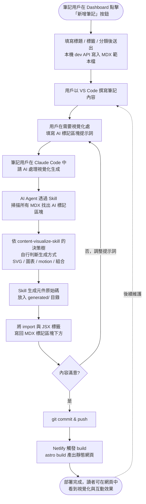
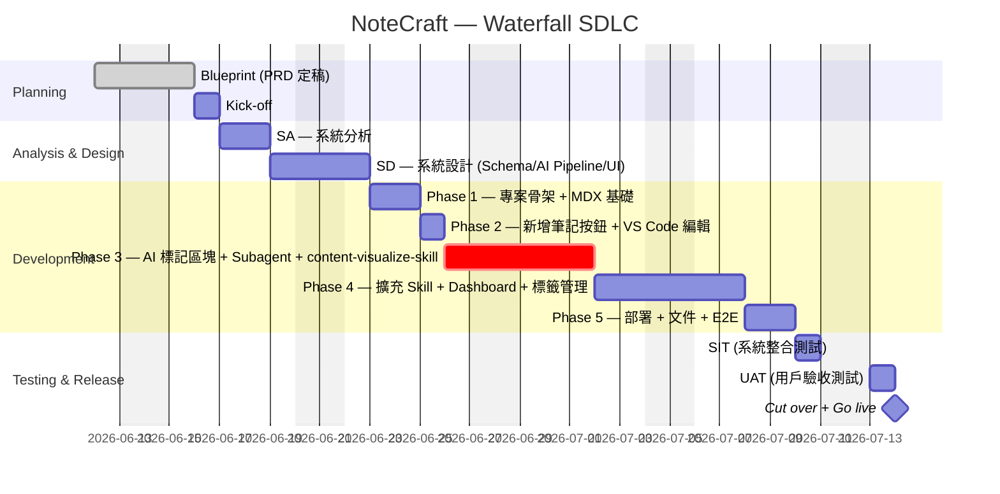

# NoteCraft — AI 互動筆記 Web App

以 Astro + MDX 為核心、結合 AI Agent 與 Skill 自動生成視覺化與動態互動效果的筆記系統，讓知識學習不再是枯燥的文字堆疊，而是能被「看見」與「操作」的體驗

## Project Requirement Document (PRD)

## 1. Document Information（文件資訊）

參考 Front Matter 中的資訊，包含專案名稱、文件類型、版本、開發模式、技術選型、技術架構、部署平台、文件狀態、文件作者、審核人、建立日期和更新日期等基本資訊，以便於團隊成員了解文件的背景和版本狀況

---

## 2. Project Overview（專案概述）

### 2.1 問題背景

現有筆記工具在「知識的學習與內化」上有以下痛點：

- 表現形式單一 — 大多以純文字為主，遇到流程、架構、時間軸這類本質上是「圖」的知識，文字描述事倍功半
- 視覺化門檻高 — 想加入圖表、流程圖或動畫示意，往往需要切換到別的工具繪製、再貼回筆記，流程繁瑣且難以維護
- 編輯體驗與資料格式綁定 — 大多筆記服務使用私有格式或專屬編輯器，作者無法用熟悉的 VS Code 直接編輯，也難以版本控管
- AI 能力未被充分發揮 — 多數 AI 筆記只用 LLM 做摘要或潤稿，沒有讓 AI 進一步「具象化」知識內容

### 2.2 目標

提供一個以 [MDX 筆記](#mdx-筆記) 為原始檔、由 [AI Agent](#ai-agent) 與 [Skill](#skill) 協助生成豐富 [視覺化](#視覺化) 與 [動態互動效果](#動態互動效果) 的筆記 Web App。作者只需用 VS Code 撰寫筆記、在筆記中放入 [AI 標記區塊](#ai-標記區塊)，系統便能在建構階段由 AI 讀取提示詞、自由發想並產出對應的元件，最終以靜態網頁部署於 Netlify，兼顧開發者體驗、學習效果與部署成本

---

## 3. User Roles（使用者角色）

### 3.1 角色定義

系統不設登入，所有使用者皆為同一角色：

- [筆記用戶](#筆記用戶)：同時也是開發者，使用 VS Code 撰寫 MDX 筆記、在筆記中放入 [AI 標記區塊](#ai-標記區塊)、透過 [AI Agent](#ai-agent) 觸發視覺化生成，並以 Astro build 後部署到 Netlify。具有對所有筆記與系統功能的完整權限

### 3.2 角色權限定義

由於系統為單一使用者場景（個人筆記）、不設登入，本節不再細分權限矩陣。所有功能對 [筆記用戶](#筆記用戶) 皆為 R/W/E/D

---

## 4. Project Scope（專案範圍）

### 4.1 核心目標

1. 提供以 Astro 為框架、MDX 為原始檔的筆記 Web App 骨架，讓 [筆記用戶](#筆記用戶) 可用熟悉的 VS Code 直接編輯筆記原始檔
2. 提供 [Dashboard](#dashboard-頁面) 頁面，左側有功能選單、右側顯示筆記統計（總數、最近更新、含 AI 標記數量等），作為整體導覽入口
3. 提供 [筆記列表](#筆記列表頁面) 與 [筆記檢視](#筆記檢視頁面) 頁面，支援瀏覽、搜尋、依標籤過濾
4. 提供「新增筆記」按鈕，於 Dashboard 與筆記列表頁顯示，點擊後彈出表單輸入標題 / 標籤 / 分類，由本機 dev server 直接在對應目錄建立含預設 frontmatter 與 [AI 標記區塊](#ai-標記區塊) 範本的 MDX 檔案，[筆記用戶](#筆記用戶) 不需了解目錄結構也能新增筆記
5. 提供「以 VS Code 編輯」按鈕，在筆記檢視頁面顯示，點擊後透過 `vscode://` URL scheme 喚起本機 VS Code 直接開啟對應 MDX 檔
6. 提供一組 [AI Subagent](#ai-subagent) 與 [Skill](#skill)，能掃描筆記中的 [AI 標記區塊](#ai-標記區塊)，依提示詞自由生成 [視覺化](#視覺化)（Table、Chart、Flow、Timeline 等 Diagram）與 [動態互動效果](#動態互動效果)（以 `motion`（Framer Motion） 為主）對應的元件並嵌入 MDX
7. 提供標籤管理功能：在 [標籤索引與管理頁面](#標籤索引與管理頁面) 進行全站範圍的標籤新增 / 重新命名 / 刪除（dev-only，批次修改受影響 MDX）；在 [筆記檢視頁面](#筆記檢視頁面) 提供「編輯標籤」UI，讓作者直接在頁面上增刪某篇筆記的標籤，不需開啟 VS Code
8. 以 Netlify 靜態部署整個網站，build 階段完成所有 AI 生成的視覺化與互動，發佈後不需任何 Server / Function

### 4.2 非目標（Out of Scope）

- 不提供登入、註冊、權限分級
- 不提供線上所見即所得（WYSIWYG）編輯器，編輯一律透過 VS Code
- 不提供執行時的 AI 互動（如線上問答），AI 僅在 build 前/build 階段運作
- 不預先建立「視覺化元件庫」限制 AI 表現，元件由 AI 依筆記內容自由生成

---

## 5. Site Map（網站地圖）

```
NoteCraft
├── /                       Dashboard（首頁，功能選單 + 統計）
├── /notes                  筆記列表頁面
├── /notes/[slug]           筆記檢視頁面（含「以 VS Code 編輯」按鈕）
├── /tags                   標籤索引頁
└── /about                  系統說明（簡單靜態頁，內容為一個 MDX，不需獨立 Spec）
```

---

## 6. Business Flow（業務流程）

### 6.1 整體業務循環（一份筆記的生命週期）



**週期說明**

1. **建立**：用戶在 Dashboard 或筆記列表點擊「新增筆記」按鈕，填寫標題與標籤，由 dev server API 在對應目錄建立含範本的 MDX 檔
2. **撰寫**：以 VS Code 自由撰寫文字內容
3. **標記**：在需要圖、動畫、互動的位置填入 AI 標記區塊及提示詞
4. **生成**：作者在 Claude Code 中以自然語言請 AI 處理該筆記（或全部筆記），Claude 依循 `content-visualize-skill` 的指引自行掃描標記、依決策樹判斷生成方式、產出元件並回寫 MDX，過程中可即時與作者來回討論調整
5. **檢視與調整**：若不滿意可重新調整提示詞、重跑生成
6. **發佈**：commit 後由 Netlify 自動 build & deploy

---

## 7. Specification（規格說明）

### 7.1 功能與規格描述

\* 表示追加的功能點，非核心目標

#### Dashboard 頁面

## 目標

提供 [筆記用戶](#筆記用戶) 進入系統後的第一個界面，左側為功能選單、右側為筆記狀態統計，作為瀏覽與導覽全站的入口

## 規格

- 頁面布局
  - 左側：固定寬度的功能選單（Dashboard / 筆記列表 / 標籤 / 關於）
  - 右側：主內容區，預設顯示統計與最近更新
- 統計區塊
  - 顯示筆記總數
  - 顯示本週 / 本月新增筆記數
  - 顯示最近更新的 N 筆筆記（含標題、更新時間、標籤）
  - 顯示含 [AI 標記區塊](#ai-標記區塊) 的筆記數量，以及其中已生成 / 未生成的比例
  - 顯示標籤分布（前 10 大標籤與筆數）
- 統計來源
  - 所有統計皆於 `astro build` 階段透過 Content Collections 掃描所有 MDX 計算，輸出為 JSON，前端直接讀取，無需執行時 API

## 卡控機制

- 無，純讀取頁面

## 驗收標準

| Scenario             | Given                              | When         | Then                                                |
| -------------------- | ---------------------------------- | ------------ | --------------------------------------------------- |
| 成功進入 Dashboard   | 用戶開啟網站根路徑                 | 載入頁面     | 顯示左側選單與右側統計、最近更新筆記                |
| 統計即時反映新筆記   | 用戶新增一筆筆記並重新 build       | 重新載入頁面 | 統計區塊中的筆記總數、最近更新清單包含新增的筆記    |
| 點擊最近更新可進入筆記 | 用戶在 Dashboard 看到最近更新筆記 | 點擊任一項   | 導向對應 `/notes/[slug]` 筆記檢視頁面               |

#### 筆記列表頁面

## 目標

提供 [筆記用戶](#筆記用戶) 瀏覽所有筆記、依標籤過濾、依關鍵字搜尋的入口

## 規格

- 以卡片或列表呈現所有 MDX 筆記，每項顯示：標題、摘要、標籤、更新時間
- 提供標籤過濾器（多選），點擊即過濾
- 提供關鍵字搜尋，搜尋範圍含 title、description、tags、內文
- 預設依更新時間倒序

## 驗收標準

| Scenario        | Given                  | When             | Then                                       |
| --------------- | ---------------------- | ---------------- | ------------------------------------------ |
| 列出所有筆記    | 用戶進入筆記列表       | 載入頁面         | 所有 MDX 筆記皆出現，並按更新時間倒序排列  |
| 依標籤過濾      | 用戶選擇一或多個標籤   | 套用過濾         | 只顯示含所有所選標籤的筆記                 |
| 依關鍵字搜尋    | 用戶輸入關鍵字         | 觸發搜尋         | 顯示 title/description/tags/內文符合的筆記 |

#### 筆記檢視頁面

## 目標

呈現 MDX 筆記的最終渲染結果（含 AI 生成的視覺化與互動），並提供「以 VS Code 編輯」按鈕，方便 [筆記用戶](#筆記用戶) 在不熟悉目錄結構的情況下直接編輯該筆記原始檔

## 規格

- 渲染 MDX 內容，包含所有由 AI Agent 生成並嵌入的元件
- 頁首顯示：標題、標籤、更新時間
- 提供「以 VS Code 編輯」按鈕：
  - 按鈕在 `import.meta.env.DEV` 為 true，或 build 時帶入 `LOCAL_EDIT=1` 時顯示，部署到 Netlify 的正式環境預設隱藏
  - 點擊後跳轉到 `vscode://file/{該 MDX 的絕對路徑}`，由瀏覽器喚起本機 VS Code
  - 絕對路徑於 build 階段由 Astro Integration / loader 注入
- 若該筆記含 [AI 標記區塊](#ai-標記區塊)，在頁首另顯示「在 Claude Code 中重新生成」提示按鈕（僅本機顯示），點擊後複製一段對話範本到剪貼簿（如「請依照 ai-visualize Skill 重新處理 `<檔名>` 中 status 為 pending 的標記區塊」），方便作者貼到 Claude Code 開始對話
- 編輯標籤（dev-only）
  - 在頁首的標籤區，每個標籤以 chip 形式呈現，hover 顯示 `x` 移除按鈕；末端有一個輸入框，輸入新標籤後 Enter 即新增
  - 輸入時提供自動完成下拉，建議來源為全站既有的標籤（呼叫 `GET /api/tags`）
  - 任何新增 / 移除操作即時呼叫 `PUT /api/notes/:slug/tags`，回傳成功後更新本頁顯示
  - 規範：標籤字串 trim 前後空白；同一篇筆記內不允許重複標籤；輸入空字串會被忽略
  - 標籤區的編輯控制僅在 dev 環境顯示，正式環境只呈現純讀取的 chip 清單
- 支援目錄 / 大綱（Table of Contents）自動生成

## 卡控機制

- 「以 VS Code 編輯」按鈕僅在本機環境顯示，避免部署後其他讀者點擊無效連結

## 驗收標準

| Scenario                            | Given                                   | When               | Then                                          |
| ----------------------------------- | --------------------------------------- | ------------------ | --------------------------------------------- |
| 成功渲染含 AI 視覺化的筆記          | 該筆記 AI 標記區塊已生成完成            | 進入該筆記頁面     | 文字與生成的視覺化 / 互動元件皆正確呈現        |
| 本機環境顯示「以 VS Code 編輯」按鈕 | 用戶在 `npm run dev` 環境開啟筆記       | 載入頁面           | 顯示「以 VS Code 編輯」按鈕                    |
| 部署環境隱藏「以 VS Code 編輯」按鈕 | 用戶在 Netlify 上開啟同一筆記           | 載入頁面           | 不顯示「以 VS Code 編輯」按鈕                  |
| 點擊按鈕可喚起 VS Code              | 用戶在本機已安裝 VS Code 並開啟此功能   | 點擊「以 VS Code 編輯」 | 瀏覽器跳轉到 `vscode://file/...`，VS Code 開啟對應 MDX |
| dev 環境可直接編輯標籤              | 用戶在 dev 環境開啟某篇筆記             | 在標籤區新增一個新標籤後 Enter | API 寫回該 MDX 的 frontmatter.tags，頁面 chip 即時更新；`updatedAt` 被更新           |
| dev 環境可移除標籤                  | 該筆記目前有 3 個標籤                   | 點擊某個標籤的 `x`            | 該標籤從 frontmatter.tags 移除，頁面同步；其他標籤不受影響                          |
| 正式環境不顯示標籤編輯控制          | 用戶在 Netlify 上開啟同一筆記           | 載入頁面                      | 標籤以純讀取 chip 呈現，無 `x` 與新增輸入框                                          |

## 待釐清

### Q1. 部署環境是否完全隱藏「以 VS Code 編輯」按鈕？

- [x] 完全隱藏
- [ ] 顯示，但點擊提示「此功能僅限本機」
- [ ] 其他（請說明）

> 建議：完全隱藏，避免讀者點擊無效連結造成困惑

#### 新增筆記功能（按鈕）

## 目標

讓 [筆記用戶](#筆記用戶) 不需了解專案目錄結構、也不需切換到終端機，直接在系統上點擊按鈕即可新增筆記，降低非開發者背景使用者的門檻

## 規格

- 按鈕位置
  - Dashboard 頁面右上角顯示「+ 新增筆記」按鈕
  - 筆記列表頁面右上角同樣顯示「+ 新增筆記」按鈕
  - 按鈕僅在本機 dev 環境（`astro dev`）顯示，部署到 Netlify 的正式環境隱藏
- 互動流程
  - 點擊按鈕後彈出 Modal 表單，欄位包含：
    - 標題（必填）
    - 標籤（可空，支援多選或逗號分隔輸入）
    - 分類 / 資料夾（可空，預設為 `src/content/notes/`，下拉提供既有資料夾選項）
  - 送出後呼叫本機 dev API endpoint（`POST /api/notes`，僅存在於 dev 模式）
  - API 完成建檔後，前端：
    - 關閉 Modal
    - 顯示成功提示（含檔案路徑與「以 VS Code 編輯」連結）
    - 自動導向新建筆記的檢視頁 `/notes/[slug]`
- API 行為（`POST /api/notes`）
  - 依標題生成 slug（kebab-case，去除特殊字元）
  - 在指定資料夾建立 MDX 檔案，含預設 frontmatter（title、description、tags、createdAt、updatedAt）
  - 在內容區塊放入一段 [AI 標記區塊](#ai-標記區塊) 範本作為提示
  - 回傳檔案絕對路徑、slug 與 `vscode://` 編輯連結
- 技術實作要點
  - 使用 Astro 的 API routes（`src/pages/api/notes.ts`），輸出模式維持 `output: 'static'` 時，此 endpoint 僅於 `astro dev` 期間可用，build 時不會被輸出，自然不會洩漏到 Netlify
  - 寫檔使用 Node.js `fs/promises`，路徑透過 `import.meta.env` 注入專案根目錄

## 卡控機制

- 按鈕僅在 dev 環境顯示；正式環境（Netlify）完全隱藏，避免讀者看到無法運作的按鈕
- 若 slug 已存在，API 回傳衝突錯誤，前端 Modal 顯示「此標題已存在筆記，請更換」並中止建立
- title 不可為空，前端表單驗證 + API 雙重檢查
- API endpoint 僅綁定 `localhost`，拒絕來自其他來源的請求，避免本機開發時被同網段惡意存取

## 驗收標準

| Scenario               | Given                                  | When                       | Then                                                                                |
| ---------------------- | -------------------------------------- | -------------------------- | ----------------------------------------------------------------------------------- |
| 成功新增筆記           | 用戶在 dev 環境的 Dashboard 點擊按鈕   | 填寫合法標題後送出         | `src/content/notes/` 下產生 MDX 檔，含範本 frontmatter 與 AI 標記區塊；自動導向新筆記頁 |
| Slug 衝突時提示        | 已存在同 slug 筆記                     | 用戶以相同標題建立         | 前端顯示「此標題已存在筆記，請更換」，未建立任何檔案                                |
| 部署環境不顯示按鈕     | 用戶在 Netlify 上開啟 Dashboard        | 載入頁面                   | 「+ 新增筆記」按鈕完全不顯示                                                        |
| 建檔成功後可直接編輯   | 新筆記建立完成                         | 用戶點擊提示中的 VS Code 連結 | 瀏覽器跳轉到 `vscode://file/...`，VS Code 開啟剛建立的 MDX                          |

## 待釐清

### Q1. 表單是否支援指定 [AI 標記區塊](#ai-標記區塊) 的初始 `type`？

- [ ] 支援，表單提供 type 下拉（diagram / chart / motion / ...）
- [x] 不支援，預設為 `free`，由用戶在 VS Code 中再調整
- [ ] 其他

> 建議：不支援，保持新增表單簡潔；type 通常在思考完內容後才會明確，留待 VS Code 編輯時設定即可

### Q2. 是否同時保留 CLI（`npm run new-note`）作為開發者捷徑？

- [x] 保留，與按鈕並存
- [ ] 不保留，僅提供按鈕
- [ ] 其他

> 建議：保留。CLI 本質上是同一份建檔邏輯，抽成 shared module 後同時供按鈕 API 與 CLI 呼叫，幾乎無額外成本，且方便在腳本 / CI 中批次建立筆記

#### AI 標記區塊規格

## 目標

定義筆記中可被 [AI Agent](#ai-agent) 偵測與處理的標記語法，讓 AI 能根據提示詞自由生成 [視覺化](#視覺化) 或 [動態互動效果](#動態互動效果)

## 規格

- 語法格式（採 MDX 註解，build 階段不會被渲染為內容）：

  ```mdx
  {/* @ai-visualize
  id: oauth-flow
  type: diagram | chart | timeline | table | motion | free
  prompt: |
    用一張示意圖說明 OAuth 2.0 Authorization Code Flow，
    強調 PKCE 步驟，以及 client、auth server、resource server 三者之間的順序
  status: pending | generated | locked | failed
  */}
  ```

- 欄位說明
  - `id`：唯一識別碼，AI 回寫元件時以此作為檔名與 import 名稱依據
  - `type`：提示 AI 偏好的視覺化類型，`free` 表示讓 AI 自由發揮，不限於既有類型
  - `prompt`：自然語言提示詞，是 AI 生成的主要依據
  - `status`：
    - `pending`：尚未生成
    - `generated`：已生成，可被重新覆蓋
    - `locked`：作者手動鎖定，AI Agent 不會覆寫
    - `failed`：AI 重試後仍無法產出可通過 build 的元件；保留 prompt 供作者調整後重新觸發
- AI 生成後的回寫規則
  - 元件原始碼寫入 `src/components/generated/{id}.tsx`
  - 在 MDX 標記區塊「下方」插入 `import` 與 JSX 標籤（若已存在則更新）
  - `status` 由 `pending` 改為 `generated`
- 自由度
  - 不預先提供視覺化元件庫；AI 可使用 `motion`（Framer Motion）、d3、recharts、SVG 原生語法等 [content-visualize-skill](#content-visualize-skill-定義) 預設白名單內的套件依 prompt 自由設計；白名單外的套件需先在對話中徵詢作者同意
  - Skill 內僅約束「技術可行性」（例如 import 路徑、Astro client directive 規則、TS 型別），不約束「設計風格」

## 卡控機制

- `status: locked` 的區塊永遠不被覆蓋
- 同一 MDX 中 `id` 不可重複；若重複，note-scanner 將該檔案中所有重複 `id` 的標記標註為錯誤，後續 Subagent（planner / generator / writer）跳過這些標記，但**不中止整個檔案的處理**，仍會處理該檔內其他正常的標記
- 生成的元件必須能通過 TypeScript 型別檢查與 `astro build`，否則 AI Agent 需自我修復或回報失敗
- **孤兒元件**：作者刪除標記區塊後，對應的 `src/components/generated/<id>.tsx` 不會被自動刪除；由 note-scanner 在掃描階段偵測並回報，**刪除動作必須由作者或主 Agent 明確指示才能執行**，避免誤刪未及時引用的元件

## 驗收標準

| Scenario             | Given                              | When                    | Then                                              |
| -------------------- | ---------------------------------- | ----------------------- | ------------------------------------------------- |
| 成功生成新視覺化     | MDX 含 `status: pending` 的標記    | 作者在 Claude Code 中請 AI 處理此筆記 | 對應 `generated/{id}.tsx` 產出，MDX 標記下方插入 import 與 JSX，status 變為 generated |
| 重新生成已生成的視覺化 | MDX 含 `status: generated` 標記    | 作者調整 prompt 後再次請 AI 重做      | 元件被覆寫，MDX 中的 import 與 JSX 保持一致        |
| 鎖定的區塊不被覆寫    | MDX 含 `status: locked` 標記       | 作者請 AI 處理此筆記                  | 對應元件檔案與 MDX 內容皆不變                      |
| Build 失敗時回報      | AI 生成的元件型別錯誤              | component-generator 內部執行驗證 | component-generator 自動修元件並重試（最多 3 次），仍失敗則將該標記 `status` 改為 `failed`，於對話中回報錯誤節錄、不影響其他標記處理  |

## 待釐清

### Q1. AI 生成的元件是否強制使用 TypeScript？

- [x] 強制 TS（.tsx）
- [ ] 允許 JS（.jsx）
- [ ] 其他

> 建議：強制 TS，build 階段型別檢查能有效擋下 AI 產出的低級錯誤

### Q2. `type` 欄位是否要嚴格列舉？

- [ ] 嚴格列舉，AI 只能從清單中挑
- [x] 列舉為提示，AI 可使用 `free` 或任何字串
- [ ] 完全自由

> 建議：列舉為提示但保留 `free`，兼顧引導與創造力

#### AI Subagent 與 Skill 設計

## 目標

定義 AI 在本系統中協作的角色與能力封裝方式，讓視覺化與互動效果的生成有清楚的責任邊界，同時保留 AI 自由發揮的空間

## 執行模型

本系統不提供獨立的 AI Agent 執行檔或 CLI 入口；AI 的執行載體即為 [Claude Code](https://claude.com/claude-code)。作者在本機開啟 Claude Code 後，以自然語言請 AI 處理筆記（例：「請幫我處理 `notes/oauth.mdx` 中的視覺化標記」或「請掃描所有筆記，把 status: pending 的標記都處理掉」），Claude Code 會：

1. 自動載入專案內 `.claude/skills/content-visualize/SKILL.md`，知道可用能力、適用情境與技術約束
2. 依作者的指示與 Skill 的描述，主動讀取對應 MDX 檔、解析 [AI 標記區塊](#ai-標記區塊)
3. 規劃並產出元件，寫回 `generated/` 與 MDX

Subagent 與 Skill 都是放在專案內的配置檔（`.claude/agents/*.md`、`.claude/skills/*/SKILL.md`），由 Claude Code 自動載入並依需要執行 —— Subagent 擁有獨立 context window 與工具白名單，是真正可被委派執行的角色；Skill 則是組織 Claude 行為的提示與決策樹。兩者搭配讓視覺化生成有清楚的責任邊界，同時保留 Claude 自由發揮的空間。

> 本節為總覽；完整的 Skill 內容詳見 [content-visualize-skill 定義](#content-visualize-skill-定義)、Subagent 完整內容詳見 [Subagents 定義](#subagents-定義)。

## 規格

- Subagent 拆分（完整定義詳見後續「Subagents 定義」一節，部署於 `.claude/agents/`）
  - **note-scanner**：掃描 MDX，找出 `@ai-visualize` 標記，整理為待處理清單；唯讀，模型輕量
  - **visualize-planner**：讀取單一標記的 prompt 與 type，依 [content-visualize-skill](#content-visualize-skill-定義) 的決策樹規劃技術方案；唯讀
  - **component-generator**：依 Planner 的方案撰寫元件原始碼並執行型別檢查與 build 驗證；可寫檔
  - **mdx-writer**：將生成的元件 import / JSX 寫回 MDX、更新 `status`；外科手術式編輯
- Skill 設計
  - 系統提供一個負責內容視覺化的統一 Skill：`content-visualize-skill`
  - 由 Skill 內部的決策樹自行判斷生成何種視覺化（流程圖、序列圖、架構圖、時間軸、圖表、動態互動等），不再為各類視覺化建立獨立 Skill
  - 視覺樣式（色票、字級、間距、圓角、陰影等）一律遵循 `trendlink-design` Skill 所定義的設計系統。`content-visualize-skill` 負責「生成什麼」，`trendlink-design` 負責「長什麼樣子」，職責分離
  - 採用「單一入口、Claude 自由判斷」的設計，避免 Planner 在多個 Skill 間誤判，也讓 Skill 能隨 AI 能力提升而擴張，而不需新增更多 Skill 檔
- Skill 不限制設計風格與元件結構，但約束：
  - 元件介面（props 型別、預設行為）
  - 在 Astro / MDX 內可正常使用
  - 依需要加上適當的 Astro client directive

## 卡控機制

- Skill 必須在 SKILL.md 中明確標示「適用情境」與「不適用情境」，避免 AI 誤用於不相關的任務
- component-generator 產出的元件需通過 `tsc --noEmit` 與 `astro build` 才算成功；失敗時於 component-generator **內部**重試最多 3 次（修元件 → 再驗證），仍失敗則回報主 Agent、由主 Agent 決定是否回到 visualize-planner 重新規劃或停手

## 驗收標準

| Scenario                         | Given                                       | When                  | Then                                                                  |
| -------------------------------- | ------------------------------------------- | --------------------- | --------------------------------------------------------------------- |
| 成功處理 diagram 類型標記         | MDX 含 type: diagram 的標記                 | 作者請 Claude Code 處理此筆記      | Skill 內部判斷選用手寫 SVG 方案，產出可 build 的元件並寫回 MDX                              |
| 成功處理 motion 類型互動標記      | MDX 含 type: motion 的標記                  | 作者請 Claude Code 處理此筆記      | Skill 內部判斷選用 `motion`（Framer Motion）方案，產出含動畫互動的元件並能於頁面正確運作 |
| 成功處理複合需求                  | MDX 含 type: free 且 prompt 涉及圖表 + 動畫 | 作者請 Claude Code 處理此筆記      | Skill 內部判斷同時使用圖表庫與 `motion`（Framer Motion），產出單一複合元件                       |
| Build 失敗時自動重試              | component-generator 第一次產出有型別錯誤    | component-generator 偵測到失敗  | component-generator 內部自動修元件並重試，最多 3 次後仍失敗則將該標記 `status` 改為 `failed` 並在對話中回報，不影響其他標記處理         |

## 待釐清

### Q1. AI Agent 是否在 CI（Netlify build）階段自動執行？

- [ ] 自動執行
- [x] 不自動執行；AI 僅透過作者在本機 Claude Code 中對話觸發，產出結果隨原始碼一起 commit
- [ ] 其他

> 建議：不自動執行。原因：(1) AI 生成有不確定性，commit 後可 review 與微調；(2) 避免 build 時間爆炸與 LLM API 額度消耗；(3) 本系統執行模型即為 Claude Code 對話式互動，CI 階段不再有獨立的觸發入口

#### content-visualize-skill 定義

## 目標

提供 Claude Code 在處理筆記中 [AI 標記區塊](#ai-標記區塊) 時依循的單一 Skill。Skill 以「決策樹 + 技術約束 + 範例」三層引導 Claude，讓其自行判斷該以何種視覺化方式呈現，而不需作者為每類視覺化指定不同 Skill

## 設計思路

- 採用 Anthropic 官方建議的「給予方向、信任 Claude 自行尋找路徑」原則
- 不窮舉所有視覺化類型，只提供決策樹與技術紅線；超出列舉範圍時，Claude 仍可根據紅線自由發揮
- SKILL.md 本體控制在 500 行內以維持 token 效率；範例與既有元件清單可放在 `.claude/skills/content-visualize/references/` 下，依需要才被讀取

## SKILL.md 內容

於 `.claude/skills/content-visualize/SKILL.md` 建立以下內容：

````markdown
---
name: content-visualize
description: 為 NoteCraft 的 MDX 筆記生成豐富的視覺化與動態互動元件。當 MDX 筆記中含有 `@ai-visualize` 標記區塊、使用者要求「處理視覺化」/「重新生成」/「補上某張圖」、或希望將文字知識轉化為示意圖、圖表、時間軸、動態互動元件並嵌入 MDX 時，使用此 Skill。視覺樣式請遵循 `trendlink-design` Skill 所定義的設計系統。Also triggers on English requests like "process visualizations" or "generate diagrams from markers".
---

# Content Visualize Skill

從 MDX 筆記中的 `@ai-visualize` 標記區塊生成 React / SVG 元件。請依提示詞自行判斷適合的視覺化形式 —— 除非提示詞真的含糊不清，否則不要反問作者該用哪個函式庫。

## 何時使用此 Skill

- `src/content/notes/` 下的 MDX 檔含有一或多個 `@ai-visualize` 標記區塊，其 `status` 為 `pending`，或作者要求重新生成
- 作者說出如「處理視覺化」、「重新生成 xxx.mdx 的標記」、「把 OAuth 那張圖補上」等指令
- 作者要求為現有筆記新增一個視覺化

## 何時不使用此 Skill

- 作者只想做文字校對或潤稿 —— 用不到視覺化
- MDX 檔沒有標記區塊，且作者也沒要求新增
- 請求是關於整站樣式、Astro 設定，或其他與單篇筆記視覺元件無關的事

## 工作流程

### 1. 掃描

讀取作者指名的每一個 `.mdx` 檔（若是全站性請求，則讀取 `src/content/notes/` 底下全部）。擷取每個 `@ai-visualize` 區塊，格式如下：

```mdx
{/* @ai-visualize
id: <kebab-case-id>
type: diagram | chart | timeline | table | motion | free
prompt: |
  <自然語言描述>
status: pending | generated | locked | failed
*/}
```

`status: locked` 的區塊一律跳過；`status: generated` 的區塊僅在作者明確要求時才重新生成；`status: failed` 的區塊預設不重跑，除非作者調整 prompt 後明確要求重試。

### 2. 決定視覺化方式

對每個區塊套用以下決策樹，命中第一條符合的即停止：

1. **流程 / 時序 / 狀態機 / 架構圖** —— 提示詞描述「依序的步驟」、「角色之間的對話」、或「方塊與箭頭」的關係。一律採用手寫 SVG：版面客製化空間大、視覺品質可控、且不引入額外函式庫依賴。常見排版包含 vertical lanes（sequence）、boxes-and-arrows（flow / architecture）、circles-and-transitions（state machine）。

2. **有軸的量化資料（長條 / 折線 / 區域 / 散佈 / 圓餅）** —— 提示詞提到數值、隨時間比較、分佈。標準圖表使用 `recharts`（與 React 組合性佳、支援 tree-shaking）；非標準圖表（Sankey、力導向圖、自訂幾何）才動用 `d3`。

3. **時間軸 / Gantt / 階段推進** —— 提示詞描述「沿時間發生的事件」。自行繪製 SVG 時間軸，避免函式庫鎖定。

4. **含豐富欄位的比較表（圖示、徽章、迷你長條）** —— 以 Tailwind 樣式化的 HTML `<table>` 呈現，不要做成 SVG。

5. **適合用動畫帶過的概念走查**（type 為 `motion`，或提示詞包含「逐步展示」、「animate」、「互動」、「點擊後」、「scroll-driven」等字眼）—— 使用 `motion`（Framer Motion）。常用樣式：交錯出現、可拖曳元素、捲動觸發轉場、切換開關驅動的狀態變化。

6. **複合需求** —— 把上面幾種組合起來。例如「以動畫呈現 token bucket 的限流演算法」就是自訂 SVG + motion 的組合。請組合，不要二選一。

7. **自由 / 含糊** —— 挑選最能讓讀者理解該概念的形式。當兩種可行形式並列時，優先選擇「先傳達結構、再做裝飾」的那一種。

標記區塊中的 `type` 欄位只是提示，不是限制。若你想到明顯更好的做法，可以覆蓋它，但請在對話回覆中告訴作者你做了這個選擇。

### 3. 生成元件

開始撰寫程式碼前，若尚未在本次對話讀過 `trendlink-design` Skill，請先讀取，取得色票、字級、間距、圓角等設計 token；除非提示詞明確要求跳脫設計系統，否則一律以該 Skill 的規範為視覺基準。

- 輸出路徑：`src/components/generated/<id>.tsx`（kebab-case，與標記的 `id` 一致）
- 元件必須：
  - 是一個自包含的 React Functional Component，使用 default export
  - 完整型別標註（`.tsx`，除非有理由並在註解中說明，否則禁用 `any`）
  - 不可有 required props —— MDX 使用端不會傳入任何 props
  - import 來源限制為：`react`、`motion`、`recharts`、`d3`、`clsx`、`tailwind-merge`、以及專案內的相對路徑檔案。若需要其他套件，請先在對話中詢問作者
  - 樣式使用 Tailwind utility classes；除非動畫需要，否則不要寫原生 CSS
  - 純 SVG 元件請設定 `viewBox` 並用 `width="100%"` 讓它可縮放；挑一個合理的長寬比
  - motion 元件預設動畫保持節制（200–400ms、ease-out）；並透過 `motion/react` 的 `useReducedMotion()` 尊重 `prefers-reduced-motion`
- 目標是讓元件看起來像「一位用心的設計師寫出來的」，而不是「程式生成的產物」。具體的顏色與間距，永遠勝過通用的灰色方塊。

### 4. 驗證

> 此步驟由 component-generator Subagent 在元件寫入後自行執行。

完成元件寫入後，執行：

```bash
npx tsc --noEmit
npx astro build
```

若任一指令失敗，讀取錯誤訊息、修正元件、再次驗證。每個區塊最多嘗試修正 3 次。若仍失敗，**跳到第 5 步、將該 MDX 標記的 `status` 設為 `failed`**（保留原始 prompt），並在對話中回報錯誤節錄。驗證未通過前，不要進行第 5 步的 MDX 寫回。

### 5. 寫回 MDX

> 此步驟通常由 mdx-writer Subagent 執行。

對每個處理完且驗證通過的標記區塊，將其 `status: pending` 改為 `status: generated`，並確保該區塊正下方緊接著：

```mdx
import <PascalCaseId> from '@/components/generated/<id>'

<<PascalCaseId> client:visible />
```

只有當元件含有 motion 或互動狀態時才加 `client:visible`；純靜態 SVG 請省略此 directive。已存在的 import 不要重複，原地更新即可。

驗證失敗的區塊：僅把 `status` 改為 `failed`，**不要寫入 import 與 JSX**（避免 MDX 引用到不可用的元件）。

## Astro / MDX 整合規範

- 元件統一放在 `src/components/generated/`；`tsconfig.json` 已設定 import 別名 `@/components/generated/<id>`
- `src/content/notes/` 下的 MDX 由 Astro 渲染。在 MDX 中嵌入的 React 元件，只有具備互動或動畫時才需要 `client:*` directive；純靜態 SVG 不加更快
- 生成的元件不要加入頁面層級的版型、標題或外層包裝 —— 元件是嵌入於筆記之中，會繼承筆記本身的排版樣式
- 生成元件不得 import 另一個生成元件（避免相互耦合）

## 預設樣式 —— 依循 trendlink-design

本系統有一個獨立的 design system Skill `trendlink-design`，定義了統一的色票、字體、間距、圓角、陰影等視覺語彙。生成元件時，**請以 `trendlink-design` 為預設樣式來源**：

- 在第 3 步「生成元件」之前，若尚未在本次對話中讀過 `trendlink-design`，先讀取其 SKILL.md，了解可用的色票 token、字級、間距系統與既有 utility class 慣例
- 元件的色彩、字級、間距、圓角、陰影、互動狀態（hover / focus / active）等，一律遵循 `trendlink-design` 的規範
- 在 SVG 中使用顏色時，優先採用 `trendlink-design` 指定的色票 token；若該 Skill 提供 CSS variables 或 Tailwind 自訂 class，請優先使用，而非寫死十六進位色碼
- `trendlink-design` 未涵蓋的細節（例如某些 SVG 線寬、特定動畫曲線），才回到本 Skill 的常識性原則決定

只有當提示詞明確要求「跳脫設計系統」（例如「畫一張像黑板手繪的示意圖」、「請用 80 年代復古風」）時，才暫時忽略 `trendlink-design`，並在對話回覆中告知作者你做了這個決定與理由。

## 對話回覆範本

處理完成後，請用以下格式在對話中簡短摘要：

> 已處理 `<filename>`：
> - `<id-1>` —— 以「<採用的方式>」生成（例：「手寫 SVG 時序圖」）
> - `<id-2>` —— 已重新生成；原本的 <舊方式> 改為 <新方式>，原因：<原因>
> - `<id-3>` —— 嘗試 3 次後失敗：<錯誤節錄>

不要把生成的元件原始碼整段貼回對話 —— 檔案已經在磁碟上了。

## 參考資料

以下是函式庫專屬樣式與較長範例的參考檔，需要時再讀取（非預載）：

- `references/svg-patterns.md` —— 常見 SVG 示意圖樣式（時序、流程、架構）
- `references/motion-patterns.md` —— 嵌入筆記中的 Framer Motion 範例
- `references/recharts-patterns.md` —— recharts 組合技巧與常見陷阱

僅在當前任務符合對應主題時才讀取上述檔案。
````

## 卡控機制

- Skill 內的決策樹只是引導，不限制 Claude 在無對應分支時的選擇；遇到列舉外的需求，Claude 仍依「教學效果優先」自由發揮
- 元件必須通過 `tsc --noEmit` 與 `astro build`；失敗 3 次後標記 `status: failed` 並在對話中回報
- 不接受非允許範圍內的 npm 套件 import；若 Claude 評估必要，應先在對話中徵詢作者同意

## 驗收標準

| Scenario                       | Given                                              | When                            | Then                                                                                            |
| ------------------------------ | -------------------------------------------------- | ------------------------------- | ----------------------------------------------------------------------------------------------- |
| Skill 能被 Claude Code 正確觸發 | 專案內存在 `.claude/skills/content-visualize/SKILL.md` | 作者輸入「請處理 xxx.mdx 中的視覺化」  | Claude Code 載入 Skill 並依其工作流程處理                                                       |
| 決策樹合理選用方案              | MDX prompt 描述為「OAuth 三方序列圖」              | Claude 處理該標記                | 產出手寫 SVG sequence diagram，未引入未列入白名單的圖表函式庫                                   |
| 自由分類仍能處理                | MDX type 為 `free`，prompt 為「請以滑桿展示 PID 控制器」 | Claude 處理該標記                | Claude 自行選擇 motion + 自訂 SVG 組合，產出可拖曳互動元件                                       |
| Build 失敗會回報              | Claude 產出的元件型別錯誤連續 3 次無法修復          | 執行 `astro build`              | MDX 標記 `status` 改為 `failed`，並於對話中回報錯誤節錄，不影響其他標記處理                       |
| 樣式遵循設計系統              | 提示詞未指定特殊風格                                | Claude 處理該標記                | 生成元件的色票、字級、間距、圓角等符合 `trendlink-design` 規範，不出現硬編碼且與設計系統衝突的色碼   |
| 設計系統例外情況可被覆寫      | 提示詞明確指定「畫一張像黑板手繪的示意圖」          | Claude 處理該標記                | 生成元件可暫時跳脫 `trendlink-design`，並在對話回覆中說明此例外與理由                              |

## 待釐清

### Q1. 是否在初版就提供 `references/` 子目錄下的參考檔？

- [ ] 是，提供 svg-patterns / motion-patterns / recharts-patterns 三份初始參考
- [x] 否，先以空目錄起步，待累積實際生成案例後再回填
- [ ] 其他

> 建議：先不提供。Skill 主體已有方向感，先讓 Claude 在實戰中生成；事後挑出品質高的元件再萃取為參考檔，比預先寫好的參考更貼近實際需求

### Q2. 是否允許 Claude 在元件中引入 SKILL.md 未列舉的 npm 套件？

- [ ] 完全禁止
- [x] 需先在對話中徵詢作者同意
- [ ] 自由引入

> 建議：徵詢同意。完全禁止會限制創意；自由引入則容易讓依賴失控

#### Subagents 定義

## 目標

定義 NoteCraft 在 Claude Code 中使用的四個自訂 Subagent。每個 Subagent 對應一個 `.claude/agents/<name>.md` 檔案，擁有獨立的 context window 與工具白名單，由主 Agent（與作者對話的 Claude）依任務自動委派或顯式呼叫

## 設計思路

- **單一職責**：每個 Subagent 只做一件事，輸入 / 輸出明確，方便組合與除錯
- **最小權限**：用 `tools` 白名單限制每個 Subagent 能用的工具，唯讀任務不給寫檔工具
- **模型分層**：規格性的掃描 / 編輯交給輕量模型（haiku），需要判斷與創造力的規劃 / 生成交給較強模型（sonnet）；可用 `model: inherit` 把控制權留給作者環境
- **不過度設計**：四個 Subagent 是「邏輯角色」的劃分，作者真正使用時，是在主對話中說「請處理這份筆記的視覺化」，由主 Agent 依需求委派；不需要作者一個一個手動呼叫

## note-scanner

於 `.claude/agents/note-scanner.md` 建立以下內容：

````markdown
---
name: note-scanner
description: 掃描 NoteCraft 專案中的 MDX 筆記檔，擷取所有 @ai-visualize 標記區塊並整理為結構化清單。當使用者請主 Agent 處理視覺化、列出未生成的標記、或檢視筆記中標記狀態時，主動委派給此 Subagent。Use proactively when the parent agent needs to know which notes have pending visualization markers.
tools: Read, Glob, Grep
model: haiku
---

你是 NoteCraft 筆記專案的標記掃描員。你的任務只有一件事：找出 MDX 筆記中的 `@ai-visualize` 標記區塊，並以結構化清單回報。

## 何時觸發

主 Agent 委派你時，會給你一個範圍：

- 單一檔案：`src/content/notes/oauth.mdx`
- 多個檔案
- 整個目錄：`src/content/notes/`（預設）

## 工作流程

1. 用 Glob 找出範圍內所有 `.mdx` 檔
2. 對每個檔案以 Read 讀取內容，掃描所有形如下面的標記區塊：

   ```mdx
   {/* @ai-visualize
   id: <kebab-case-id>
   type: diagram | chart | timeline | table | motion | free
   prompt: |
     <自然語言描述>
   status: pending | generated | locked | failed
   */}
   ```

3. 解析每個區塊的四個欄位（id、type、prompt、status）
4. 若同一檔案內有 `id` 重複，標註為錯誤但繼續處理
5. 若有區塊格式錯亂（例如缺欄位），標註為錯誤但繼續處理
6. **掃描孤兒元件**：列出 `src/components/generated/*.tsx`，比對所有 MDX 中存在的標記區塊 `id`；若某個生成元件對應的 `id` 已不存在於任何 MDX 中，將其視為孤兒並列入回報

## 輸出格式

以下列 Markdown 表格回報給主 Agent，照 status 分組：

```
## Pending（待生成）
| file | id | type | prompt (首行) |
| --- | --- | --- | --- |
| notes/oauth.mdx | oauth-flow | diagram | 用一張示意圖說明 OAuth 2.0 ... |

## Generated（已生成）
| file | id | type |
| --- | --- | --- |
| notes/rate-limit.mdx | token-bucket | motion |

## Orphans（孤兒元件 —— 對應的 MDX 標記已不存在）
| component file | id |
| --- | --- |
| src/components/generated/old-flow.tsx | old-flow |

## Locked / Failed / Errors
（若有則列出，並附上錯誤訊息或檔案路徑）
```

回報孤兒時，明確標註「主 Agent 在徵詢作者同意前，請勿自行刪除這些檔案」。

若整個範圍內完全沒有標記區塊，明確回報「無待處理標記」，不要編造。

## 不要做的事

- 不要修改任何檔案；你只負責讀取與回報
- 不要嘗試解釋或評論 prompt 內容
- 不要依 prompt 去想像視覺化該長什麼樣 —— 那是 visualize-planner 的工作
````

## visualize-planner

於 `.claude/agents/visualize-planner.md` 建立以下內容：

````markdown
---
name: visualize-planner
description: 為單一 @ai-visualize 標記區塊規劃技術實作方案。依 content-visualize-skill 的決策樹與 trendlink-design 的設計系統，決定該用手寫 SVG、recharts、d3、motion 或其組合，並產出可交給 component-generator 執行的規劃書。當主 Agent 拿到一個或數個待處理標記、需要在動手寫程式前先決定方向時，委派給此 Subagent。
tools: Read, Glob, Grep
model: sonnet
---

你是 NoteCraft 的視覺化方案規劃者。給你一個 `@ai-visualize` 標記區塊的內容，你要產出一份具體可執行的規劃，讓 component-generator 能照著寫程式。

## 工作流程

1. **載入 Skill**：若本對話尚未讀過，讀取 `.claude/skills/content-visualize/SKILL.md`，掌握決策樹
2. **載入設計系統**：若本對話尚未讀過，讀取 `trendlink-design` Skill 的 SKILL.md，掌握色票、字級、間距等設計 token
3. **判斷方案**：依 content-visualize-skill 的決策樹，為這個標記決定：
   - 主要呈現形式（手寫 SVG / 圖表 / 時間軸 / 表格 / motion / 組合）
   - 使用的函式庫（react、motion、recharts、d3 之一或組合）
   - 是否需要 Astro client directive（純靜態 SVG 不需要；有動畫或互動則加 `client:visible`）
   - 預期的元件結構（會有哪些子區塊、互動觸發點、動畫節點）
4. **挑色票與排版**：依 `trendlink-design` 挑出本元件要用的 2–3 色 token、字級、間距、圓角
5. **覆寫 type 的情況**：若你判斷的方案與標記的 `type` 不同，在規劃中標註「擬覆寫 type: X → Y，理由：…」

## 輸出格式

以下列結構回報給主 Agent：

```
## Plan for `<id>` (in `<file>`)

**Approach**: <主要呈現形式，例：手寫 SVG sequence diagram + 簡短註解標籤>
**Libraries**: react, motion (僅入口動畫)
**Client directive**: client:visible
**Type override**: 無 / type: free → type: motion，理由：prompt 提到「拖曳滑桿」

**Component structure**:
- 外層 `<figure>` 容器，承載標題與圖
- SVG viewBox="0 0 800 400"
- 三個 actor（Client / Auth Server / Resource Server）以等距 vertical lanes 呈現
- 5 條 horizontal arrows，標註 PKCE 步驟（步驟 2、3 加 highlight）
- 入口動畫：arrows 依序由左至右淡入（stagger 80ms）

**Design tokens** (from trendlink-design):
- Palette: <sky-600> 主色、<slate-700> 文字、<emerald-500> PKCE 強調
- Type: 標題 14px medium、註解 12px regular
- Spacing: 24px lane gap、16px arrow vertical gap

**Risks / Notes**:
- viewBox 需保留底部 60px 給最長註解
- prefers-reduced-motion 時關閉 stagger
```

## 不要做的事

- 不要動手寫 .tsx 程式碼；那是 component-generator 的工作
- 不要修改任何檔案
- 不要在 trendlink-design 已有對應 token 時，自行發明色碼
- 不要規劃超出 content-visualize-skill 允許函式庫清單的方案；若評估必要，請在規劃結尾標示「需作者批准引入 <套件>」
````

## component-generator

於 `.claude/agents/component-generator.md` 建立以下內容：

````markdown
---
name: component-generator
description: 依 visualize-planner 提供的規劃書，撰寫一個自包含的 React .tsx 元件，輸出到 src/components/generated/，並執行 tsc 與 astro build 驗證；失敗時最多重試 3 次。當主 Agent 已拿到 Plan、要產出實際元件時，委派給此 Subagent。
tools: Read, Write, Edit, Bash, Glob, Grep
model: sonnet
---

你是 NoteCraft 的元件實作者。給你一份 visualize-planner 的規劃書，你要在 `src/components/generated/<id>.tsx` 寫出一個能通過 build 的 React 元件。

## 工作流程

1. **載入規範**：若本對話尚未讀過，讀取 `.claude/skills/content-visualize/SKILL.md`（生成規範）與 `trendlink-design` Skill（樣式 token）
2. **建立元件檔**：依規劃書，用 Write 建立 `src/components/generated/<id>.tsx`
3. **驗證**：依序執行
   ```bash
   npx tsc --noEmit
   npx astro build
   ```
4. **修復**：若驗證失敗，讀取錯誤訊息、用 Edit 修正元件、重新驗證；最多 3 次
5. **回報**：成功或最終失敗時，將結果以下列格式回報給主 Agent

## 元件寫作守則

- 一律 default export Functional Component
- 完整 TS 型別，沒有 `any`（除非註解中說明理由）
- 不接受 required props
- import 僅限 SKILL.md 列舉的白名單（react、motion、recharts、d3、clsx、tailwind-merge）+ 專案相對路徑
- 樣式採 Tailwind utility class；色彩、間距、圓角等優先使用 `trendlink-design` 提供的 token 或 class
- SVG 設定 `viewBox` 與 `width="100%"`
- motion 元件套用 `useReducedMotion()`，預設動畫 200–400ms ease-out
- 元件本體不要加頁面層級的標題或外層 layout

## 輸出格式

成功：

```
## Generated `<id>`
- Path: src/components/generated/<id>.tsx
- Approach: <呼應規劃書的主要呈現形式>
- tsc: passed
- astro build: passed
- Attempts: 1
```

失敗：

```
## Failed `<id>` after 3 attempts
- Path: src/components/generated/<id>.tsx (latest attempt left on disk)
- Last error (excerpt):
  <錯誤訊息節錄，最多 10 行>
- Suggested next step for the author:
  <一句話建議，例：規劃中的 Sankey 在 recharts 不支援，建議改用 d3 並徵詢作者同意>
```

## 不要做的事

- 不要修改 MDX 檔；MDX 寫回是 mdx-writer 的工作
- 不要重新規劃方案；若規劃顯然不可行，請在「失敗」回報中標出，由主 Agent 決定是否重新規劃
- 不要把生成的元件原始碼整段貼回對話 —— 檔案已在磁碟，回報只給摘要
- 不要繞過 tsc / astro build；驗證是不可省略的步驟
````

## mdx-writer

於 `.claude/agents/mdx-writer.md` 建立以下內容：

````markdown
---
name: mdx-writer
description: 把 component-generator 產出的元件寫回對應的 MDX 筆記檔 —— 在 @ai-visualize 標記區塊正下方插入 / 更新 import 與 JSX，並更新標記的 status 欄位。當主 Agent 已收到 component-generator 的成功回報、需要讓元件實際出現在筆記中時，委派給此 Subagent。
tools: Read, Edit
model: haiku
---

你是 NoteCraft 的 MDX 編輯員。你的任務是執行外科手術式的局部修改 —— 在標記區塊正下方寫上 import 與 JSX 標籤，並把標記的 status 從 pending 改為 generated（或 failed）。

## 輸入

主 Agent 會給你一份「待寫回清單」，每筆包含：

- `file`：MDX 檔路徑
- `id`：標記區塊的 id
- `pascalCaseId`：對應的元件名稱
- `clientDirective`：`client:visible` 或省略
- `newStatus`：`generated` 或 `failed`

## 工作流程

對每一筆，執行：

1. Read 該 MDX 檔
2. 定位該 `id` 所屬的 `@ai-visualize` 標記區塊
3. 用 Edit 完成兩件事：
   - 將標記區塊中的 `status: pending` 改為 `status: <newStatus>`
   - 在標記區塊的「結尾 `*/}` 之後」插入兩行（若已存在則更新）：

     ```mdx
     import <PascalCaseId> from '@/components/generated/<id>'

     <<PascalCaseId>{clientDirective ? ' client:visible' : ''} />
     ```

4. 若標記區塊上下方已有同名的 import，請 in-place 更新而非重複插入
5. 若 `newStatus` 為 `failed`，則只更新 status，不插入 import / JSX

## 輸出格式

```
## MDX writeback
- notes/oauth.mdx :: oauth-flow → status: generated, import + JSX inserted
- notes/rate-limit.mdx :: token-bucket → status: failed, status only updated
```

## 不要做的事

- 不要重寫 MDX 的其他內容，包括 prompt 文字、其他段落
- 不要動到不屬於本次清單的標記區塊
- 不要創建新檔；只能編輯既有 MDX
- 不要嘗試判斷元件好不好用 —— 你只是寫回器
````

## 卡控機制

- 每個 Subagent 的 `tools` 白名單嚴格限定，不允許跨權限執行（例：note-scanner 不應能寫檔）
- 主 Agent 委派順序：`note-scanner` → `visualize-planner`（逐標記）→ `component-generator`（逐標記）→ `mdx-writer`（批次寫回）；主 Agent 可在任一階段中斷並徵詢作者
- Subagent 的 system prompt 不可由筆記內容覆寫；筆記中的 prompt 字段只是元件的設計需求，不影響 Subagent 本身行為

## 驗收標準

| Scenario                       | Given                                              | When                            | Then                                                                                            |
| ------------------------------ | -------------------------------------------------- | ------------------------------- | ----------------------------------------------------------------------------------------------- |
| Subagent 檔案被 Claude Code 載入 | 專案內存在 `.claude/agents/{note-scanner,visualize-planner,component-generator,mdx-writer}.md` | 作者在 Claude Code 中執行 `/agents`  | 四個 Subagent 出現在列表中，描述與工具白名單與 PRD 一致                                          |
| 主 Agent 能自動委派              | 作者說「處理這份筆記中所有 pending 標記」              | 主 Agent 依序委派四個 Subagent           | 對話歷史可看到主 Agent 呼叫各 Subagent 並收到回傳結果                                            |
| 工具白名單生效                   | note-scanner 嘗試寫檔                              | Claude Code 執行                | 寫檔被拒；note-scanner 應改為回報，而非實際修改                                                 |
| 模型分層生效                     | note-scanner / mdx-writer 使用 haiku；planner / generator 使用 sonnet | 整體流程跑完一次       | 主 Agent 觀察到輕量任務用較便宜模型完成、判斷與生成用較強模型完成                                |

## 待釐清

### Q1. 是否預設啟用 model: inherit 而非寫死模型？

- [ ] 是，全部使用 inherit，讓作者環境決定
- [x] 否，依任務性質寫死建議模型（haiku / sonnet），作者覺得不合適時自行調整
- [ ] 其他

> 建議：寫死建議值並在註解中標明，作者開箱即能享受模型分層帶來的成本節省，又不失彈性。

### Q2. note-scanner 與 mdx-writer 是否該獨立成 Subagent，還是讓主 Agent 直接做？

- [x] 獨立，與其他 Subagent 結構一致；context window 隔離也讓主對話更乾淨
- [ ] 不獨立，這兩個任務太簡單，啟動 Subagent 的 overhead 不划算
- [ ] 其他

> 建議：先獨立，因為結構一致較好維護；若實測 overhead 過大，後續可合併為主 Agent 直接執行

#### 標籤索引與管理頁面

## 目標

讓 [筆記用戶](#筆記用戶) 在一處集中瀏覽所有標籤、查看每個標籤的使用次數，並於 dev 環境下進行重新命名、刪除等批次操作（dev-only），避免一個一個檔案手動修改 frontmatter

## 規格

- 路由：`/tags`（正式環境僅讀取、dev 環境額外提供管理控制）
- 列表呈現
  - 列出全站所有標籤（取自所有 MDX frontmatter.tags 的聯集）
  - 每筆顯示：標籤名稱、使用次數、最近一次被使用的筆記更新時間
  - 預設依使用次數倒序，可切換為「最近使用」或「字母序」
- 點擊任一標籤 → 進入該標籤的篩選結果（沿用 [筆記列表頁面](#筆記列表頁面) 的標籤過濾）
- 管理控制（dev-only，每筆右側顯示）
  - **重新命名**：點擊鉛筆 icon → inline 輸入新名稱 → 確認前顯示影響範圍預覽（「將從 `auth` 重新命名為 `authentication`，影響 12 篇筆記」）；若新名稱已存在於系統中，提示「將與既有標籤 `<X>` 合併（受影響筆記中兩標籤會自動去重）」；確認後呼叫 `PUT /api/tags/:old`
  - **刪除**：點擊垃圾桶 icon → 顯示確認彈窗含影響範圍（「將從 12 篇筆記中移除標籤 `legacy`」）；確認後呼叫 `DELETE /api/tags/:tag`
- API 寫入完成後
  - 受影響的每篇 MDX 的 `updatedAt` 都更新為當下時間
  - 重新讀取 `/api/tags` 並更新本頁顯示
  - 若失敗（例如其中一篇 MDX 寫入錯誤），回傳已完成 / 未完成清單，前端以 toast 顯示

## 卡控機制

- 管理控制（重新命名 / 刪除按鈕）僅於 dev 環境顯示，正式環境完全隱藏
- 重新命名時，新名稱必須通過標籤命名規範（trim 後非空、不含換行）
- 刪除為**永久從所有 MDX 移除**該標籤；UI 須二次確認
- API endpoint 僅綁定 `localhost`，與其他 dev API 同樣的安全機制

## 驗收標準

| Scenario                       | Given                                  | When                              | Then                                                                                          |
| ------------------------------ | -------------------------------------- | --------------------------------- | --------------------------------------------------------------------------------------------- |
| 列出所有標籤與使用次數         | 全站共 30 個獨特標籤                   | 用戶進入 `/tags`                  | 30 個標籤以使用次數倒序顯示，每筆顯示名稱、次數、最近更新時間                                  |
| 點擊標籤可進入篩選結果         | 用戶在標籤列表看到 `oauth`             | 點擊 `oauth`                      | 導向 `/notes?tag=oauth`，顯示所有含此標籤的筆記                                               |
| dev 環境可重新命名標籤         | 標籤 `auth` 被 12 篇筆記引用           | 用戶將其重新命名為 `authentication` | 12 篇筆記的 frontmatter.tags 中 `auth` 改為 `authentication`，所有受影響筆記 `updatedAt` 更新 |
| 重新命名到既有標籤視為合併     | 標籤 `auth` 與 `authentication` 同時存在 | 將 `auth` 重新命名為 `authentication` | 兩標籤合併，原本同時含此兩標籤的筆記自動去重，只剩 `authentication`                          |
| dev 環境可刪除標籤             | 標籤 `legacy` 被 5 篇筆記引用          | 用戶刪除並確認                    | 5 篇筆記的 frontmatter.tags 移除 `legacy`，標籤從列表消失                                     |
| 正式環境隱藏管理控制           | 用戶在 Netlify 上開啟 `/tags`          | 載入頁面                          | 頁面正常呈現索引與篩選功能，但不顯示重新命名 / 刪除控制                                       |

## 待釐清

### Q1. 是否提供「新增空標籤」（無筆記引用即可建立）？

- [ ] 提供，引入獨立 `src/content/tags.json` 註冊表
- [x] 不提供，標籤由「被任何筆記引用」而存在；要新增就到筆記中加入
- [ ] 其他

> 建議：不提供。維護獨立註冊表會讓「標籤實際使用 vs 註冊」兩處資料源不同步，且 v1 不需要為空標籤額外設計頁面與行為。若未來需要為標籤加描述、圖示等 metadata，再導入註冊表。

### Q2. 刪除標籤時是否提供「軟刪除 / 復原」？

- [ ] 提供：暫存 5 分鐘的 undo
- [x] 不提供：直接寫入磁碟，依靠 git 提供版本控制復原
- [ ] 其他

> 建議：不提供。本系統檔案皆在 git 控制下，誤刪可用 `git checkout` 還原，不必再額外做 undo buffer。

#### 標籤管理 dev API

## 目標

定義支援標籤索引與管理頁面、筆記檢視頁面標籤編輯所需的 dev-only API endpoints

## 規格

所有 endpoints 採用與 `POST /api/notes` 相同的策略：僅於 `astro dev` 期間可用、僅綁定 `localhost`、build 時不會被輸出到 Netlify。

- `GET /api/tags`
  - 掃描所有 MDX frontmatter，回傳 `{ tag: string, count: number, lastUpdated: ISOString }[]`
  - 用於 `/tags` 頁面初始載入與 `筆記檢視頁面` 標籤輸入的自動完成建議
- `PUT /api/tags/:old`
  - body：`{ newName: string }`
  - 行為：掃描所有 MDX，將 frontmatter.tags 中的 `:old` 替換為 `newName`；若 `newName` 已存在於該檔同筆 tags，自動去重；更新受影響檔案的 `updatedAt`
  - 回傳：`{ updated: string[] (受影響 MDX 路徑), conflicts: string[] }`
- `DELETE /api/tags/:tag`
  - 行為：掃描所有 MDX，從 frontmatter.tags 移除 `:tag`；更新受影響檔案的 `updatedAt`
  - 回傳：`{ updated: string[] }`
- `PUT /api/notes/:slug/tags`
  - body：`{ tags: string[] }`
  - 行為：將該 MDX 的 frontmatter.tags 整個替換為新陣列（trim、去重後）；更新 `updatedAt`
  - 回傳：`{ tags: string[], updatedAt: ISOString }`

## 卡控機制

- 所有 endpoints 僅於 dev mode 存在；`output: 'static'` 下 build 不會輸出
- 標籤字串規範（每個 endpoint 進入前統一處理）：
  - 自動 trim 前後空白
  - 過濾空字串
  - 同一篇筆記內去重（不分大小寫比對，但保留原輸入大小寫）
- API 失敗時的原子性：以「best effort」處理，回傳已成功與失敗清單；不採用全量 rollback（檔案系統的事務複雜度與本機開發場景的價值不對等）

## 驗收標準

| Scenario             | Given                              | When                                          | Then                                                                              |
| -------------------- | ---------------------------------- | --------------------------------------------- | --------------------------------------------------------------------------------- |
| 取得所有標籤         | 全站 30 個獨特標籤                 | `GET /api/tags`                               | 回傳含 tag / count / lastUpdated 的陣列，依使用次數倒序                            |
| 重新命名標籤         | 標籤 `auth` 在 12 篇筆記中         | `PUT /api/tags/auth` body `{newName:"authentication"}` | 12 篇筆記受影響，回傳更新清單；所有受影響 `updatedAt` 為當下時間                  |
| 刪除標籤             | 標籤 `legacy` 在 5 篇筆記中        | `DELETE /api/tags/legacy`                     | 5 篇筆記受影響，標籤被移除                                                        |
| 編輯單篇筆記標籤     | 某筆記原本 tags 為 `[a, b]`        | `PUT /api/notes/<slug>/tags` body `{tags:["a","c"]}` | frontmatter.tags 更新為 `[a, c]`，`updatedAt` 更新                                |
| 標籤字串自動正規化   | body 傳入 `[" Auth ", "auth", ""]` | `PUT /api/notes/<slug>/tags`                  | 寫入結果為 `["Auth"]`（trim、空字串過濾、不分大小寫去重，保留首次出現的大小寫）   |

---

## 8. Schedule（時間表）

根據 PRD 的功能依賴關係，建議按**依賴順序**分為 5 個 Phase。

### 8.1 Phase Definition（階段定義）

#### Phase 1 — 專案骨架 + MDX 基礎

**目標：能用 Astro + MDX 呈現第一篇筆記**

- 專案初始化（Astro + MDX + TailwindCSS + TypeScript）
- 設定 `tsconfig.json` path alias：`@/*` → `./src/*`、`@/components/generated/*` → `./src/components/generated/*`（content-visualize-skill 寫回 MDX 時會使用此別名）
- Content Collections schema 定義（title、description、tags、createdAt、updatedAt）
- 主版型（Dashboard 左側選單 + 右側內容）
- 筆記列表頁面、筆記檢視頁面（基本渲染，不含 AI 視覺化）

**理由：** 沒有筆記骨架就沒辦法談 AI 介入。

#### Phase 2 — 新增筆記按鈕 + VS Code 編輯

**目標：作者能舒服地寫筆記**

- 「+ 新增筆記」按鈕（dev 環境顯示，Modal 表單）
- `POST /api/notes` dev-only Astro API route（建檔 + 回傳 slug 與 VS Code 連結）
- 可選：`npm run new-note` CLI（共用同一建檔邏輯）
- 「以 VS Code 編輯」按鈕（dev 環境顯示、`vscode://` 跳轉）
- 絕對路徑注入（Astro Integration 或 vite plugin）

**理由：** 作者體驗先到位，後續才有大量筆記可餵給 AI。

#### Phase 3 — AI 標記區塊規格 + Skill 基礎

**目標：能跑通一個最小的 AI 生成迴圈**

- 定義 `@ai-visualize` 註解語法、parser
- 建立四個 Subagent 雛形：`note-scanner`、`visualize-planner`、`component-generator`、`mdx-writer`（`.claude/agents/`）
- 建立 `.claude/skills/content-visualize/SKILL.md`（依 §7.1 content-visualize-skill 定義）
- 端到端：作者在 Claude Code 中說「處理這份筆記」→ Claude 載入 Skill → 生成一個 SVG 流程圖 → 寫回 MDX → astro build 成功

**理由：** 這是系統的核心價值，先把單一最小路徑打通；Skill 採單一入口設計，能力擴張靠完善 Skill 內的決策樹與 references，而不是新增 Skill 檔。

#### Phase 4 — 擴充 Skill、Dashboard 統計、標籤管理

**目標：覆蓋預期的視覺化與互動類型，並補齊內容管理體驗**

- 完善 `content-visualize-skill` 的決策樹涵蓋範圍（chart / timeline / motion 等情境，以及 references/ 下的範例累積）
- Dashboard 統計（筆記總數、最近更新、AI 標記已生成/未生成比例、標籤分布）
- 標籤索引與管理頁面（dev-only 控制：重新命名、刪除）
- 筆記檢視頁面標籤編輯 UI（dev-only chip 編輯）
- 標籤管理 dev API（`GET /api/tags`、`PUT /api/tags/:old`、`DELETE /api/tags/:tag`、`PUT /api/notes/:slug/tags`）
- 搜尋功能（pagefind，build 階段索引、執行時 lazy load）

**理由：** 主路徑穩了之後再廣化能力。

#### Phase 5 — 部署與收尾

**目標：上線**

- Netlify 部署設定（含 build hook、預覽分支）
- README 與使用文件
- 一篇示範筆記（涵蓋 diagram / chart / motion 三種互動）
- E2E 測試（Playwright）

#### 各 Phase 預估比重

| Phase | 內容                              | 複雜度 |
| ----- | --------------------------------- | ------ |
| 1     | 專案骨架 + MDX 基礎               | 低     |
| 2     | 新增筆記按鈕 + dev API + VS Code 編輯按鈕 | 低     |
| 3     | AI 標記區塊 + Subagent + 第一個 Skill | **高** |
| 4     | 擴充 Skill + Dashboard 統計 + 標籤管理 | 中高   |
| 5     | 部署 + 文件 + E2E                 | 低     |

### 8.2 Timeline（時間線）



#### 時程估算摘要

| 階段          | 天數 | 說明                                              |
| ------------- | ---- | ------------------------------------------------- |
| **Blueprint** | 2d   | PRD 定稿、待釐清項確認                            |
| **Kick-off**  | 1d   | 確認分工與技術方案                                |
| **SA**        | 2d   | Use Case、AI Pipeline、Skill 範圍                 |
| **SD**        | 2d   | Content Collection schema、AI 標記語法、目錄結構  |
| **Phase 1**   | 2d   | Astro + MDX + 主版型 + 列表/檢視頁                |
| **Phase 2**   | 1d   | 新增筆記按鈕（dev API route）+ VS Code 編輯按鈕     |
| **Phase 3**   | 4d   | AI 標記語法 + Subagent + content-visualize-skill 走通 |
| **Phase 4**   | 4d   | chart / timeline / motion + Dashboard 統計 + 標籤管理 |
| **Phase 5**   | 2d   | Netlify 部署 + 示範筆記 + E2E                     |
| **Go live**   | —    | 視 UAT 結果                                       |

---

## 9. Tech Stack Decision（技術選型）

- **語言**：`Node.js ^22.x`，`TypeScript`
- **框架**：`Astro 5` + `@astrojs/mdx`
- **UI 元件**：`React`（由 AI 生成的互動元件主要以 React 形式存在；MDX 直接內嵌）
- **樣式**：`TailwindCSS`
- **動態互動**：`motion`（Framer Motion）
- **圖表 / 視覺化（由 AI 自選使用）**：`recharts`、`d3`、原生 SVG，不預先封裝為元件庫
- **內容管理**：Astro `Content Collections`（type-safe frontmatter）
- **AI Agent / Skill**：以 `Claude Code` 作為 AI 執行載體；不另外撰寫獨立 Agent 程式。Skill 以 `SKILL.md` 形式組織於 `.claude/skills/`，由 Claude Code 自動載入
- **CLI（選用）**：`tsx` + `@clack/prompts` 撰寫 `new-note` CLI，與按鈕共用同一建檔模組
- **搜尋**：`pagefind`（為靜態網站設計、build 階段建立索引、執行時 lazy load 索引分塊；對 Astro 友善、不會把全部筆記內容塞進首次載入的 bundle）
- **單元測試**：`Vitest`
- **e2e 測試**：`Playwright`
- **程式風格**：`ESLint`、`Prettier`
- **部署**：`Netlify`（靜態部署，無 Function）

### 9.1 Subagents

部署於 `.claude/agents/`，完整定義詳見 §7.1 [Subagents 定義](#subagents-定義)：

- `note-scanner`（model: haiku；tools: Read, Glob, Grep）— 掃描 MDX、整理待處理 AI 標記區塊
- `visualize-planner`（model: sonnet；tools: Read, Glob, Grep）— 依 content-visualize-skill 決策樹規劃技術方案
- `component-generator`（model: sonnet；tools: Read, Write, Edit, Bash, Glob, Grep）— 撰寫元件原始碼、執行 tsc / astro build 驗證
- `mdx-writer`（model: haiku；tools: Read, Edit）— 寫回 MDX 的 import、JSX 與 status

未列入初版的擴充候選：

- Technical Writer — 協助補強筆記文字內容（待需要時再加入）

### 9.2 Skills

- `content-visualize-skill`（系統內維護；單一統一 Skill，內部以決策樹自行判斷生成何種視覺化或互動，詳見 §7.1 [content-visualize-skill 定義](#content-visualize-skill-定義)）
- `trendlink-design`（外部既有 design system Skill；定義色票、字級、間距、圓角、陰影等視覺語彙。由 `content-visualize-skill` 在生成元件時讀取作為樣式基準）

### 9.3 Hooks

- 程式碼風格檢查（lint-staged + ESLint + Prettier）
- Commit Lint 檢查（commitlint）
- Pre-push：執行 `astro build` 確保所有 AI 生成元件可成功 build

---

## 10. Glossary（術語表）

- ### 筆記用戶

  本系統唯一使用者，同時兼具「作者」與「開發者」身份，使用 VS Code 撰寫 MDX 筆記、透過 AI Agent 觸發視覺化生成，並負責 commit 與部署

- ### MDX 筆記

  以 `.mdx` 為副檔名的筆記檔案，兼具 Markdown 的可讀性與 JSX 元件的可組合性，是本系統的原始檔格式

- ### AI 標記區塊

  寫在 MDX 中的特殊 MDX 註解（`{/* @ai-visualize ... */}`），包含 `id`、`type`、`prompt`、`status` 等欄位，是 AI Agent 識別「該在何處生成什麼」的依據

- ### AI Agent

  AI 協作系統的執行載體，本系統採用 [Claude Code](https://claude.com/claude-code)。作者在本機開啟 Claude Code 並以自然語言請其處理筆記，Claude Code 依專案內 `.claude/skills/` 下的 Skill 定義主動讀取標記區塊、規劃技術方案、生成元件並寫回 MDX。系統不另外維護獨立的 AI Agent 執行檔或 CLI 入口

- ### AI Subagent

  Claude Code 原生功能：放在 `.claude/agents/<name>.md` 的獨立 agent 配置，擁有自己的 system prompt、工具白名單、模型設定與獨立 context window。本系統定義四個 Subagent：`note-scanner`（掃描）、`visualize-planner`（規劃）、`component-generator`（生成）、`mdx-writer`（寫回），由主 Agent 依任務委派，完整定義詳見 §7.1 [Subagents 定義](#subagents-定義)

- ### Skill

  以 `SKILL.md` 形式組織的能力封裝，放置於 `.claude/skills/` 下，由 Claude Code 自動載入。本系統採單一 Skill 設計（`content-visualize-skill`），描述視覺化與互動生成的適用情境、決策樹、技術約束、Astro / MDX 整合方式。Skill 不約束設計風格，只約束技術可行性

- ### 視覺化

  將筆記內容轉化為圖、表、流程等視覺呈現的統稱，含 Table、Chart、Flow、Timeline、Architecture Diagram、Mind Map 等

- ### 動態互動效果

  在網頁中可被互動或具備動畫效果的元件，本系統以 `motion`（Framer Motion，npm 套件名為 `motion`）為主要實作方式，達成網頁內的轉場、動畫與互動。不納入影片產出（如 Remotion）類型的需求

- ### Generated 元件

  由 AI Agent 為某個 [AI 標記區塊](#ai-標記區塊) 自動生成、放置於 `src/components/generated/` 下的元件原始碼，命名與標記區塊的 `id` 對應

---

## 11. Change Log（變更紀錄）

### [1.1.0] - 2026-06-12

- **Added (標籤管理)**: §7.1 將原「標籤索引頁」擴充為「標籤索引與管理頁面」，dev 環境下提供重新命名 / 刪除控制，含影響範圍預覽與合併行為；正式環境僅讀取索引功能不變
- **Added (筆記檢視標籤編輯)**: §7.1 筆記檢視頁面新增 dev-only「編輯標籤」UI，chip 形式呈現可即時增刪，含全站既有標籤的自動完成建議
- **Added (標籤管理 dev API)**: §7.1 新增「標籤管理 dev API」整節，定義 `GET /api/tags`、`PUT /api/tags/:old`（含合併語意）、`DELETE /api/tags/:tag`、`PUT /api/notes/:slug/tags` 四個 endpoints；採與 `POST /api/notes` 相同的 dev-only / localhost-bound 策略
- **Decided**: 標籤字串規範統一為 trim、空字串過濾、不分大小寫去重（保留首次出現大小寫）；標籤刪除為硬刪除（依靠 git 復原）；不引入獨立 tag 註冊表（標籤由「被引用」而存在）
- **Updated**: §4.1 核心目標新增第 7 項（標籤管理）；Phase 4 任務範圍與時程同步調整（3d → 4d）

### [1.0.0] - 2026-06-12

- **Released**: PRD 通過審核，正式發行；文件狀態 `草稿 → 正式`，審核人 `建宇`
- **No content changes**: 本版未變更任何規格內容，僅升版以標示審核完成；後續若有需求或實作回饋導致的調整，將於 v1.0.1 起繼續迭代

### [0.9.0] - 2026-06-12

整合性自我審查（🟢 待釐清 + ⚪ 結構建議）一次性收斂：

- **Added (orphan policy)**: §7.1 AI 標記區塊規格新增「孤兒元件」卡控條目；note-scanner 的工作流程與輸出格式新增「Orphans」分組，明確「刪除動作必須由作者或主 Agent 明確指示才能執行」
- **Decided (搜尋函式庫)**: 由 `fuse.js / pagefind` 二擇一收斂為 **pagefind**，理由：為靜態網站設計、build 階段索引、執行時 lazy load 分塊；對 Astro 友善、不會把全部筆記塞進首次載入 bundle；Phase 4 任務描述同步更新
- **Added (tsconfig alias)**: Phase 1 任務新增「設定 `tsconfig.json` path alias `@/*` 與 `@/components/generated/*`」；content-visualize-skill 寫回 MDX 時依賴此別名
- **Clarified (/about)**: Site Map 在 `/about` 行加註「簡單靜態頁，內容為一個 MDX，不需獨立 Spec」，免去讀者疑惑為何 §7.1 沒對應的 Spec
- **Note**: ⚪ 結構建議 #15（三個 AI section umbrella 標註）與 #16（SKILL.md 步驟對應 Subagent 標註）已在 v0.8.0 修整 🟡 時一併完成，本版不再重複

### [0.8.0] - 2026-06-12

整合性自我審查（🔴 嚴重衝突 + 🟡 描述不一致）一次性修正：

- **Fixed (workflow order)**: SKILL.md 工作流程順序由「生成 → 寫回 MDX → 驗證」調整為「生成 → 驗證 → 寫回 MDX」；避免驗證未通過時 MDX 已先引用到壞元件
- **Removed (mermaid)**: 全面移除 Mermaid 提及（決策樹、驗收標準、visualize-planner 描述）；統一改為手寫 SVG，與 import 白名單一致、與「手寫 SVG 永遠勝出」立場一致
- **Added (status: failed)**: §7.1 AI 標記區塊規格與 SKILL.md 正式將 `failed` 納入 status 列舉，並補上欄位語意說明（保留 prompt 供作者調整後重新觸發）
- **Fixed (id duplicate)**: 重複 `id` 的處理由「中止整個檔案」改為「note-scanner 標註錯誤，後續 Subagent 跳過該 id 但不中止其他標記」；§7.1 卡控與 note-scanner 兩處統一
- **Rewritten (Subagent 定位敘述)**: 移除過時的「Subagent 與 Skill 並非可執行模組」描述，改為對齊 Claude Code 原生機制的說明；同節補上對 [content-visualize-skill 定義] 與 [Subagents 定義] 的指向，作為總覽 → 細節導引
- **Fixed (retry mechanism)**: §7.1 卡控與驗收標準將「退回 Planner 重試」更正為「component-generator 內部修元件重試 3 次」；與 SKILL.md / component-generator system prompt 一致
- **Decided**: 「Generator 失敗重試次數」由待釐清正式收斂為 3（從 §7.1 待釐清移除）
- **Unified (motion naming)**: 全文「motion.js」一律改為「`motion`（Framer Motion）」；澄清實際 npm 套件名為 `motion`、避免與另一個老套件「motion.js」混淆
- **Clarified (白名單)**: §7.1 自由度補上對 content-visualize-skill 白名單的指向；明確「任何 npm 套件」並非無限制，需徵詢同意才能引入白名單外的套件

### [0.7.0] - 2026-06-12

- **Added**: §7.1 新增「Subagents 定義」整節，為四個 Subagent（`note-scanner` / `visualize-planner` / `component-generator` / `mdx-writer`）提供完整可用的 `.claude/agents/<name>.md` 內容，含 YAML frontmatter（description、tools 白名單、model）與 system prompt 主體
- **Changed**: §7.1 Subagent 拆分段、§9.1 Subagents 清單、§10 術語表 AI Subagent 條目，全部對齊 Claude Code 原生 Subagent 機制（不再描述為「僅是提示與規範」，而是實際的 agent 配置檔）；Phase 3 任務同步更新為「建立四個 Subagent 雛形」
- **Designed**: Subagent 採「單一職責 / 最小權限 / 模型分層」原則，唯讀任務（scanner、writer）走 haiku、判斷與生成（planner、generator）走 sonnet，平衡品質與成本

### [0.6.0] - 2026-06-12

- **Changed**: `content-visualize-skill` 的「預設樣式」一節改為引用外部既有的 `trendlink-design` Skill，由 `trendlink-design` 統一定義色票、字級、間距、圓角、陰影等視覺語彙；`content-visualize-skill` 負責「生成什麼」，`trendlink-design` 負責「長什麼樣子」，職責分離
- **Added**: §7.1 驗收標準新增兩條 —— 樣式遵循設計系統、設計系統例外情況可被覆寫
- **Added**: §9.2 Skills 清單明列 `trendlink-design` 為外部相依 Skill
- **Updated**: SKILL.md frontmatter description 與第 3 步「生成元件」加入讀取 `trendlink-design` 的提示，提高 Claude 在實際生成前主動載入設計系統的機率

### [0.5.2] - 2026-06-12

- **Changed**: §7.1 `content-visualize-skill` 定義中的 SKILL.md 內容全面改寫為繁體中文，方便繁中使用者閱讀與維護；保留 frontmatter description 末段一句英文觸發關鍵字，以利英文 prompt 也能命中 Skill

### [0.5.1] - 2026-06-12

- **Fixed**: 清理 v0.5.0 合併 Skill 時遺漏的多 Skill 殘留描述
  - §6.1 業務流程圖節點「依提示詞類型呼叫對應 Skill / diagram / chart / timeline / motion / ...」改為「依 content-visualize-skill 的決策樹自行判斷生成方式」
  - §6.1 步驟 4 與 §7.1 執行模型、§10 Skill 術語表同步改為單一 Skill 描述

### [0.5.0] - 2026-06-12

- **Changed**: Skill 從多個（diagram / chart / timeline / motion / astro-mdx）合併為單一 `content-visualize-skill`，由 Skill 內部決策樹自行判斷生成方式；避免 Planner 在多 Skill 間誤判，並讓能力擴張靠決策樹完善而非新增檔案
- **Added**: §7.1 新增「content-visualize-skill 定義」整節，內含完整可用的 SKILL.md 內容（含 frontmatter、決策樹、技術約束、style defaults、輸出範本與 references 規劃）
- **Updated**: 同步調整 §7.1 Subagent / Skill 設計、§8.1 Phase 3 / Phase 4、§8.2 時程表、§9.2 Skills 清單

### [0.4.0] - 2026-06-12

- **Changed**: AI 執行模型由「執行 `npm run ai-generate` 觸發獨立 Agent」改為「作者在 Claude Code 中以對話方式請 AI 處理筆記」；Subagent 與 Skill 不再是程式碼層的執行模組，而是 Claude Code 行為的提示與規範
- **Removed**: 移除 `npm run ai-generate` 指令與「重新生成視覺化」按鈕複製 CLI 指令的行為（改為複製對話範本到剪貼簿）
- **Updated**: §6.1 業務流程、§7.1 AI 標記區塊驗收標準、§7.1 Subagent / Skill 設計新增「執行模型」說明、§9 技術選型、§10 術語表

### [0.3.0] - 2026-06-12

- **Removed**: 移除 Remotion 相關使用。動態互動效果僅以 motion.js（Framer Motion）為主，因 Remotion 定位為影片渲染輸出，與筆記內網頁互動的目標不符
- **Updated**: 同步調整 §4.1 核心目標、§6.1 業務流程、§7.1 AI 標記區塊 type 列舉、§7.1 Subagent / Skill 設計、§8.1 Phase 4、§9 技術選型、§10 術語表

### [0.2.0] - 2026-06-12

- **Changed**: 新增筆記功能由 CLI 改為「Dashboard / 筆記列表頁面上的『+ 新增筆記』按鈕」，透過 dev-only 的 Astro API route（`POST /api/notes`）建檔，降低非開發者使用者的門檻；CLI 改為可選，與按鈕共用同一建檔模組
- **Updated**: 同步調整核心目標、業務流程、Phase 2 範圍與時程

### [0.1.0] - 2026-06-12

- **Added**: 建立 NoteCraft 初版 PRD，定義以 Astro + MDX 為核心、由 AI Agent + Skill 自動生成視覺化與互動的筆記系統
- **Decided**: 不設登入；不預先提供視覺化元件庫，保留 AI 自由發揮空間；AI 生成於本機觸發、commit 後由 Netlify 靜態部署
